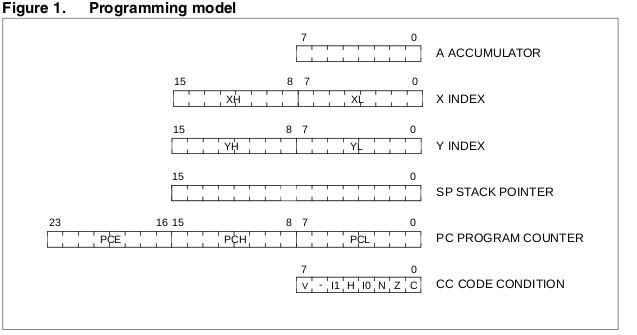
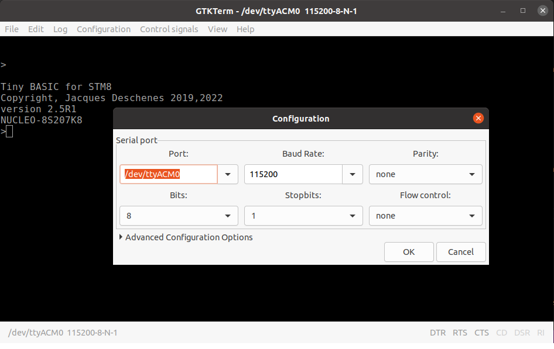
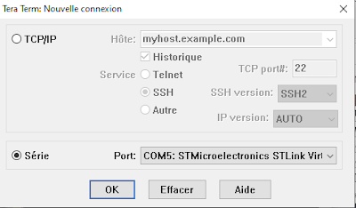
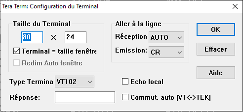
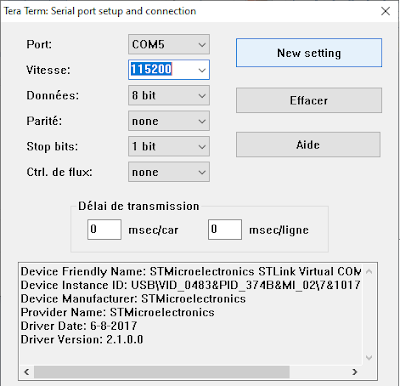
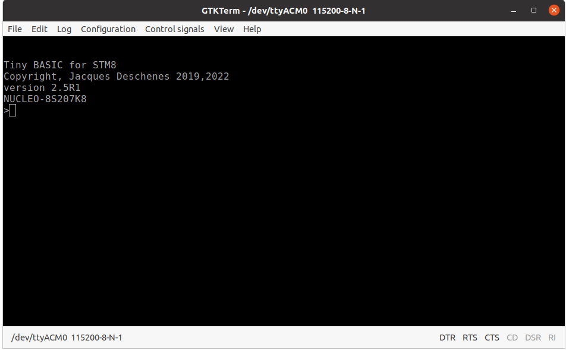
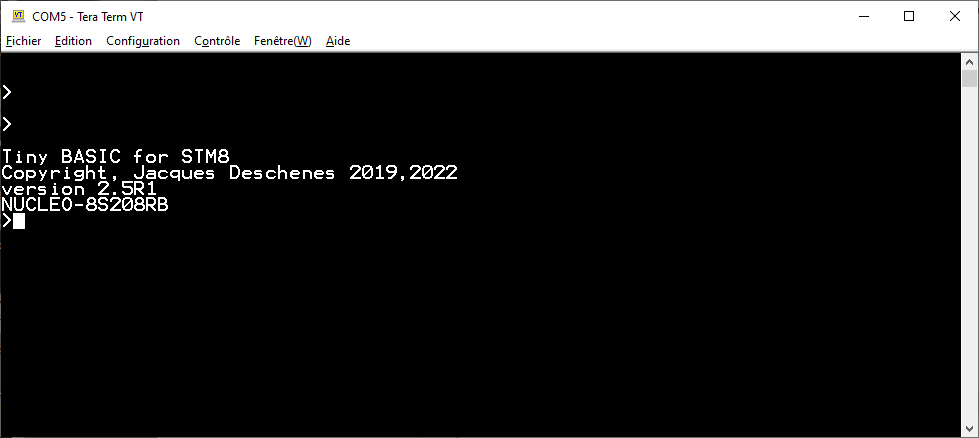
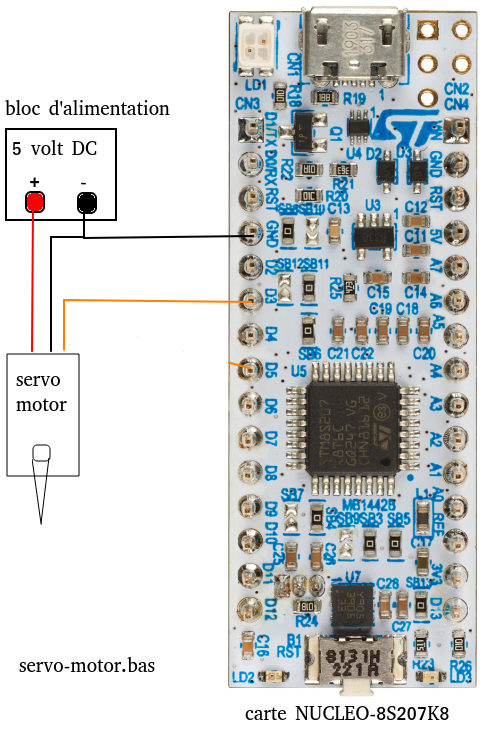

# Manuel de l'utilisateur de Tiny BASIC, version 2.6

<a id="index"></a>
 * [présentation](#intro)
 * [matériel supporté](#supported-bords)
 * [installation du firmware Tiny BASIC sur la carte](#firmware-install)
 * [Configuration du terminal](#terminal-setup)
 * [exemples de programmes](#usage-examples)

<a id="intro"></a>

## Présentation 

Tiny BASIC pour STM8 est un langage simple qui cependant permet de configurer et d'utiliser tous les périphériques du microcontrôleur STM8S20x sur les cartes d'expérimentations supportées. La seule limitation est que les interruptions ne sont pas supportées. Le système Tiny BASIC lui-même n'utilise que les interruptions suivantes: 

* TIMER4 Update  pour le compteur de millisecondes
* UART(1 ou 3) RX full, pour la réception des caractères du terminal.
* AWU pour la commande BASIC **AWU**.
* Sur la carte **NUCLEO_8S208RB**, le bouton **USER** déclenche l'interruption externe **EXTI4**.

Il s'agit d'un langage simple pour des applications microcontrolleurs simples.

Le système est conçu pour fonctionner en autonomie, aucune installation n'est requise sur l'ordinateur hôte autre qu'un émulateur de terminal compatible **VT100**. De tels émulateurs sont disponibles sur tous les systèmes d'exploitations majeurs, Unix, Linux, Windows, OSX.

Le projet STM8 Tiny BASIC est lui-même développé sur un ordinateur utilisant Ubuntu/Linux comme système d'exploitation. Le dépôt du projet est maintenu sur [https://github.com/Picatout/stm8_tbi](https://github.com/Picatout/stm8_tbi).

### STM8

**STM8** est le nom du microprocesseur au coeur d'une famille de microcontrôlleurs produit pas [STMicroelectronics](https://www.st.com/content/st_com/en.html). Il s'agit d'une architecture 8 bits classique qui ressemble à  une extension du processeur 8 bits MOS6502 de la fin des années 70. 
#### Modèle de programmation du STM8
<br>
STM8 TinyBASIC 

L'objectif de ce manuel est de présenter les fonctionnalités du langage à travers des applications du microcontrôleur. Je n'ai pas définie toutes les constantes des registres du MCU dans le langage il est donc nécessaire de se référer au [feuillet de spécifications](docs/stm8s208rb.pdf) ainsi qu'au manuel de référence du [STM8S](docs/stm8s_reference.pdf). Les manuels d'utilisateur des cartes [NUCLEO-8S208RB](docs/NUCLEO-8S208RB/nucleo-8s208rb_user_manual.pdf) et [NUCLEO-8S207K8](docs/NUCLEO-8S207K8/nucleo-stm8S207K8_user_man.pdf) sont aussi utile.

Pour le langage TIny BASIC lui-même il faut consulter le manuel de référence du langage disponible aux formats:

* [Markdown](tbi_reference_fr.md)
* [PDF](tbi_reference_fr.pdf) 

[index](#index)
<hr align="left">

<a id="#supported-boards"></a>
## Matériel supporté

Actuellement le projet supporte 2 modèles de cartes NUCLEO vendues par [STMicroelectronics](https://www.st.com/content/st_com/en.html).

* [NUCLEO-8S207K8](https://www.st.com/en/evaluation-tools/nucleo-8s207k8.html)
  <br>
* [NUCLEO-8S208RB](https://www.st.com/en/evaluation-tools/nucleo-8s208rb.html) 
  <br>


Chacune de ces cartes incorpore un programmeur STLINK et se branche au PC de développement via un cable USB. Le firmware du STLINK émule à la fois un unité de stockage et une interface port sériel. 

Pour l'utilisateur de Tiny BASIC la communication avec la carte NUCLEO se fait par l'intermédiaire du port sériel en utilisant un émulateur de terminal.

Pour la [configuration du terminal](#trminal-config) consultez la rubrique plus bas.

[index](#index)
<hr align="left">

<a id="firmware-install"></a>
## Installation du firmware Tiny BASIC sur la carte 

Lorsque la carte NUCLEO est branchée sur le port USB de l'ordinateur une nouvelle unité de stockage apparaît. 

* Sous Windows cette unité est identifiée par une lettre comme tous les autres disques et suivit de son nom:
* **NOD_8S207** pour la carte NUCLEO-8S207K8.
* **NODE_8S208** pour la carte NUCLEO-8S208RB.

* Sous Ubuntu seul le nom de l'unité de stockage est utilisé.

### programmation du firmware Tiny BASIC 
1. Clonez ou téléchargez la dernière version de [STM8 tiny BASIC](https://Picatout/stm8_tbi)

1. Dans l'arborescence du projet il y a un dossier **build** et pour chaque carte un sous-dossier portant le nom de la carte. En fonction de la carte choisie il suffit de copier le fichier **TinyBasic.bin** vers le disque **NOD_8S207** ou **NODE_8S208** pour programmer le firmware sur  la carte.  

En cas d'échec de la copie il peut-être nécessaire de mettre à jour le [firmware du programmeur STLINK](https://www.st.com/en/development-tools/stsw-link007.html) lui-même. L'utilitaire pour ce faire n'est disponible que sous Windows. Une fois STLINK mis à jour réessayez l'étape 2.

[index](#index)
<hr align="left">

<a id="terminal-setup"></a>
## Configuration du terminal 

Sur système Windows les émulateurs de terminal suivants peuvent-être utilisés.

* [TeraTerm](https://osdn.net/projects/ttssh2/releases/) 
* [PUtty](https://www.chiark.greenend.org.uk/~sgtatham/putty/latest.html)

Sur systèmes Linux 

* Minicom<br>sur Ubuntu pour installer 
```
sudo apt install minicom 
```
* GTKTerm <br> Il s'agit d'un projet open source hébergé sur [https://github.com/Jeija/gtkterm](https://github.com/Jeija/gtkterm)
```
sudo apt install gtkterm
```
* Et de nombreuses autres possibilités. 

La communication entre la carte NUCLEO et le terminal suit les paramètres suivants:

* **115200 BAUD** 
* **8 bits**
* **1 stop bit**
* **pas de parité**
* **marque de fin de ligne CR (ASCII 13)**

La carte envoie des séquences de contrôles ANSI conforme au terminaux VT100. Donc l'émulateur de terminal doit supporter ce protocole.

### Exemple de configuration sous Ubuntu utilisant GTKTerm.


Pour sauvegarder cette configuration utilisez dans le menu *configuration*, *save configuration*. Utilisez le nom *default* si vous voulez qu'elle soit utilisée automatiquement au démarrage de GTKterm.
<hr align="left" width="40%">

### Exemple de configuration sous Windows 10 utilisant TeraTerm.
Au démarrage de Teraterm la fenêtre nouvelle connection s'affiche.
<br>
Il faut aussi ajuster les paramètres du terminal 
<br>
Ainsi que les paramètres du port série.<br>
<br>
Encore là la configuration peut-être sauvegardée pour ne pas avoir à recommencer à chaque fois **(configuration - sauvegarder setup)**. Cependant une fois que vous avez récupérer la configuration **(configuration - restaurer setup)**, il faudra aller dans **configuration - port série** et simplement cliquer sur le bouton **New setting** pour activer cette configuration.  
<hr align="left" width="40%">

Voici de quoi ça a l'air dans GTKTerm<br>

Et dans TeraTerm sous Windows avec la police ajustée à 12 points.
<br>

[index](#index)
<hr align="left">

<a id="examples"></a>
## exemples de programmes

Le réperoite **BASIC** contient plusieurs programmes qui peuvent servir d'exemples. 

Il est aussi recommandé de lire en pré-requis de ce manuel la [référence du langage Tiny BASIC](tbi_reference_fr.pdf)

La commande **WORDS** affiche la liste complète des mots qui sont dans le dictionnaires. 
```
>words
ABS		ADCON		ADCREAD		ALLOC		AND
ASC		AUTORUN		AWU		BIT		BRES
BSET		BTEST		BTOGL		BUFFER		BYE
CHAIN		CHAR		CONST		CR1		CR2
DATA		DDR		DEC		DIM		DIR
DO		DREAD		DROP		DWRITE		EDIT
EEFREE		EEPROM		END		ERASE		FCPU
FOR		FREE		GET		GOSUB		GOTO
HEX		I2C.CLOSE	I2C.OPEN	I2C.READ	I2C.WRITE
IDR		IF		INPUT		KEY		KEY?
LET		LIST		LOG2		LSHIFT		NEW
NEXT		NOT		ODR		ON		OR
PAD		PAUSE		PEEK		PICK		PINP
PMODE		POKE		POP		POUT		PRINT
PORTA		PORTB		PORTC		PORTD		PORTE
PORTF		PORTG		PORTI		PUSH		PUT
READ		REBOOT		REM		RESTORE		RETURN
RND		RSHIFT		RUN		SAVE		SIZE
SLEEP		STEP		STOP		TICKS		TIMEOUT
TIMER		TO		TONE		TRACE		UBOUND
UFLASH		UNTIL		USR		WAIT		WORDS
WRITE		XOR		
107 words in dictionary

>
```

Pour la carte **NUCLEO-8S208RB** il y a 4 commandes de plus car le périphérique **SPI** est disponible.


### exécution des programmes
Si une ligne de commande est saisie sans numéro de ligne elle est compilée et exécutée immédiatement. Par contre si le texte commence par un entier entre 1 et 32767 cette ligne est considérée comme faisant partie d'un programme et après sa compilation elle est insérée dans la zone texte réservée au progammes BASIC. Les programmes sont exécutés à partir de la mémoire RAM. Pour les cartes __NUCLEO-STM8S208RB__ et __NUCLEO-STM8S207K8__ il y a 6Ko de mémoire RAM une partie ce cette mémoire est utilisée par l'interpréteur et il reste environ 5561 octets disponibles pour les progammes. Les programmes sauvegardés en mémoire FLASH sont excécutés sur place.

## exemple 1 blinky 
Sur la carte il y a une LED indentifiée **LD2** ou **LD3**. Cette LED est connecté à la broche qui correspond au bit 5 du GPIO C. Cette GPIO   est pré-configurée en mode sortie par le système Tiny BASIC. Pour contrôler son état il suffit donc de modifier l'éatt du bit 5 du registre **ODR** du GPIO C. Dans ce premier exemple nous allons faire clignoer cette LED au rythme de 1 fois par seconde. Le programme est interrompu en enfonçant n'importe quelle touche du terminal.
```
1 BLINK 
5 ' Blink LED2 on card 
10 DO BTOGL PORTC , BIT ( 5 ) PAUSE 500 UNTIL KEY? 
20 LET A = KEY 
30 BRES PORTC , BIT ( 5 ) 
40 END 
```
Notez que vous pouvez saisir le texte aussi bien en minuscules qu'en majuscules. l'interpréteur convertie en majuscules. 

Une autre méthode pour faire clignoter la LED est d'utiliser la commande **DWRITE** comme illustré dans l'exemple suivant:
```
5 ' CTRL+C pour arrêter le programme
7 ' clignote 3 fois par seconde
10 LET B = 1 
20 FOR A = 0 TO 0 STEP 0 ' boucle infinie
30 DWRITE 13 , B ' la LED sur la broche D13
40 LET B = 1 - B 
50 PAUSE 333 
60 NEXT A 

```
## exemple 2 PWM logiciel

Dans cet exemple l'intensité de la LED est contrôlée par PWM logiciel.
```
    1 PWM.SOFT 
    5 ' Software PWM, controle LD2 sur la carte  
    7 GOSUB HELP 
   10 LET R = 511 , S = 1 , N = 0 , P = 0 : ? R ; 
   20 LOOP ' PWM loop 
   22 IF K = P : LET N = N + 1 , S = N / 10 + 1 
   24 IF K <> P : LET S = 1 , N = 0 
   26 LET P = K , K = 0 
   30 IF R : BSET PORTC , BIT ( 5 ) 
   40 FOR A = 0 TO R : NEXT A 
   50 BRES PORTC , BIT ( 5 ) 
   60 FOR A = A TO 1023 : NEXT A 
   70 IF KEY? : LET K = KEY : GOSUB UPPER 
   72 IF ( K = ASC ( \D ) OR K = ASC ( \U ) ) AND K = P : LET N = N + 1 , S = N / 10 + 1 
   74 IF K = 0 OR K <> P : LET S = 1 , N = 0 
   78 IF K = 0 : GOTO 30 
   80 IF K = ASC ( \U ) : GOTO 200 
   84 IF K = ASC ( \F ) : LET R = 1023 : GOTO 600 : '  pleine intensite 
   90 IF K = ASC ( \D ) : GOTO 400 
   94 IF K = ASC ( \O ) : LET R = 0 : GOTO 600 : '  eteindre
   96 IF K = ASC ( \? ) : GOSUB HELP : GOTO 600 
  100 IF K = ASC ( \Q ) : GOSUB CLS : END 
  110 GOTO LOOP 
  200 IF R < 1023 : LET R = R + S : GOTO 600 
  210 GOTO LOOP 
  400 IF R > 0 : LET R = R - S : GOTO 600 
  410 GOTO LOOP 
  600 IF R < 0 : LET R = 0 
  602 IF R > 1023 : LET R = 1023 
  604 GOSUB CLS : ? R ; 
  610 GOTO LOOP 
 1000 UPPER ' upper case letter
 1010 IF K < ASC ( \a ) : RETURN 
 1020 IF K > ASC ( \z ) : RETURN 
 1030 LET K = K - 32 
 1040 RETURN 
 2000 CLS ' clear terminal screen and move cursor home
 2010 ? CHAR ( 27 ) ; "[2J" ; CHAR ( 27 ) ; "[H" 
 2020 RETURN 
 3000 HELP 
 3010 GOSUB CLS 
 3012 ? "To control LD2 use:" 
 3014 ? , "'D' decrease intensity" 
 3016 ? , "'U' increase intensity" 
 3018 ? , "'F' full intensity" 
 3020 ? , "'O' turn off LD2" 
 3024 ? , "'Q' quit." 
 3026 ? , "'?' help" 
 3028 ? "Press any key to leave this help screen." 
 3030 DO UNTIL KEY? : ? KEY 
 3032 GOSUB CLS 
 3034 RETURN 
```
L'intensité s'affiche en au à gauche sur le terminal.

L'intensité de la LED est contrôlée à partir du terminal avec les touches
* **u** pour augmenter l'intensitée 
* **d** pour la réduire
* **f** pour la pleine intensité
* **o** pour l'éteindre
* **q** opur quitter le programme
* **?** pour afficher l'aide 

## exemple 3 lecture analogique
Dans cet exemple il s'agit encore de contrôler l'intensité de la LED mais cette fois l'intensité est déterminée par la lecture d'un potentimètre. Il faut brancher un potentiomètre de 10Ko entre **GND**,**V3,3** et  l'entrée analogique **AN0** de la carte.
```
    1 AN.READ
    5 'demo lecture analogique
   10 LET K = 0 :PRINT K;: ADCON  1 
   20 LET R =ADCREAD ( 0 )
   30 IF R :BSET PORTC,BIT(5) 
   40 FOR A = 0 TO R :NEXT A 
   50 BRES PORTC,BIT(5) 
   60 FOR A =A TO  1023 :NEXT A 
   70 IF KEY? :LET K =KEY AND $DF
   80 IF K =ASC (\Q):ADCON  0 :END
   90 PRINT "\b\b\b\b\b\b";R;
  100 GOTO  20 
```
 Le programme peut-être interrompue par len enfonçant la touche **q** sur le terminal. 

Sur le ligne 1 de ce programme on voit qu'il y a une étiquette **AN.READ**. Cette étiquette permet de sauvegarder ce programme en mémoire FLASH et de l'exécuter à partir de là. L'étiquette **AN.READ** va devenir le nom du fichier.
```
>save

>dir     
$B704 206 bytes,AN.READ

>run an.read
$0   
>autorun an.read

>reboot
 auto run program
432    
>
```
On utilise la commande **SAVE** pour sauvegarder le programme en mémoire FLASH ensuite la commande **DIR** nous donne la liste des programmes sauvegardés. Le premier chiffre en hexadécimal est l'adresse d'exécution du programme **$B704**, ensuite viens la taille en décimal **206 octets** et finalement son nom **AN.READ**. 

La commande **RUN** suivie d'un nom de fichier permet d'exécuter le fichier portant ce nom. 

La commande **AUTORUN** suivit d'un nom de fichier, ici **AN.READ** permet de lancer automatiquement ce programme lorsque la carte est mise sous tension ou réinitialisée avec le bouton **RESET**, la commande **REBOOT** ou encore **CTRL+X**. 

La commande **REBOOT** est utilisée pour réinitialiser la carte ce qui a pour effet de démarrer le programme **AN.READ**. Le message **auto run program** est affiché sur le terminal. **432** est la valeur de lecture du potentiomètre. En tournant l'axe du potentiomètre cette valeur change et l'intensité de la LED aussi. 

### exemple 4, PWM par périphérique TIMER1
La minuterie TIMER1 qui est un compteur 16 bits permet de:
* Compter des impulsions sur une entrée, c'est le mode *input capture*.
* Générer des impulsions sur uen sortie, c'est le mode *output compare*.

Cette minuterie possède 4 canaux qui peuvent-être configurés indépendemments à l'exception du compteur qui est commun aux 4. Dans l'exemple suivant le canal 1 qui branché sur **D3** est configuré en mode **PWM** (Pulse Widh Modulation) pour contrôler l'intensité d'une LED. 

#### branchement de la LED
* Cathode -&gt; GND 
* Anode -&gt; résistance 100 ohm -&gt; D3 
#### branchement du potentiomètre
* Patte 1 -&gt; GND 
* Patte 2 (milieu) -&gt; A0
* Patte 3 -&gt; 3.3V

1. On définie des constantes qui correspondes aux adresses des différents registres de contrôle du TIMER1. 
1. ligne 60, on active le signal clock qui alimente le TIMER1.
1. lignes 80-100, on configure le mode PWM sur le canal 1.
1. ligne 110-120, on configure la période du compteur 1023 comptes.
1. ligne 130, on ajuste le rapport cyclique à 50%.
1. ligne 150, on active le canal PWM. 
1. ligne 170, on active le convertisseur analogue numérique.
1. lignes 190-220, Dans une boucle DO..UNTIL on fait une lecture d'un potentiomètre branché sur **A0** et on ajuste la valeur du rapport cyclique du  PWM avec cette valeur en la déposant dans TIM1.CCR1. Cette valeur contrôle l'intensité de la LED.
1.  Lorsque l'utilisateur enfonce une touche sur le terminal. La bouche se termine et le périphérique TIMER1 est désactivé avant de quitter le programme.

```
1 PWM.HARD 
5 ' pwm on D3 using TIMER1 channel 1
10 CONST TIM1.CR1=$5250,TIM1.ARRH=$5262,TIM1.ARRL=$5263,TIM1.CCMR1=$5258 
20 CONST TIM1.CCR1H=$5265,TIM1.CCR1L=$5266,TIM1.EGR=$5257,TIM1.CCER1=$525C 
30 CONST TIM.CCMR.OCM=4,TIM1.PSCRH=$5260,TIM1.PSCRL=$5261,CLK.PCKENR1=$50C7
40 CONST TIM1.BRK=$526D,TIM1.MOE=7
50 ' Enable TIMER1 clock 
60 BSET CLK.PCKENR1,bit(7) 
70 ' Set up TIMER1 channel 1 for pwm output MODE 1 
80 POKE TIM1.CCMR1, LSHIFT(6,TIM.CCMR.OCM):BSET TIM1.BRK,BIT(TIM1.MOE) 
90 ' no prescale divisor on TIMER clock  
100 POKE TIM1.PSCRH,0:POKE TIM1.PSCRL,0 
110 ' 1023 for counter period, this give 10 bits resolution like the ADC 
120 POKE TIM1.ARRH,3:POKE TIM1.ARRL,255
130 POKE TIM1.CCR1H,1:POKE TIM1.CCR1L,255 
140 ' enable counter 
150 BSET TIM1.CCER1,BIT(0):BSET TIM1.EGR,BIT(0):BSET TIM1.CR1,BIT(0)
160 ' enable analog digital converter 
170 ADCON 1 
180 ' read analog input channel and set TIM1.CCR1 register with value.
190 DO 
200 ? "\b\b\b\b\b";:LET N=ADCREAD(0): ? n;
210 POKE TIM1.CCR1H,N/256:POKE TIM1.CCR1L,N
220 UNTIL KEY? ' quit when a key is pressed 
230 BRES TIM1.CCER1,BIT(0):BRES TIM1.CR1,BIT(0):BRES CLK.PCKENR1,BIT(7)
240 END 
```

### Contrôle d'un petit servo-moteur 
Les petits servo-moteurs sont aussi contrôlé par PWM (**P**ulse **W**idth **M**odulation). Dans l'exemple suivant le canal 2 de la minuterie est utilisé pour contrôlé un petit servo-moteur de type [SG90](https://www.amazon.ca/-/fr/servo-t%C3%A9l%C3%A9command%C3%A9-h%C3%A9licopt%C3%A8re-contr%C3%B4le-servomoteurs/dp/B072V529YD). 

#### montage 



Le système fournis 3 commandes pour activer et contrôler les servo-moteurs. 

* **SERVO.EN 0|1** 0 désactive la fonction, 1 l'active.
* **SERVO.CH.EN ch#,0|1**
  * **ch#** numéro do canal {1..4}
  * **0|1** 0 désactive le canal, 1 l'actve 
* **SERVO.POS ch#,usec** sert à positionné l'axe du servo-moteur.   
  * **ch#** Numéro du canal à positionner
  * **usec** largeur de l'impulsion en microsecondes {500..2500}

Jusqu'à 4 servo-moteurs peuvent-être contrôlés sur les broches 

canal<br>servo|Sortie|conn.
-|-|-
1|D3|CN3:6
2|D5|CN3:8
3|D6|CN3:9
4|D9|CN3:12 


__AVERTISSEMENT:__ Ne pas connecter l'alimentation du servo-moteur au 5V de la carte. Le moteur tire trop de courant lorsqu'il se met en rotation. Ça réinitialise la carte.

Ces servo-moteurs sont contrôlés par des impulsions qui se répètent à un intervalle de 20 msec. C'est la largeur de l'impulsion qui détermine la position de l'axe en rotation. 

Selon les spécifications du SG90 que j'ai trouvé dans l'internet l'axe devrait effectué une rotation totale de 180&deg; avec une largeur d'impulsion variant entre 1 msec et 2 msec. Ce n'est pas le résultat que j'obtient avec ceux que j'ai en mains. Pour obtenir une rotation totale de 180&deg; la largeur d'impulsion doit varier entre 0,5 msec et 2,5 msec. J'ai donc paramétré le programme en conséquence. 

```
1 SERVO.CTRL 
5 ' servo-motor control on channel 1 on D3 
6 ' servo-pulse range 500 usec - 2500 usec.
10 ' enable servo-motor control
20 SERVO.EN 1 ' 0 to disable 
30 'enable channel 1
40 SERVO.CH.EN 1,1 
50 ADCON 1 
60 ' read analog input channel and set TIM1.CCR1 register with value.
70 DO 
80 ? "\b\b\b\b\b";:LET N=ADCREAD(0)*2+500: ? n;
90 SERVO.POS 1,N  
100 UNTIL KEY? ' quit when a key is pressed 
110 ' disable servo motor control 
120  SERVO.CH.EN 1,0 ' disable channel 0
130  SERVO.EN 0 ' disable TIMER1 
140 END
```

### périphérique I2C 

**I2C** est l'acronyme anglophone pour **I**nter **I**ntegrated **C**ommunication. Il s'agit d'un protocole de type **bus** à 2 fils. **bus** veut dire que plus d'un dispositif peut-être branché sur le même bus. Chaque dispositif est identifié par une adresse de 7 bits (ou 10 bits). Dans le dossier **BASIC** il a 2 programme démontrant l'utilisation de ce périphérique. 
Les commandes qui utilisent ce périphériques sont:

* **I2C.OPEN** pour activé le périphérique.
* **I2C.CLOSE** pour le fermer.
* **I2C.WRITE** pour envoyé des données à un dispositif branché sur le bus.
* **I2C.READ** pour recevoir des données d'un dispositif branché sur le bus.

Le programme [i2c_eeprom.bas](BASIC/i2c_eeprom.bas) fait la démonstration de l'utilisation d'une mémoire EEPROM à interface I2C. 

Le programme [i2c_oled.bas](BASIC/i2c_oled.bas) fait la démonstration d'un petit affichage OLED à interfaace I2C. 

[index](#index)

