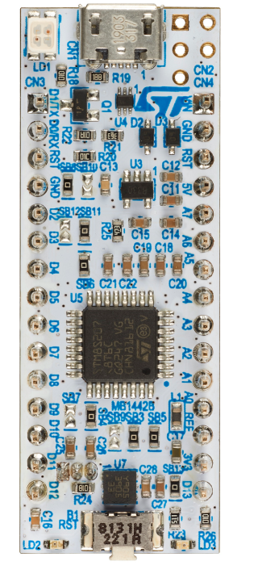

[english](readme_en.md)
# Tiny BSIC sur carte STM8 NUCLEO 

Au départ en 2019 il s'agissait d'implémenter [Tiny BASIC](docs/TINIDISK.DOC) pour fonctionnement en autonome, c'est à dire n'utilisant qu'un émulateur de terminal comme interface utilisateur pour communiquer avec la carte [NUCLEO-8S208RB](https://www.st.com/en/evaluation-tools/nucleo-8s208rb.html).
Avec le temps de nombreuses fonctionnalités ont étées ajoutées au langage de sorte qu'il n'est plus aussi petit que le Tiny BASIC original.

* Maintenant le projet surporte en plus de la carte originale  [NUCLEO-8S208RB](https://www.st.com/en/evaluation-tools/nucleo-8s208rb.html) la carte [NUCLEO-8S207K8](https://www.st.com/en/evaluation-tools/nucleo-8s207k8.html).

* La version originale de Tiny BASIC utilisait des entier 16 bits alors que cette implémentation utilise des entiers 24 bits car la mémoire flash s'étend au delà des 64KO de mémoire, le compteur ordinal est de 24 bits. 

* Les commandes **GOTO** et **GOSUB** peuvent adresser des étiquettes au lieu d'un simple numéro de ligne. Les étiquettes sont des noms placés en début de ligne. 

* Le mot réservé **CONST** permet de définir des constantes symboliques. 

* Le mot réservé **DIM** permet de définir des variables symboliques en plus des 26 variables du Tiny BASIC traditionnel. 

* Le mot réservé **ON** *expr** **GOTO** ou **GOSUB** permet de faire des sauts ou des appels de sous-routines sélectif en fonction de la valeur de *expr*. 

* L'éditeur de programme fait partie du système installé sur la carte. 

* Le compilateur fait partie du système installé sur la carte.

* Le décompilateur fait partie du système installé sur la carte. 

* Un petit système de fichiers permet de sauvegarder les programmes en mémoire FLASH.

# documentation 

* Format Markdown: [référence du language](tbi_reference_fr.md) 
* Format PDF: [docs/tbi_reference_fr.pdf](docs/tbi_reference_fr.pdf)
* Format Markdown: [manuel de l'utilisateur](manuel_Utilsateur.md_)
* Format PDF: [docs/manuel_utilisateur.pdf](docs/manuel_Utilisateur.pdf)
* Format Markdown: [notes_de_révision.md](notes_de_révision.md)
* Notes de révision: [notes de révision](notes_de_révision.md)

## cartes supportées 

**NUCLEO-8S208RB** 
  
1. 128 KB FLASH memory
1. 2KB EEPROM 
1. 6KB RAM 
1. Plenty of I/O

 

 

**NUCLEO_8S207K8** 

1. 64KB FLASH memory
1. 1KB EEPROM 
1. 6KB RAM 
1. small form factor, plugable on solderless prototyping board.

