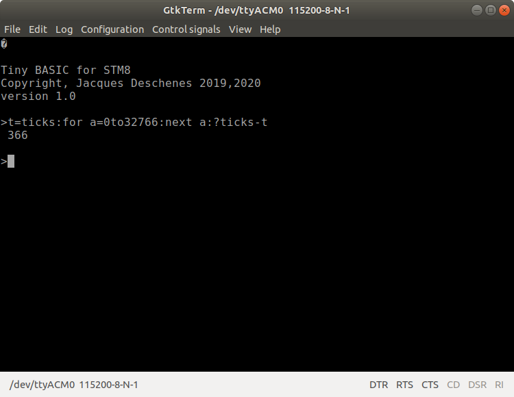

[english](readme_en.md)
## 2022-11-29 Version 2.6R1

Ajout de 3 nouvelles commandes 

* __SERVO.EN__  Pour activer une fonction de contrôle de servo-moteur.
* __SERVO.CH.EN__ Pour aactiver un canal spécifique. Il y en a 4.
* __SERVO.POS__ Pour contrôler la position d'un servo-moteur. 

Un pré-release avec le tag V2.5R1 a été créé pour cette nouvelle version.

## 2022-11-28  Version 2.6R3 

Il s'agit de corrections de bogues, de modification de comportement de certaines fonctions et commandes et d'ajout de documentation.

* Les manuels de référence français et anglais sont maintenant disponible en format PDF.

* Dans le fichier [config.inc](config.inc) l'option **WANT_IWDG** a été ajoutée et désactivée. L'utilisation du **IWDG** me semble de peut d'usage. Cependant il demeure toujours possible de l'intégré en mettant **WANT_IWDG=1** dans [config.inc](config.inc).

* Lorsqu'un programme est démarré en **AUTORUN** son nom est envoyé au terminal à l'initialisation de la carte.

* Création de répertoires séparés dans dans **build** pour chaque carte. Modification du [Makefile](Makefile) et du [build.sh](build.sh) en conséquence.

* Le travail sur la documentation se poursuit. Présentement en cours le manuel de l'utilisateur en français qui sera suivit de sa traduction en anglais.

## 2022-11-19

Version 2.5R1  pre-release viens d'être créé. Cette version ne concerne que la correction de plusieurs bogues ainsi qu'un effort d'optimisation pour réduire la 
taille du binaire. Je crois bien que tous les bogues évidents, c'est à dire ceux qui se présentent de façon constante sont réglés. Il serait naïf de croire qu'il n'y en 
a pas de subtils qui se cachent encore dans le code. Si vous  découvrez un bogue il serait apprécié d'ouvrir un ticket à ce sujet avec suffisamment d'information pour que je puisse le reproduire.

###  optimsation de taille 
Malheureusement l'assembleur **sdasstm8** n'est pas doué pour l'optimisation. J'ai donc été obligé de la faire à la main en créant des macros qui se trouvent 
dans le fichier [gen_macros.inc](inc/gen_macros.inc). L'assembleur n'utilise que la forme *longmem* des instructions, les macros que j'ai créées code la forme 
*shortmem*. Toutes les macros ont un nom qui débute par le caractère **'_'**  et celles qui concerne l'adressage *shortmem* se terminent par un **'z'**. **'z'** pour *zero page* car la forme *shortmem* sert à adresser les variables dans la page zéro {0..255} comme pour le processeur **MOS-6502**. 

## 2022-11-17 

Je viens de pousser le code de la version 2.5R0 sur le serveur. Il s'agit d'un travail que j'ai débuté à la fin septembre et qui est toujours en cours.

* Il s'agit d'une réécriture importante du code source pour changer le modèle de l'interpréteur de bytecode. Je trouvais la boucle *interp_loop* et la fonction *next_token* trop compliqué. J'ai donc décidé de simplifier.

* Cette modification implique que le mot réservé  **LET** utilisé pour initialier une variable et maintenant obligatoire. Cependant plusieurs variables peuvent-être initialisées dans la même commande en les séparant par une virgule. Exemple:
```
LET A=31416, B=2*A
```

* Aucune fonctionnalité supplémentaire n'a été ajouté, cependant lorsque la carte **NUCLEO_S207K8** est sélectionnée dans [config.inc](config.inc)
Les commandes reliées au périphérique **SPI** sont retirées du code source.

* Cette version ajoute le support pour la carte d'expérimentation [NUCLEO-8S207K8](https://www.st.com/en/evaluation-tools/nucleo-8s207k8.html).
Le MCU sur cette carte est de la même catégorie que celui de la carte [NUCLEO-8S208RB](https://www.st.com/en/evaluation-tools/nucleo-8s208rb.html)
sauf que cette carte est au format Arduino Nano et est enfichable sur un carte d'expérimentation sans soudure.  Voici les différences entre les 2 MCU.

paramètre|STM8S2K08RB|STM8S207K8 
--|--|-
packaging|LQFP 64|LQFP 32
broches|64|32
RAM|6K|6K
EEPROM|2K|1K
FLASH|128K|64K

Évidemment comme il y a 2 fois moins de broches, il y moins de GPIOs. Le périphérique **SPI** est pas relié aux connecteurs CN3,CN4 sur la carte **NUCLEO-8S207K8**, donc ne peut-être utilisé. 

Le périphérique **I2C** est une fonction alternative sur la carte **NUCLEO-8S207K8**, donc la fonction alternative doit-être programmée dans le registre d'option **OPT2** avant son utilisation. Ça peut-être fait de la façon suivante:
```
>LET A=PEEK($4803) OR 64:WRITE $4803,A:REBOOT 


Tiny BASIC for STM8
Copyright, Jacques Deschenes 2019,2022
version 2.5R0

>
```   
Pour désactiver cette fonction alternative il faut faire:
```
>LET A=NOT 64 AND PEEK($4803):WRITE $4803,A: REBOOT


Tiny BASIC for STM8
Copyright, Jacques Deschenes 2019,2022
version 2.5R0

>
``` 
Toute modification à un registre d'option nécessite une réininitalisation du MCU pour prendre effet. Donc ça ne peut-être activé dans le programme BASIC lui-même.

### Construction du projet. 

1. Il faut d'abord configuré la carte cible dans le fichier [config.inc](config.inc). 
2. Esuite pour construire le projet on utilise script bash [build.sh](build.sh).
Ce script accepte 2 paramètres, le second est optionnel.

* 1ier paramètre,sélection de la carte, valeurs: __s207__ ou __s208__.

* 2ième paramètre,optionnel pour flasher la carte: __flash__.

Sur la ligne de commande du PC ça donne ceci:
```
~/github/stm8_tbi$ ./build.sh s207 flash

```

* Présentement le code du fichier [debug_support.asm](debug_support.asm) est compilé puisque ce projet est encore développement. Il y a une option dans le fichier [config.inc](config.inc) pour le retirer du projet. 

## 2022-06-25, version 2.1 

Ajout de plusieurs commandes. 

  * **BUFFER** *nom*, *greandeur* &nbsp;&nbsp; permet d'allouer un tampon de *grandeur* octets en mémoire. Ce tampon est référencé par *nom* qui retourne son addresse.

  * Ajout de 4 fonctions pour utiliser le périphérique **I2C** du **STM8S208** 
    * **I2C.OPEN** 
    * **I2C.CLOSE** 
    * **I2C.WRITE**
    * **I2C.READ** 

  * Avec cette version, lorsque le programme est compilé sans le support [DEBUG](config.inc) il occupe 14340 octets dans la mémoire FLASH.

  * Un vidéo de démonstration de l'utilisation du périphérique I2C est disponible sur [youtube](https://youtu.be/WRrV2kTRoWk).
  
## 2022-06-10, version 2.0

* Nombreuses modfications par rapport à la version __1.x__. TinyBASIC est de moins en moins Tiny. Il ressemble de plus en plus à Microsoft BASIC tel qu'il existait sur les ordinateur 8 bits des années 80, tel que le Apple II, Commode VIC-20,C64 et Tandy TRS-80. Le comportement de plusieurs commandes a été modifié. Il faut consulter le [manuel de référence](tbi_reference.md).

  1. Les entiers sont maintenant de 24 bits au lieu de 16 bits. Ce qui permet d'accéder la mémoire étendue pour y enregistrer des données avec la commande
  **WRITE** et de les relire avec la commande **PEEK**. 

  1. Les commandes **GOTO** et **GOSUB** acceptent maintenant une étiquette comme cible.  Une étiquette (label) peut-être inscrit au début d'une ligne 
  à cet effet.

  1. Concernant la sauvegarde des programmes dans la mémoire FLASH du MCU. Il n'y a plus de sauvegarde dans la mémoire étendue. Cette mémoire n'est plus utilisée par le système BASIC. Cependant les applications peuvent l'utiliser avec la commande **WRITE** et la fonction **PEEK**. Puisque maintenant les entiers sont de 24 bits au lieu de 16 bits les adresses au delà de 65535 sont maintenant accessibles à ces 2 commandes. Les programmes sont conservés mainteant dans la mémoire sous l'adresse 65536 dans la partie qui n'est pas utilisée par le système BASIC.  En ce moment il reste environ 19000 octets 
  de libres. Ça va diminuer ave l'ajout de nouvelles fonctionnalités au système BASIC. 

  1. La commande **SAVE** n'accepte plus de nom de fichier. Le nom du programme doit-être indiqué sur la première ligne de celui-ci sous la forme d'une 
  étiquette (label). 
  
  1. La commande **FORGET** a été remplacé par la commande **ERASE**. Il est maintenant possible d'effacer un seul fichier. 

  1. Plusieurs commandes ont étées ajoutées. Voir le [manuel de référence](tbi_reference.md).

  1. Les fonctions **OR**, **AND** et **XOR** ont étées transformées en opérateurs infixes.

  1. De nombreux bogues ont étés détectés et corrigés.
  
## vidéo des nouvelles fonctionnalités

[vidéo des nouvelles fonctionnalités](https://youtu.be/BShutntojic)


## 2022-04-21 version 2.0

J'ai décidé de laisser tomber le système de fichier en mémoire flash étendue. Un seul programme est sauvegardé en mémoire FLASH et il s'exécute automatiquement au démarrage du MCU. Les commandes suivante sont donc disparues 
de la version 2.0: **DIR**,**FORGET** et **LOAD** 

La commande **SAVE** ne prend aucun argument et sauvegarde le programme en mémoire RAM dans la mémoire FLASH. Ce programme devient alors l'application qui s'exécute à l'initialisation de la carte. 

La nouvelle commande **ERASE \E|\F** Efface la mémoire EEPROM ou la mémoire FLASH en conservant seulement le système TinyBASIC. 

La nouvelle commande **EDIT** copie le programme qui a été sauvegardé avec la commande **SAVE** vers la mémoire RAM pour modification.

<hr>

Pour suivre l'évolution du projet vous pouvez consulter le [journal](journal.md).

Il s'agit d'une implémentation du [Tiny BASIC](https://en.wikipedia.org/wiki/Tiny_BASIC) originellement conçu par [Dennis Allison](https://en.wikipedia.org/wiki/Dennis_Allison) au milieu des années 197x. Cette implémentation est créée en me référend aux documents [TINYDISK.DOC](TINYDISK.DOC) et [TINYDISK.ASM](TINYDISK.ASM). Cependant elle n'est pas exactement identique. Comme il s'agit de programmer un microcontrôleur et non un ordinateur d'usage général des fonctions et commandes spécifiques à cet objectif sont ajoutées.

Ce système a été développé et testé sur une carte NUCLEO-8S208RB 

## utilisation
Il suffit de brancher la carte **NUCLEO-8S208RB** avec un cable USB au PC. 
Cette carte comprend son propre programmeur **ST-LINK/V2.1** ainsi qu'un canal de communication sériel utilisant le UART1 du mcu **STM8S208RB**. Tiny BASIC utilise ce canal de communication pour l'interface utilisateur. 

Sur le PC lorsqu'on branche le cable de la carte un nouveau périphérique **/dev/ttyACMx** apparaît:
```
jacques@HP8200:~/github/stm8_tbi$ ls /dev/ttyACM*
/dev/ttyACM0
jacques@HP8200:~/github/stm8_tbi$ 
```
Il faut donc configurer l'émulateur de terminal pour utiliser ce périphérique:



## fonctionnement 

Il s'agit d'un interpréteur. Au départ il s'agissait d'un interpréteur pur. C'est à dire que le texte source du programme était sauvegardé tel quel et était lu et analyser à chaque exécution. Il n'y avait  pas de génération de code intermédiaire pour exécution sur une machine virtuelle. L'avantage est au niveau de la simplicité. Par exemple la commande **LIST** ne nécessitait pas de désassemblage pour afficher le contenu du texte original puisque celui-ci était sauvegardé tel quel. 

L'inconvénient est au niveau de la vitesse d'éxécution qui est beaucoup plus lente. J'ai donc modifié le code pour utiliser une méthode intermédiaire entre la compilation en byte code pour une machine virtuelle et l'interprétation pure. Cette méthode consiste à remplacer le texte original en une liste d'unités lexicales. L'analyse lexicale n'est faite qu'une fois. Avec cette méthode l'exécution est 4 à 5 fois plus rapide selon mes tests. Par exemple le code suivant:
```
>t=ticks:for a=0 to 1000:next a:print ticks-t
  13
```
avait un temps d'exécution qui affichait 56 ou 57 millisecondes alors qu'avec cette nouvelle implémentation l'affichage oscille entre 12 et 13 millisecondes. 

L'inconvénient est que le code est plus complexe. Lorsqu'une ligne est saisie par l'utilisateur le texte est d'abord *compilée* en une liste d'unitée lexicale avant d'être exécutée. 

De plus la commande **LIST** qui était très simple est maintenant plus complexe car il faut *décompiler* la liste des unités lexicales pour afficher le programme. 

## Notes historique

* Avant même l'invention de l'expression *logiciel libre* Tiny BASIC a été le premier logiciel libre. Ce qui l'à rendu populaire sur les premier ordinateurs qui possédaient peu de mémoire RAM.

* La première version TRS-80 modèle I, était vendu avec 4Ko de mémoire RAM et une version de Tiny BASIC en ROM. Cependant ils ont rapidement ajouter les calculs en virgule flottante par la suite.  

* Les mots réservés **GOTO** et **GOSUB** du BASIC viennent de l'époque du FORTRAN alors que les espaces dans ce langage n'étaient pas significatifs. Ainsi dans Tiny BASIC qui avait adopté cette syntaxe on pouvait écrire **GOTO** au lieu de **GO TO**. Ce **GOTO** en un seul mot est devenu usuel dans de nombreux langages par la suite comme le **goto** du **C**. 

## documentation
* [manuel de référence de stm8 Tiny BASIC](tbi_reference.md)
* [manuel de l'utilisateur de stm8 Tiny BASIC](manuel_util_tb.md)
* [journal de développement](journal.md)


