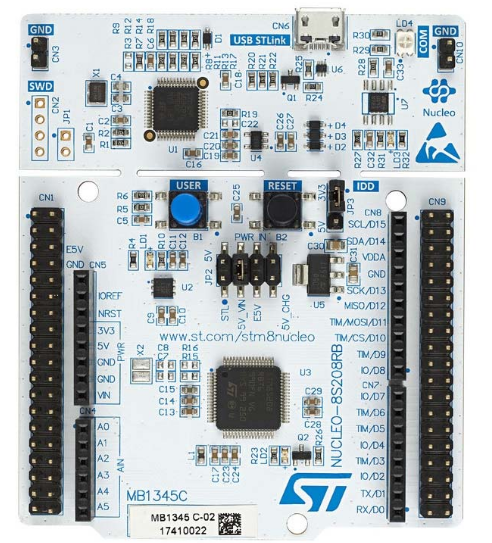
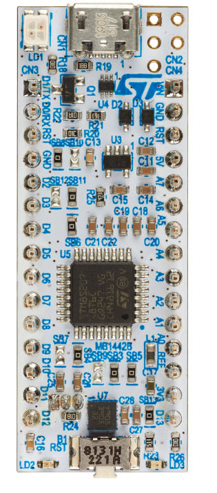

[français](readme.md)

# Tiny BASIC on STM8 NUCLEO board. 

When I started this project in 2019 it was an implementation of  [Tiny BASIC](https://en.wikipedia.org/wiki/Tiny_BASIC) on STMicroelectronics NUCLEO-8S208RB board. 

Overtime the project has evolved to a more featured BASIC and since version 2.5 it support also NUCLEO-8S207K8 board.

1. Original Tiny BASIC was supporting 16 bits integers. STM8 TBI support 24 bits integers.
1. Symbolic targets for GOTO and GOSUB are supported.
1. Keyword **CONST** is available to define symbolic constants.
1. Keyword **DIM** is available to define symbolic variables. 
1. **ON** *expr* **GOSUB|GOTO** *selection_list* is also available.
1. Source editor on board. 
1. Compiler on board. 
1. Decompiler on board.
1. Small file system on board FLASH memory.

The system is completely installed on the NUCLEO board, it can be used with any PC whatever the operating system. The only requirement is a Terminal emulator connected to the virtual serial port available on these NUCLEO boards. The communication parameters are 115,200 BAUD, 1 stop, no parity.

## documentation 

[language reference](tbi_reference_en.md) 

[user's manual](user_man.md_)

## boards supported 

  
1. 128 KB FLASH memory
1. 2KB EEPROM 
1. 6KB RAM 
1. Plenty of I/O

 

 

1. 64KB FLASH memory
1. 1KB EEPROM 
1. 6KB RAM 
1. small form factor, plugable on solderless prototyping board.

