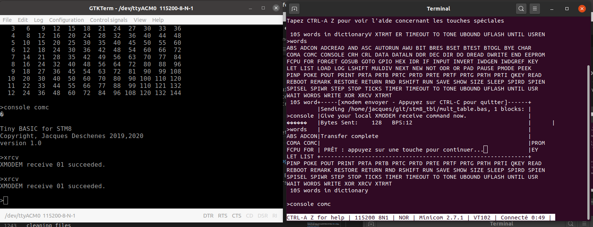
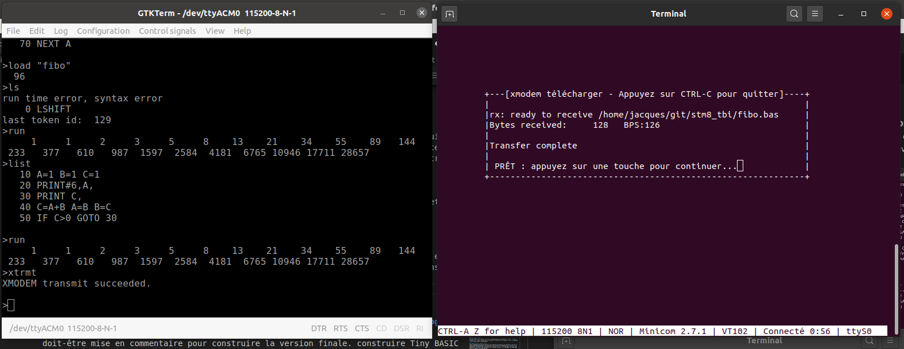
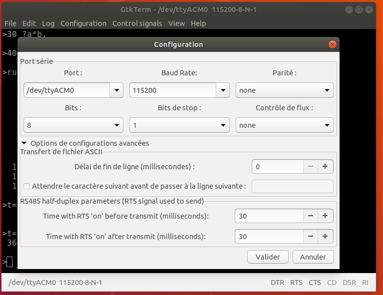
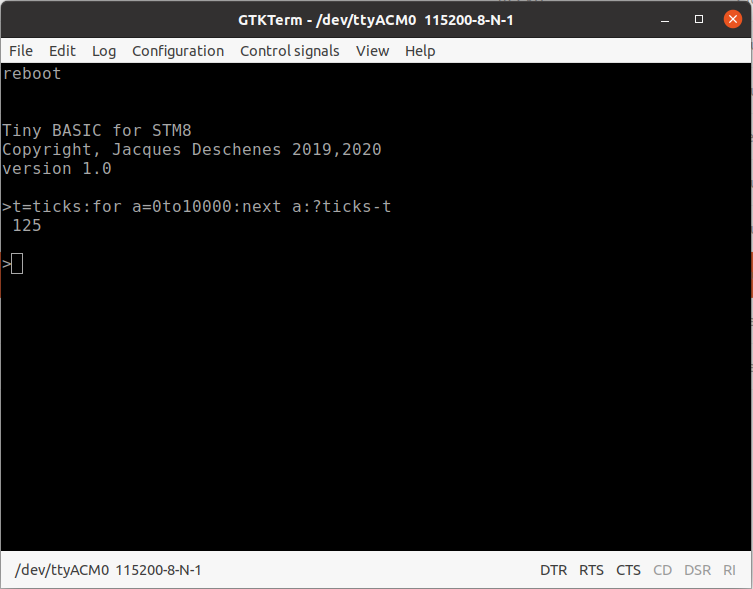

# référence du langage Tiny BASIC pour STM8

<a id="index-princ"></a>
## index principal 

* [Types de données](#data)

* [Variables](#variables)

* [Expressions arithmétiques](#expressions)

* [Syntaxe](#syntaxe)

* [Bases numériques](#bases)

* [Ligne de commande](#cli)

* [Fichiers](#fichiers)

* [Référence des commandes et fonctions](#index)

* [Installation](#install)

* [Utilisation](#utilisation)

* [transfert de fichiers](#xmodem)

* [Code source](#sources)

<a id="data"></a>
### Type de données 
Le seul type de donné numérique est l'entier 16 bits donc dans l'intervalle **-32768...32767**.  

Cependant pour des fins d'impression des chaînes de caractères entre guillemets sont disponibles. Seul les commandes **PRINT** et **INPUT** utilisent ces chaînes comme arguments. 

Le type caractère est aussi disponible sous la forme **\c** i.e. un *backslash* suivit d'un caractère ASCII. 

Il est aussi possible d'imprimer un caractère en utilisant la fonction **CHAR()**. Qui retourne un jeton de type **TK_CHAR**. Ce type de donnée ne peut-être sauvegardé dans une variable sauf en utilisant la fonction **ASC()** qui le convertie ent type **TK_INTGR** qui peut-être sauvegardé dans une variable ou utilisé dans un expression.  

[index principal](#index-princ)

<a id="variables"></a>
### Variables 

Le nombre des variables est limité à 26 et chacune d'elle est représentée par une lettre de l'alphabet. 

### Tableau 

Il n'y a qu'un seul tableau appelé **@** et dont la taille dépend de la taille du programme. En effet ce tableau utilise la mémoire RAM laissée libre par le programme. Un programme peut connaître la taille de ce tableau en invoquant la fonction **UBOUND**. 

[index principal](#index-princ)
<a id="expressions"></a>
### expression arithmétiques 

Il y a 5 opérateurs arithmétiques par ordre de précédence:
1. **'-'**  moins unaire, qui a la plus haute priorité.
1.  __'*'__ mulitipliation, **'/'** division, **'%'** modulo 
1. **'+'** addition, **'-'** soustraction.

Notez que les opérations de division et de modulo réponde à la définition de la [division Euclidienne sur entiers relatif](https://fr.wikipedia.org/wiki/Division_euclidienne#Extension_aux_entiers_relatifs). Ce qui peut réserver des surprises aux non informés. Dans ce type de division le quotient est arrondie vers l'entier le plus petit et le reste (modulo) est toujours positif. Ainsi **-5/3=-2** et **-5%3=1** de sorte que __D=q*n+r__ où **D** est le dénominateur, **q** le quotient, **n** le diviseur et **r** le reste. Dans cet exemple on a donc __-5=-2*3+1__.  

### opérateurs relationnels.

Les opérateurs relationnels ont une priorités inférieure à celle des opérateurs arithmétiques. Le résultat d'une relation est **0|1** et ce résultat peut-être utilisé dans une expression arithmérique. Puisque les relations sont de moindre priorité elle doivent-être misent entre parenthèses lorsqu'elles sont utilisées dans une expression arithmétique.

1. **'&gt;'**   Retourne vrai si le premier terme est plus grand que le deuxième.
1. **'&lt;'** Retourne vrai si le premier terme est plus petit que le second.
1. **'&gt;='** Retourne vrai si le premier terme est plus grand ou égal au second. 
1. **'&lt;='** Retourne vrai si le premier terme est plus petit ou égal au second. 
1. **'='** Retourne vrai si les 2 termes sont identiques. 
1. **'&lt;&gt;'** ou **'&gt;&lt;'** Retourne vrai si les 2 termes sont différents. 

[index principal](#index-princ)
<a id="syntaxe"></a>
## Syntaxe 

Le code utilisé pour le texte est le code [ASCII](https://fr.wikipedia.org/wiki/American_Standard_Code_for_Information_Interchange).

Un programme débute par un numéro de ligne suivit d'une ou plusieurs commandes séparées par le caractère **':'**.

Une commande est suivie de ses arguments séparés par une virgule. Les arguments des fonctions doivent-être mis entre parenthèses. Par fonction j'entends une sous-routine qui retourne une valeur. Cependant une fonction qui n'utilise pas d'arguments n'est pas suivie de parenthèses. Les commandes , c'est à dire les sous-routines qui ne retoune pas de valeur, reçoivent leur arguments sans parenthèses. 

Les *espaces* entre les *unitées lexicales* sont facultatifs sauf s'il y a ambiguité. Par exemple si le nom d'un commande est immédiatement suivit par le nom d'une variable un espace doit les séparer. 

Les commandes peuvent-être entrées indifféremment en minuscule ou majuscule.
L'analyseur lexical convertie les lettres en  majuscule sauf à l'intérieur d'une chaîne entre guillemets.

Les commandes peuvent-être abrégées au plus court à 2 caractères à condition qu'il n'y est pas d'ambiguité entre 2 commandes. L'abréviation doit-être d'au moins 2 lettres pour éviter la confusion avec les variables. Par exemple **GOTO**peut-être abrégé **GOT** et **GOSUB** peut-être abrégé **GOS**. 

Certaines commandes sont représentées facultativement par une caractère unique. Par exemple la commande **PRINT** peut-être remplacée par le caractère **'?'**. La commande **REMARK** peut-être remplacée par un apostrophe (**'**). 

Plusieurs commandes peuvent-être présentent sur la même ligne. Le caractère **':'** est utilisé pour indiqué la fin d'une commande. Son utilisation est facultif s'il n'y pas pas d'ambiguité. 
```
>A=2:B=4   ' valide

>C=3 D=35 ' valide car il n'y pas d'ambiguité.

>? a=3 b<=45  ' pas d'ambiguité il s,agit de 2 comparaisons. 
   0   1

```

Une fin de ligne marque la fin d'une commande. Autrement dit une commande ne peut s'étendre sur plusieurs lignes. 

[index principal](#index-princ)
<a id="bases"></a>
## bases numériques
Les entiers peuvent-être indiqués en décimal,hexadécimal ou binaire. Cependant ils ne peuvent-être affichés qu'en décimal ou hexadécimal. 

Forme lexicale des entiers. Dans la liste qui suit ce qui est entre **'['** et **']'** est facultatif. Le caractère **'+'** indique que le symbole apparaît au moins une fois. Un caractère entre apostrophes est écris tel quel *(symbole terminal)*. **::=** introduit la définition d'un symbole.

*  digit::= ('0','1','2','3','4','5','6','7','8','9')
*  hex_digit::= (digit,'A','B','C','D','E','F') 
*  entier décimaux::=  ['+'|'-']digit+
*  entier hexadécimaux::= '$'hex_digit+
*  entier binaire::= '&'('0'|'1')+   

examples d'entiers:

    -13534 ' entier décimal négatif 
    $ff0f  ' entier hexadécimal 
    &101   ' entier binaire correspondant à 5 en décimal. 

[index principal](#index-princ)
<a id="cli"></a>
## Ligne de commande et programmes 
 
Au démarrage l'information sur Tiny BASIC est affichée. Ensuite viens l'invite de commande qui est représentée par le caractère **&gt;**. 
```
Tiny BASIC for STM8
Copyright, Jacques Deschenes 2019,2020
version 1.0

>
```
À partir de là l'utilisateur doit saisir une commande au clavier. Cette commande est considérée comme complétée lorsque la touche **ENTER** est enfoncée. La texte est d'abord compilé en *tokens*. Si il y a un numéro de ligne alors cette ligne est inséré dans l'espace mémoire réservé aux programmes sinon elle est exébutée immédiatement. 

* Un numéro de ligne doit-être dans l'intervalle {1...32767}.

* Si une ligne avec le même numéro existe déjà elle est remplacée par la nouvelle. 

* Si la ligne ne contient qu'un numéro sans autre texte et qu'il existe déjà une ligne avec ce numéro la ligne en question est supprimée. Sinon elle est ignorée. 

* Les lignes sont insérée en ordre numérique croissant. 

Certaines commandes ne peuvent-être utilisées qu'à l'intérieur d'un programme et d'autres seulement en mode ligne de commande. L'exécution est interrompue et un message d'erreur est affiché si une commande est utilisée dans un contexte innaproprié. 

Le programme en mémoire RAM est perdu à chaque réinitialiation du processeur sauf s'il a été sauvegardé comme fichier dans la mémoire flash. Les commandes de fichiers sont décrites dans la section référence.

[index principal](#index-princ)
<a id="fichiers"></a>
## Système de fichier
Le microcontrôleur de la carte NUCLEO-8S208RB possède 128Ko de mémoire flash. Cependant seulement 32Ko sont dans la plage de mémoire standard {0..65535}. Le reste fait partie de la mémoire étendue {32768..131071}. 
Cette mémoire étendu n'est pas utilisée par Tiny BASIC, elle est réservée pour un mini système de fichiers qui sert à sauvegarder les programmes BASIC.

<a id="reference"></a>
## Référence des commandes et fonctions.
la remarque **{C,P}** après le nom de chaque commande indique dans quel contexte cette commande ou fonction peut-être utilisée. **P** pour *programme* et **C** pour ligne de commande. Une fonction ne peut-être utilisée que comme argument d'une commande ou comme partie d'une expression. 

[index principal](#index-princ)

<a id="index"></a>
## INDEX du vocabulaire
nom|abrévation
-|-
[ABS](#abs)|AB
[ADCON](#adcon)|ADCO
[ADCREAD](#adcread)|ADCR
[AND](#and)|AN
[ASC](#asc)|AS
[AUTORUN](#autorun)|AU
[AWU](#awu)|AW 
[BIT](#bit)|BI
[BRES](#bres)|BR
[BSET](#bset)|BS
[BTEST](#btest)|BTE
[BTOGL](#btogl)|BTO
[BYE](#bye)|BY
[CHAR](#char)|CH
[CRH](#chr)|CRH
[CRL](#crl)|CRL
[DATA](#data)|DATA
[DATALN](#dataln)|DATAL
[DDR](#ddr)|DD
[DEC](#dec)|DE
[DIR](#dir)|DI
[DO](#do)|DO
[DREAD](#dread)|DR
[DWRITE](#dwrite)|DW
[EEPROM](#eeprom)|EE
[END](#end)|EN
[FCPU](#fcpu)|FC 
[FOR](#for)|FO
[FORGET](#forget)|FORG
[GOSUB](#gosub)|GOS
[GOTO](#goto)|GOT
[GPIO](#gpio)|GP
[HEX](#hex)|HE
[IDR](#idr)|ID
[IF](#if)|IF
[INPUT](#input)|IN
[INVERT](#invert)|INV
[IWDGEN](#iwdgen)|IDGE
[IWDGREF](#iwdgref)|IWGR
[KEY](#key)|KE
[LET](#let)|LE
[LIST](#list)|LI
[LOAD](#load)|LO
[LOG](#log)|LOG
[LSHIFT](#lshift)|LS
[MULDIV](#muldiv)|MU
[NEW](#new)|NEW
[NEXT](#next)|NE
[NOT](#not)|NO
[ODR](#odr)|OD
[OR](#or)|OR
[PAD](#pad)|PA
[PAUSE](#pause)|PA
[PEEK](#peek)|PE
[PINP](#pinp)|PI
[PMODE](#pmode)|PM
[POKE](#poke)|PO
[POUT](#pout)|POU
[PRINT](#print)|?
[PRTA](#prtx)|PRTA
[PRTB](#prtx)|PRTB
[PRTC](#prtx)|PRTC
[PRTD](#prtx)|PRTD
[PRTE](#prtx)|PRTE
[PRTF](#prtx)|PRTF
[PRTG](#prtx)|PRTG
[PRTH](#prtx)|PRTH
[PRTI](#prtx)|PRTI
[QKEY](#qkey)|QK
[READ](#read)|REA
[REBOOT](#reboot)|REB
[REMARK](#remark)|'
[RESTORE](#restore)|RES
[RETURN](#return)|RET
[RND](#rnd)|RN
[RSHIFT](#rshift)|RS
[RUN](#run)|RU
[SAVE](#save)|SA
[SHOW](#show)|SH
[SIZE](#size)|SI
[SLEEP](#sleep)|SL
[SPIEN](#spien)|SPIE
[SPIRD](#spird)|SPIR
[SPISEL](#spisel)|SPIS
[SPIWR](#spiwr)|SPIW
[STEP](#step)|STE
[STOP](#stop)|ST
[TICKS](#ticks)|TI
[TIMEOUT](#timeout)|TIMEO
[TIMER](#timer)|TIMER
[TO](#to)|TO
[TONE](#tone)|TON
[UBOUND](#ubound)|UB
[UFLASH](#uflash)|UF
[UNTIL](#until)|UN
[USR](#usr)|US
[WAIT](#wait)|WA
[WORDS](#words)|WO
[WRITE](#write)|WR
[XOR](#xor)|XO
[XRCV](#xrcv)|XR
[XTRMT](#xtrmt)|XT

<hr>

<a id="abs"></a>
### ABS(*expr*)  {C,P}
Cette fonction retourne la valeur absolue de l'expression fournie en argument. 

    >? abs(-45)
    45
[index](#index)
<a id="adcon"></a>
### ADCON 0|1 [,diviseur]
Active **1** ou désactive **0** le convertisseur analogique/numérique. *diviseur* détermine la fréquence d'horloge du convertisseur et doit-être un entier dans l'intervalle {0..7}. Il s'agit d'un diviseur donc **7** correspond à la fréquence la plus basse. Le diviseur s'applique à Fosc qui est de 16Mhz. Il faut 11 cycles d'horloges pour chaque conversion.  Il s'agit d'un convertisseur 10 bits donc le résultat est entre 0...1023. Si l'argument *diviseur* est omis c'est la fréquence maximale qui est utilisée.

paramètre|diviseur|fréquence
-|-|-
0|2|8Mhz
1|3|5,33Mhz
2|4|4Mhz
3|6|2,66Mhz
4|8|2Mhz
5|10|1,6Mhz
6|12|1,33Mhz 
7|18|0,89Mhz
```
>adcon 1,0 ' active ADC fréquence maximale

>?adcread(0) 'Lecture canal 0 
 757

>adcon 0 ' desactive l'ADC.
```
On peut désactiver le convertisseur pour réduire la consommation du MCU.

[index](#index)
<a id="adcread"></a>
### ADCREAD(canal)
Lecture d'une des 6 entrées analogiques reliées au connecteur CN4. L'argument **canal** détermine quel entrée est lue {0..5}. Cette fonction est l'équivalent de la fonction *AnalogRead* de l'API Arduino.
```
>adcon 1,0 ' active ADC fréquence maximale

>?adcread(0) 'Lecture canal 0 
 655

```

[index](#index)
<a id="and"></a>
### AND(*expr1*,*expr2*) {C,P}
Il s'agit de la fonction logique **AND** binaire c'est à dire d'une application bit à bit entre les 2 expressions. L'équivalent de l'opérateur **&** en C. 
```
>? and(4,6)
   4

>? and(255,127)
 127

>
```

[index](#index)
<a id="asc"></a>
### ASC(*string*|*char*) {C,P}
La fonction **ascii** retourne la valeur ASCII du premier caractère de la chaîne fournie en argument ou du caractère.
```
    >? asc("A")
    65 

    >? asc(\Z)
    90

    >
```
[index](#index)
<a id="autorun"></a>
### AUTORUN *"file"*  {C}
Cette commande définie un fichier programme à charger et exécuter au démarrage. Si le fichier n'existe pas il n'y a aucun message d'erreur, on se retrouve simplement sur la ligne de commande.
Le nom du fichier est sauvegardé au début de la mémoire **EEPROM** qui est à l'adresse  **0x4000 (16384)**.  Il faut donc faire attention pour ne pas l'écraser avec la commande **WRITE**.
```
>10 btogl $500a,32: pause 333:if not(qkey):goto 10

>20 bres $500a,32

>li
   10 BTOGL  20490 , 32 :PAUSE  333 :IF NOT (QKEY ):GOTO  10 
   20 BRES  20490 , 32 

>save "blink"
  53
>autorun "blink"

>reboot


Tiny BASIC for STM8
Copyright, Jacques Deschenes 2019,2020
version 1.0
blink loaded and running
```
Maintenant chaque fois que la carte est réinitialisée le progamme **blink** est chargé et exécuté. 

[index](#index)
<a id="awu"></a>
### AWU *expr*  {C,P}
Cette commande arrête le MCU pour une durée déterminée. Son nom vient du périphérique utilisée **AWU** qui signifit  *Auto-WakeUp*.  Ce périphérique utilise l'oscillateur LSI de 128 Khz pour alimenter un compteur. Lorsque le compteur arrive à expiration une interruption est activée. Ce périphérique déclenché par l'instruction machine **HALT** qui arrête l'oscillateur interne **HSI** de sorte que le MCU et les périphériques internes à l'exception de celui-ci cessent de fonctionner. Ce mode réduit la consommation électrique au minimum. *expr* doit résutler en un entier dans l'interval {1..32720}. Cet entier correspond à la durée de la mise en sommeil en millisecondes.
```
>awu 1  ' sommeil d'une milliseconde

>awu 30720 ' sommeil maximal de 30.7 secondes

>
```

L'Oscillateur **LSI** possède une précision de +/-12.5% sur l'étendu de l'échelle de température d'opération du MCU.  Il ne faut donc pas attendre une grande précision de cette commande. La commande **PAUSE**  est plus précise mais consomme plus de courant. **AWU** est surtout utile pour les applications fonctionnant sur piles pour prolonger la durée de celles-ci.

[index](#index)
<a id="bit"></a>
### BIT(*expr*) {C,P}
Cette fonction retourne 2^*expr*  (2 à la puissance n). *expr* doit-être entre {0..15} 
```
>for i=0 to 15: ? bit(i),:next i
   1   2   4   8  16  32  64 128 256 512 1024 2048 4096 8192 16384 -32768
   
> bset $500a,bit(5) ' allume LD2 sur la carte

```
[index](#index)
<a id="bres"></a>
### BRES addr,mask {C,P}
La commande **bit reset** met à **0** les bits de l'octet situé à *addr*. Seul les bits à **1** dans l'argument *mask* sont affectés. 

    >bres $500a,32 

Éteint la LED2 sur la carte en mettant le bit 5 à 0. **Notez** que les bits sont numérotés de **0..7**, **0** étant le bit le moins significatif. 

[index](#index)
<a id="bset"></a>
### BSET addr,mask  {C,P}
La commande **bit set** met à **1** les bits de l'octet situé à *addr*. Seul les bits à **1** dans l'argument *mask* sont affectés. 

    >bset $500a,&100000

Allume la LED2 sur la carte en mettant le bit 5 à 1.

[index](#index)
<a id="btest"></a>
### BTEST(addr,bit) {C,P}
Cette fonction retourne l'état du *bit* à *addr*.  Permet entre autre de lire l'état d'une broche GPIO configurée en entrée.
*bit* doit-être dans l'intervalle {0..7}. 
```
>? btest($50f3,0)
   1

>? btest($50f3,5)
   0
```

[index](#index)
<a id="btogl"></a>
### BTOGL addr,mask  {C,P}
La commande **bit toggle** inverse les bits de l'octet situé à *addr*. Seul les bits à **1** dans l'argument *mask* sont affectés. 
```
    >btogl $500a,32
```

Inverse l'état de la LED2 sur la carte. 

[index](#index)
<a id="bye"></a>
### BYE  {C,P}
Met le microcontrôleur en mode sommeil profond. Dans ce mode tous les oscilleurs sont arrêtés et la consommation électrique est minimale. Une interruption extérieure ou un *reset* redémarre le MCU. Sur la care **NUCLEO-8S208RB** il y a un bouton **RESET** et un bouton **USER**. Le bouton **USER** est connecté à l'interruption externe **INT4** donc permet de réveiller le MCU. Au réveil le MCU est réinitialisé.

[index](#index)
<a id="char"></a>
### CHAR(*expr*) {C,P}
La fonction *character* retourne le caractère ASCII correspondant aux 7 bits les moins significatifs de l'expression utilisée en argument. Pour l'interpréteur cette fonction retourne un jeton de type **TK_CHAR** qui n'est reconnu que par les commandes **PRINT** et **ASC**.

    >for a=32 to 126:? char(a),:next a 
     !"#$%&'()*+,-./0123456789:;<=>?@ABCDEFGHIJKLMNOPQRSTUVWXYZ[\]^_`abcdefghijklmnopqrstuvwxyz{|}~
    > 

[index](#index)
<a id="chr"></a>
### CRH {C,P}
Cette fonction retourne l'index du registre **CR2** *(Control Register 2)* d'un port GPIO. En mode entrée ce registre active ou désactive l'interruption externe. En mode sortie il configure la vitesse du port. 

[index](#index)
<a id="crl"></a>
### CRL (C,P)

Cette fonction retourne l'index du registre **CR1** *(Control Register 1)* d'un port GPIO. En mode entrée ce registre active ou désactive le pull-up. En mode sortie il configure le mode push-pull ou open-drain. 

[index](#index)
<a id="data"></a>
### DATA {P}
Cette directive permet de définir des données dans un programme. L'interpréteur ignore les lignes qui débute par **DATA**.  Ces lignes ne sont utilisées que par la commande **READ**.
```
>list
    5 ' joue 4 mesures de l'hymne a la joie
   10 RESTORE 
   20 DATA 440,250,440,250,466,250,523,250,523,250,466,250,440,250
   30 DATA 392,250,349,250,349,250,392,250,440,250,440,375,392,125
   40 DATA 392,500
   50 FOR I =1TO 15:TONE READ ,READ :NEXT I 
```

[index](#index)
<a id="dataln"></a>
### DATALN *expr* {P}
Cette commande initialise le pointeur de données au début de la ligne **DATA** correspondant 
au numéro de ligne fourni par *expr*. 
```
>list
    5 ' joue 4 mesures de l'hymne a la joie
   10 DATALN 20  ' initialise le pointeur a la ligne 20 
   20 DATA 440,250,440,250,466,250,523,250,523,250,466,250,440,250
   30 DATA 392,250,349,250,349,250,392,250,440,250,440,375,392,125
   40 DATA 392,500
   50 FOR I =1TO 15:TONE READ ,READ :NEXT I 
```
Si le numéro de ligne fourni n'existe pas ou n'est pas une ligne de data l'exécution du programme s'arrête avec un message d'erreur. 
```
>dataln 20
invalid line number.
    0 DATALN 20

>
```

[index](#index)
<a id="ddr"></a>
### DDR {C,P}
Cette fonction retourne l'index du registre **DDR** *(Data Direction Register)* d'un périphérique GPIO. Ce registre permet de configurer les bits du port en entrée ou en sortie. Par défaut ils sont tous en entrée. 
```
>bset gpio(2,ddr),32 ' LED2 en sortie

>
```

[index](#index)
<a id="dec"></a>
### DEC {C,P}
La commande *decimal* définie la base numérique pour l'affichage des entiers à la base décimale. C'est la base par défaut. Voir la commande **HEX**.

    >HEX:?-10:DEC:?-10
    $FFFFF6
    -10

[index](#index)
<a id="dir"></a>
### DIR {C,P}
La commande *directory*  affiche la liste des fichiers sauvegardés en mémoire flash.

    >dir
    table1   66
    hello   21
    blink   52
    3 files

[index](#index)
<a id="do"></a>
### DO {C,P}
Mot réservé qui débute une boucle **DO ... UNTIL** Les instructions entre  **DO** et **UNTIL**  s'exécutent en boucle aussi longtemps que l'expression qui suit **UNTIL** est fausse.  Voir **UNTIL**. 
```
>li
   10 A = 1 
   20 DO 
   30 PRINT A ,
   40 A =A + 1 
   50 UNTIL A > 10 

>run
   1   2   3   4   5   6   7   8   9  10
``` 

[index](#index)
<a id="dread"></a>
### DREAD *pin*
Cette fonction permet de lire l'état d'une des broches **D0..D15** du connecteur **CN8** 
Lorsqu'elle est configuré avec **PMODE** en mode entrée. Cette fonction retourne **0** si l'entrée est à zéro volt ou **1** si l'entrée est à Vdd. 
```
10 PMODE 5,PINP 
20 ? DREAD(5)
```
[index](#index)
<a id="dwrite"></a>
### DWRITE *pin*,*level* 
Le connecteur **CN8**  de la carte **NUCLEO** indentifie les broches selon la convention *Arduino*. Ainsi les broches notées **D0...D15** peuvent-être utilisées en entrée ou sortie digitales, i.e. leur niveau est à 0 volt ou à Vdd.  **DWRITE** est une commande qui porte le même nom que la fonction Arduino et qui permet d'écrire **0|1** sur l'une de ces broche lorsqu'elle est configurée en mode sortie. *pin* est une numéro entre **0...15** et *level* est soit **PINP** ou **POUT**. Avant d'utiliser **DWRITE** sur une broche il faut utiliser **PMODE** pour configurée la broche en sortie. 
```
10 PMODE 10,POUT ' mettre D10 en sortie 
20 DWRITE 10, 0  , Met la sortie D10 a zero.
```

[index](#index)
<a id="eeprom"></a>
### EEPROM {C,P}
Retourne l'adresse du début de la mémoire EEPROM.
```
>?pe(ee) 'print peek(eeprom)
 $AA

>?ee,pe(ee)
 $4000 $AA

>?pe(ee+1)
  $0

>wr ee+1,$55 'write 16385,85

>?pe(ee+1) ' verifie 
  85

>
```

[index](#index)
<a id="end"></a>
### END {C,P}
Cette commande arrête l'exécution d'un programme et retourne le contrôle à la ligne de commande. Cette commande peut-être placée à plusieurs endroits dans un programme. Elle peut aussi être utlisée sur la ligne de commande pour interrompre un programme après l'invocation d'une commande STOP.
```
>lis
   10 a=1
   20 a=a+1
   30 ? a,: if a>100:end 'arrete lorsque A depasse 100
   40 goto 20

>run
   2   3   4   5   6   7   8   9  10  11  12  13  14  15  16  17  18  19  20  21  22  23  24  25  26  27  28  29  30  31  32  33  34  35  36  37  38  39  40  41  42  43  44  45  46  47  48  49  50  51  52  53  54  55  56  57  58  59  60  61  62  63  64  65  66  67  68  69  70  71  72  73  74  75  76  77  78  79  80  81  82  83  84  85  86  87  88  89  90  91  92  93  94  95  96  97  98  99 100 101
>
```

[index](#index)
<a id="fcpu"></a>
### FCPU *integer*
Cette commande sert à contrôler la fréquence d'horloge du CPU. Au démarrage le CPU fonctionne à la fréquence de l'oscillateur interner **HSI** qui est de 16 Mhz. Cette commande permet de réduire la fréquence par puissance de 2 à dans l'intervalle **0..7**. Fcpu=16Mhz/2^7.
```
>fcpu 7 ' Fcpu=125 Khz

>t=ticks:for a=1to1000:ne a:?ticks-t
 1890

>fcpu 0 ' Fcpu=16 Mhz 

>t=ticks:for a=1to1000:ne a:?ticks-t
  12

>

```
Réduire la vitesse du CPU permet de réduire la consommation électrique. Notez que la fréquence de fonctionnement des périphériques demeure à 16Mhz.

[index](#index)
<a id="for"></a>
### FOR *var*=*expr1* TO *expr2* [STEP *expr3*] {C,P}
Cette commande initialise une boucle avec compteur. La variable est initialisée avec la valeur de l'expression *expr1*. À chaque boucle la variable est incrémentée de la valeur indiquée par *expr3* qui suit le mot réservé **STEP**. Si **STEP** n'est pas indiqué la valeur par défaut **1** est utilisée. Une boucle **FOR** se termine par la commande **NEXT** tel qu'indiqué plus bas. Les instructions entre les comamndes **FOR** et **NEXT**
peuvent s'étaler sur plusieurs lignes à l'intérieur d'un programme. Mais sur la ligne de commande le bloc au complet doit-être sur la même ligne.

La boucle FOR...NEXT est excéutée au moins une fois même si la limite est déjà dépassée par la condition initiale de la variable de contrôle. Ceci est du au fait que l'incrément et la vérification de la limite est effectuée par la commande **NEXT** qui vient à la fin de la boucle.  

```
>for a=1to10:? a,:next a
   1   2   3   4   5   6   7   8   9  10
>
``` 
Exemple de boucle FOR...NEXT dans un programme.
```
>li
    5 ' table de multiplication de 1 a 17
   10 for a=1to17
   20 for b=1to17
   30 ?a*b,
   40 next b:?
   50 next a

>run
   1   2   3   4   5   6   7   8   9  10  11  12  13  14  15  16  17
   2   4   6   8  10  12  14  16  18  20  22  24  26  28  30  32  34
   3   6   9  12  15  18  21  24  27  30  33  36  39  42  45  48  51
   4   8  12  16  20  24  28  32  36  40  44  48  52  56  60  64  68
   5  10  15  20  25  30  35  40  45  50  55  60  65  70  75  80  85
   6  12  18  24  30  36  42  48  54  60  66  72  78  84  90  96 102
   7  14  21  28  35  42  49  56  63  70  77  84  91  98 105 112 119
   8  16  24  32  40  48  56  64  72  80  88  96 104 112 120 128 136
   9  18  27  36  45  54  63  72  81  90  99 108 117 126 135 144 153
  10  20  30  40  50  60  70  80  90 100 110 120 130 140 150 160 170
  11  22  33  44  55  66  77  88  99 110 121 132 143 154 165 176 187
  12  24  36  48  60  72  84  96 108 120 132 144 156 168 180 192 204
  13  26  39  52  65  78  91 104 117 130 143 156 169 182 195 208 221
  14  28  42  56  70  84  98 112 126 140 154 168 182 196 210 224 238
  15  30  45  60  75  90 105 120 135 150 165 180 195 210 225 240 255
  16  32  48  64  80  96 112 128 144 160 176 192 208 224 240 256 272
  17  34  51  68  85 102 119 136 153 170 187 204 221 238 255 272 289

>
```

[index](#index)
<a id="forget"></a>
### FORGET ["file"] {C,P}
Cette commande sert à supprimer un fichier sauvegardé dans la mémoire flash. 
**Tous les fichiers qui suivent celui nommé sont aussi supprimés. Si aucun fichier n'est nommé tous les fichiers sont supprimés.**
```
>dir
table1   66
hello   21
blink   52
   3 files

>forget "blink"

>dir
table1   66
hello   21
   2 files

>
```

[index](#index)
<a id="gosub"></a>
### GOSUB *expr* {P}
Appel de sous-routine. *expr* doit résulté en un numéro de ligne existant sinon le programme arrête avec un message d'erreur.
```
>li
   10 a=0
   20 gosub 1000
   30 if a>20 : end 
   40 goto 20
 1000 ? a,
 1010 a=a+1
 1020 ret

>run
   0   1   2   3   4   5   6   7   8   9  10  11  12  13  14  15  16  17  18  19  20
>
```

[index](#index)
<a id="goto"></a>
### GOTO *expr* {P}
Passe le contrôle à la ligne dont le numéro est déterminé par *expr*. *expr* doit résulté en un numéro de ligne existant sinon le programme s'arrête avec un message d'erreur. 
```
>li
   10 a=0
   20 goto 1000
   30 if a>20 : end 
   40 goto 20
 1000 ? a,
 1010 a=a+1
 1020 goto 30

>ru
   0   1   2   3   4   5   6   7   8   9  10  11  12  13  14  15  16  17  18  19  20
>
```

[index](#index)
<a id="gpio"></a>
### GPIO(*expr1*,*reg*) {C,P}
Cette commande retourne l'adresse d'un des registre de contrôle d'un port GPIO. *expr1* doit indiqué un numéro de port valide dans l'ensemble **{0..8}**. Ces valeurs correspondent aux ports {A,B,C,D,E,F,G,H,I} du MCU. *reg* indique le registre. Chaque GPIO a 5 registres de contrôle: **ODR**, **IDR**, **DDR**, **CRL**, **CRH**. 
```
>bset gpio(2,odr),32 ' allume LD2 

>bres gpio(2,odr),32 ' eteint LD2

>
``` 

[index](#index)
<a id="hex"></a>
### HEX {C,P}
Sélectionne la base numérique hexadécimale pour l'affichage des entiers.
Voir la commande **DEC**  pour revenir en décimale.

    >HEX:?-10:DEC:?-10
    $FFFFF6
    -10

[index](#index)
<a id="idr"></a>
### IDR {C,P}
Cette fonction retourne l'index du registre GPIO **IDR** *(Input Data Register)*. Ce registre permet de lire les états d'entrée d'un port GPIO. 
```
>hext:?peek(gpio(4,idr))
 $F9

>
```
Dans cet exemple on fait la lecture du GPIO E et on constate que toutes les entrées sauf les bits 1 et 2 sont à l'état **1**. 

[index](#index)
<a id="if"></a>
### IF *relation* : cmd [:cmd]* {C,P}
Le **IF** permet d'exécuter les instructions qui suivent sur la même ligne si l'évalution de *relation* est vrai. Toute valeur différente de zéro est considérée comme vrai.  Si la résultat de *relation* est zéro les instructions qui suivent le **IF** sont ignorées.  Il n'y a pas de **ENDIF** ni de **ELSE**. Toutes les instructions à exécuter doivent-être sur la même ligne que le **IF**. 

```
>a=5%2:if a:?"vrai",a
vrai   1

>if a>2 : ? "vrai",a

>
```

[index](#index)
<a id="input"></a>
### INPUT [*string*]*var* [,[*string*]*var*]+  {C,P}
Cette commande permet de saisir un entier fourni par l'utilisateur. Cet entier est déposé dans la variable donnée en argument. Plusieurs variables peuvent-être saisies en une seule commande en les séparant par la virgule. 
Facultativement un message peut-être affiché à la place du nom de la variable. Cette chaîne précède le nom de la variable sans virgule de séparation entre les deux.

```
>10 input "age? "a,"sexe(1=M,2=F)? "s 

>run
age? 24
sexe(1=M,2=F)? 1

>? a,s
  24   1

>
```
[index](#index)
<a id="invert"></a>
### INVERT(*expr*) {C,P}
Cette fonciton retourne l'inverse binaire de *expr*. C'est à dire que la valeur de chaque bit de l'entier est inversé. 
```
> ? invert(5)
   -6
> hex: ? invert(&101)
   $FFFA   
```

[index](#index)
<a id="iwdgen"></a>
### IWDGEN *expr* {C,P}
Active l'*Independant WatchDog timer*. *expr* représente le délais de la minuterie en mulitiple de **62,5µsec** avant la réinialiation du MCU. Le compteur du **IWDG** doit-être rafraîchie avant la fin de ce délais sinon le MCU est réinitialisé. Un **WatchDog timer** sert à détecter les pannes matérielles ou logicielles. Une fois activé le **IWDG** ne peut-être désactivé que par une réiniatiliation du MCU.  La commande **IWDGREF**  doit-être utilisée en boucle pour empêcher une réinitialisation intempestive du MCU. *expr* doit-être dans l'interval {1..16383}.
16383 représente un délais d'une seconde.

```
   10 IWDGEN 16383 ' activation de **IWDG** délais ~ 1 seconde 
   20 IF QKEY :GOTO 40
   30 IWDGREF ' réinitialise le compteur du **IWDG**
   34 GOTO 20  
   40 GOTO 40 ' la cart var réinitialiser après 1 seconde.


```

[index](#index)
<a id="iwdgref"></a>
### IWDGREF  {C,P}
Cette commande sert à rafraîchir le compteur du **IWDG** avant l'expiration de son délais.
Voir commande **IWDGEN**.

[index](#index)
<a id="key"></a>
### KEY {C,P}
Attend qu'un caractère soit reçu de la console. Ce caractère est retourné sous la forme d'un entier et peut-être affecté à une variable.
```
>? "Press a key to continue...":k=key
Press a key to continue...

>
```

[index](#index)
<a id="let"></a>
### LET *var*=*expr* {C,P}
Affecte une valeur à une variable. En Tiny BASIC il n'y a que 26 variables représentées par les lettres de l'alphabet. Il y a aussi une variable tableau unidimensionnelle nommée **@**. **Notez** que le premier indice du tableau est **1**. 

*expr* peut-être arithmétique ou relationnel ou une combinaison des deux. Le mot réservé **LET** est facultatif. 
```
>LET A=24*2+3:?a
  51
>b=3*(a>=51):?b
   3
>c=-4*(a<51):?c
   0
>@(3)=24*3

>?@(3)
  72

>
```

[index](#index)
<a id="list"></a>
### LIST [*expr1*][,*expr2*] {C}
Affiche le programme contenu dans la mémoire RAM à l'écran. Sans arguments toutes les lignes sont affichées. Avec un argument la liste débute à la ligne dont le numéro est **&gt;=expr1**. Avec 2 arguments la liste se termine au numéro **&lt;=expr2**. 
```
>list
   10 'Fibonacci
   20 A =1:B =1
   30 IF B >100:END 
   40 PRINT B ,
   50 C =A +B :A =B :B =C 
   60 GOTO 30

>run
   1   2   3   5   8  13  21  34  55  89
>list 20,40

>

```

[index](#index)
<a id="load"></a>
### LOAD *string*  {C}
Charge un fichier sauvegardé dans la mémoire flash vers la mémoire RAM dans le but de l'exécuter. *string* est le nom du fichier à charger.
```
>save "fibonacci"
  86
>new

>li

>load "fibonacci"
  86
>load "fibo"
 100
>li
   10 'Fibonacci
   20 A =1:B =1
   30 IF B >100:END 
   40 PRINT B ,
   50 C =A +B :A =B :B =C 
   60 GOTO 30

>run
   1   2   3   5   8  13  21  34  55  89
>
```

[index](#index)
<a id="log"></a>
### LOG(*expr*) {C,P}
Cette fonction retourne le log en base 2 de *expr*. I
```
> for i=1 to 16380 step 0: ? log(i),: i=i*2: next i
   0   1   2   3   4   5   6   7   8   9  10  11  12  13
>

```

[index](#index)
<a id="lshift"></a>
### LSHIFT(*expr1*,*expr2*) {C,P}
Cette fonction décale vers la gauche *expr1* par *expr2* bits. Le bit le plus faible est remplacé par **0**. 
```
>? lshift(1,15)
 -32768

>?rshift(-32768,15)
   1

```
[index](#index)
<a id="muldiv"></a>
### MULDIV(*expr1*,*expr2*,*expr3*) {C,P}
Cette fonction effectue une multiplication suive d'une division. Le résultat de la multiplication est conservé dans un entier de 32 bits pour éviter les erreurs de débordement possible lors de la multiplication. Le résultat est *expr1* * *expr2* / *expr3* 
```
>? 5000*10/10 ' erreur débordement sur la multiplication 
-1554  ' mauvaise réponse.

>? muldiv(5000,10,10)
5000  ' bonne réponse 

>? -5000*10/10 ' erreur débordement sur la multiplication 
1553 ' mauvaise réponse

>? muldiv(-5000,10,10)
-5000  ' bonne réponse 

>? muldiv(32000,25,10)
14464 ' mauvaise réponse car le quotient > INT16_MAX 

>? muldiv(32000,25,30)
26666  ' bonne réponse car le quotient est < INT16_MAX 

>t=ticks:for a=1to10000:i=muldiv(5000,25,30):next a:? ticks-t
1161 
```

[index](#index)
<a id="not"></a>
### NOT(*expr*) {C,P}
Cette fonction retourne le complément logique de la valeur de l'expression passée en argument. 
Autrement dit, si *expr*=0 la fonction retourne **-1** et pour toute autre valeur retourne **0**.
```
> ? not(qkey)
-1
>
```

S'il n'y a aucun caractère de reçu **QKEY** retourne **0** donc la fonction **NOT** renvoie **-1** qui veut dire **vrai**. 

[index](#index)
<a id="odr"></a>
### ODR {C,P}
Renvoie l'index du registre **ODR** *(Output Data Register)* d'un périphérique **GPIO**. Ce registre est utilisé pour contrôler l'état des sorties du port GPIO. Considérez chaque GPIO comme un tableau à 5 valeurs, 
qu'on définirait en 'C' par __uint8_t gpio[5]__. Les fonctions **ODR**,**IDR**,**DDR**,**CRL** et **CRH**  retourne l'index du tableau qui correspond à 1 des 5 registres du tableau. 

```
>bset gpio(2,odr),32 ' allume LED2 

>bres gpio(2,odr),32 ' eteint LED2

>
``` 
Dans cette exemple la LED2 est allumée puis éteinte. La LED est branchée sur le bit 5 du port **C**. **32=(1&lt;&lt;5)** donc ce masque affecte seulement le bit 5.  

[index](#index)
<a id="or"></a>
### OR(*expr1*,*expr2*) {C,P}
 Cette fonction applique une opération **OU** bit à bit entre les 2 arguments.
```
>? or(14,1)
  15

>? or($AA,$55)
 255

>
```
[index](#index)
<a id="pad"></a>
### PAD {C,P}
Retourne l'adresse du tampon de 128 octets utilisé pour la compilation et d'autres fonctions.
```
>? pad
5856

>

```
Ce tampon se trouve juste sous la pile et après le *tib* qui est un tampon de 80 octets utilisé entre autre par la lecture des commandes. 

[index](#index)
<a id="pause"></a>
### PAUSE *expr* {C,P}
Cette commande suspend l'exécution pour un nombre de millisecondes équivalent à la valeur d'*epxr*. pendant la pause le CPU est en mode suspendu c'est à dire qu'aucune instruction n'est exécutée jusqu'à la prochaine interruption. La commande **PAUSE** utilise l'instruction machine *wfi* pour suspendre le processeur. Le TIMER4 génère une interruption à chaque milliseconde. Le compteur de **PAUSE** est alors décrémenté et lorsqu'il arrive à zéro l'exécution du programme reprend.
```
>li
   10 input"pause en secondes? "s
   20 if s=0:stop
   30 pause1000*s
   40 goto 10

>ru
pause en secondes? 5
pause en secondes? 10
pause en secondes? 0

>
```
[index](#index)
<a id="peek"></a>
### PEEK(*expr*) {C,P}
Retourne la valeur de l'octet situé à l'adresse représentée par *expr*. Même s'il s'agit d'un octet il est retourné comme un entier positif entre {0..255}.
```
>hex:peek($5240)'UART3_SR 
 $D0
> ' $D0 signifie que le UART3 est inactif.

>
```

[index](#index)
<a id="pinp"></a>  {C,P}
### PINP pin 
Constante utilisée par la commande [PMODE](#pmode) pour définir une broche en mode entrée logique.

[index](#index)
<a id="pmode"></a>
### PMODE *pin*,*mode*
Configure le mode entrée/sortie d'une des 15 broches nommées **D0..D15** sur l connecteur **CN8**. *pin* est un entier dans l'intervalle {0..15} et mode est {PINP,POUT}. Cette commande est équivalente à la fonction Arduino *PinMode*. 
```
10 PMODE 10,POUT 
20 DWRITE 10, 1#
```
[index](#index)
<a id="poke"></a>
### POKE *expr1*,*expr2*
Dépose la valeur de *expr2* à l'adresse de *expr1*. Même si expr2 est un entier seul l'octet faible est utilisé. 
```
>poke $5241,asc("A") 'UART3_DR, envoie 'A' au terminal
A
>
```
[index](#index)
<a id="pout"></a>
### POUT  {C,P} 
Constante utilisée par la commande [PMODE](#pmode) pour définir une broche en mode sortie logique. 

[index](#index)
<a id="print"></a>
### PRINT [*string*|*expr*|*char*][,*string*|*expr*|*char*][','] {C,P}
La commande **PRINT** sans argument envoie le curseur du terminal sur la ligne suivante. Si la commande se termine par une virgule il n'y a pas de saut à la ligne suivante et la prochaine commande **PRINT** se fera sur  la même ligne. Les arguments sont séparés par la virgule. 

Le **'?'** peut-être utilisé à la place de **PRINT**.

**PRINT** accepte 3 types d'arguments: 

* *string*,  chaîne de caractère entre guillemets
* *expr*,   Toute expression arithmétique ou relationnelle qui retourne un entier.
* *char*,  Un caractère ASCII pécédé de **\\** ou tel que retourné par la fonction **CHAR()**.
```
>? "la valeur de A=",a
la valeur de A=  51

>PRINT "Caractere recu du terminal ",char(key)
Caractere recu du terminal Z

>
```
[index](#index)
<a id="prtx"></a>
### PRTx {C,P}
**PRTA**...**PRTI** sont des constates qui retourne un index de PORT pour la fonction **GPIO** 
```
>? gpio(prta,odr)
 20480

>hex: ? gpio(prtc,odr)
 $500A

>bset gpio(prtc,odr),bit(5) ' allume LD2

```
[index](#index)
<a id="qkey"></a>
### QKEY {C,P}
Cette commande vérifie s'il y a un caractère en attente dans le tampon de réception du terminal. Retourne **1** si c'est le cas sinon retourne **0**.
```
>for a=0to0ste0:a=qkey:next a

>z
```
Pour créer une boucle infinie on utilise un FOR...NEXT avec la valeur de STEP à zéro. À l'intérieur de la boucle on appelle la fonction **QKEY** dont la valeur est affectée à la variable **A** qui est la variable de contrôle de la boucle. Sitôt qu'une touche est enfoncée sur la console la valeur de **A** passe à **1** et la boucle se termine. De retour sur la ligne de commande le caractère reçu  de la console est affiché après le **'&gt;'** puisqu'il est lu par la fonction *readln* de l'interpréteur de commande.

[index](#index)
<a id="read"></a>
### READ {P}
Cette fonction retourne l'entier pointé par le pointeur de donné initialisé avec les commandes **RESTORE** ou **DATALN**. À chaque appel de **READ** le pointeur est avancé à l'item suivant et s'il y a plusieurs lignes **DATA** dans le programme et que la ligne courante est épuisée, le pointeur passe à la ligne suivante. C'est une erreur fatale d'invoquer **READ** lorsque toutes les données ont étées lues. Cependant le pointeur peut-être réinitialisé avec l'une des commandes **RESTORE** ou **DATALN**.  
```
>list
   10 RESTORE 
   20 DATA 100,200
   30 DATA 300
   40 PRINT READ ,READ ,READ ,READ 

>run
 100 200 300
No data found.
   40 PRINT READ ,READ ,READ ,READ 
```
Dans cet exemple il y a 3 données disponibles mais on essai dans lire 4. Donc à la quatrième invocation de **READ** le programme s'arrête et affiche l'erreur *No data found.*

[index](#index)
<a id="reboot"></a>
### REBOOT {C,P}
Réinitialise le MCU 
```
>reboot

Tiny BASIC for STM8
Copyright, Jacques Deschenes 2019,2020
version 1.0

>
```

[index](#index)
<a id="remark"></a>
### REMARK  *texte*
La commande **REM**  sert à insérer des commentaires (*remark*) dans un programme pour le documenter. Le mot réservé **REM** peut-être avantageusement remplacé par le caractère apostrophe (**'**). Un commentaire se termine avec la ligne et est ignoré par l'interpréteur.
```
>list
   10 REM ceci est un commentaire
   20 'ceci est aussi un commentaire
```
[index](#index)
<a id="restore"></a>
### RESTORE {p}
Cette commande initialise le pointeur de [DATA](#data) au début de la première ligne de données. Il peut être invoqué à l'intérieur d'une boucle si on veut relire les même données plusieurs fois. Pour un exemple d'utilisation voir la fonction [READ](#read). 

[index](#index)
<a id="return"></a>
### RETURN {P}
La commande **RETURN**  indique la fin d'une sous-routine. Lorsque cette commande est rencontrée l'exécution se poursuit à la ligne qui suit le **GOSUB** qui a appellé cette sous-routine.
```
>li
    5 ? #6,"Suite de Fibonacci,'q'uitter, autre suivant"
   10 a=1:b=1:f=1
   12 ? f,
   20 gosub 100
   30 r=key:if r=asc("q"):stop
   40 goto 20
  100 'imprime terme, calcule suivant
  110 ?f,
  120 a=b:b=f:f=a+b
  130 return

>ru
Suite de Fibonacci,'q'uitter, autre suivant
     1     1     2     3     5     8    13    21    34    55    89
>
```
Dans cet exemple chaque fois qu'on presse une touche sur la console le terme suivant de la suite de Fibonacci est imprimé. La touche 'q' termine le programme. 

[index](#index)
<a id="rnd"></a>
### RND(*expr*)
Cette fonction retourne un entier aléatoire dans l'intervalle {1..*expr*}.
*expr* doit-être un nombre positif sinon le programme s'arrête et affiche un message d'erreur.
```
>?#6:r=32767:fo a=1to100:r=rnd(r):?r,:r=abs(r*113):ne a  

 10061 15156  1114   572   587   771 13879  3472   109  7406  5650  9869   833 22330 22817 17725  7596  5740  2199  6776  9098 16066  8444 11069  2060 23863  1644  6927  2477  1129   893  9684 16320  2571 11309 25964  8347  2297  1663  1504  2144 17889  5946  4483 10146  1086  8073  2449  5911  5213   417  1796  4428  2811  8606  7311 25498  1127  1488 15552  8132  1370 23611 12255  7190  8535  3260 21717 19866  8811 11734 10410  2767  8649  2142 16396  4067   115  4256 16132  2431 10187 11490  2952  2431  2599 23978 11674  4296  1501 24609 26148  2133 20845  3084 18563    13  1086  3761 10511
>
```
[index](#index)
<a id="rshift"></a>
### RSHIFT(*expr1*,*expr2*) {C,P}
Cette fonction décale vers la droite *expr1* de *expr2* bits. Le bit le plus signficatif est remplacé par un **0**.
```
>? rshift($80,7)
   1

>?rshift($40,4) 
   4

>
```
[index](#index)
<a id="run"></a>
### RUN {C}
Lance l'exécution du programme qui est chargé en mémoire RAM. Si aucun programme n'est chargé il ne se passe rien.

[index](#index)
<a id="save"></a>
### SAVE *string* 
Sauvegarde le programme qui est en mémoire RAM dans un fichier. La mémoire FLASH étendue qui n'est pas utilisée par Tiny BASIC est utilisée comme mémoire permanente pour un système de fichier rudimentaire où les programmes sont sauvegardés. *string* est le nom du fichier. Si un fichier avec ce nom existe déjà un message d'erreur s'affiche. À la fin de  la commande la taille du programme sauvegardé est affichée.
```
>li
    5 ? #6,"Suite de Fibonacci,'q'uitter, autre suivant"
   10 a=1:b=1:f=1
   12 ? f,
   20 gosub 100
   30 r=key:if r=asc("q"):end 
   40 goto 20
  100 'imprime terme, calcule suivant
  110 ?f,
  120 a=b:b=f:f=a+b
  130 return

>save "fibo"
duplicate name.
save "fibo"
           ^
>
```
[index](#index)
<a id="show"></a>
### SHOW {C,P}
 Outil d'aide au débogage d'un programme. Cette commande affiche le contenu de la  pile. Peut-être insérée à l'intérieur d'un programme ou sur la ligne de commande en conjonction avec la commande **STOP**.
```
>li
   10 for a=1to10:?a,:stop:ne a

>run
   1
break point, RUN to resume.

>show
stack:  $5B $10 $191E  $A $5B

>ru
   2
break point, RUN to resume.

>end

>
```
Dans cet exemple la commande **STOP** a été insérée au milieu d'une boucle **FOR...NEXT**. Donc à chaque itération de la boucle on retombe sur la ligne de commande où la commande **SHOW** est utilisée pour afficher le contenu des piles. Sur *dstack* on aperçoit les paramètres de la boucle **FOR...NEXT**. **39** est l'adresse de la variable de contrôle **A**, **10** est la limite de la boucle et **1** l'incrément.  

À la deuxième itération la commande **END** est utilisée pour arrêter l'exécution. 

[index](#index)
<a id="size"></a>
### SIZE {C,P}
Cette commande retourne le nombre d'octets libre dans la mémoire RAM
```
>?size
5740
>10 ?hello world!"

>?size
5721
>
```
[index](#index)
<a id="sleep"></a>
### SLEEP {C,P}
Cette commande place le MCU en sommeil profond. En mode *sleep* le processeur est suspendu et dépense un minimum d'énergie. Pour redémarrer le processeur il faut une interruption externe ou un reset. Le bouton **USER** sur la carte NUCLEO peut réactivé celle-ci.

**SLEEP** utilise l'instruction machine **halt** qui arrête tous les oscillateurs du MCU donc les périphériques ne fonctionnent plus. Par exemple le TIMER4 utilisé pour compter les millisecondes cesse de fonctioner. Le temps est suspendu jusqu'au redémarrage. 
```
>li
   10 ?"hello ",
   20 sleep
   30 ?"world!"

>ru
hello world!

>
```
Dans cet exemple le mot **"hello "** s'affiche puis il ne passe plus rien jusqu'à ce qu'on appuie sur le bouton **USER** sur la carte **NUCLEO**. 
Ce qui déclenche l'interruption externe **INT4** et redémarre le MCU qui exécute la suite du programme et affiche le mot **"world!"**. 

Si le bouton **RESET** avait été utilisé le MCU aurait été réinitialisé.

[index](#index)
<a id="spien"></a>
### SPIEN *div*,*0|1*
Commande pour activer le périphérique SPI l'interface matérielle du SPI est sur les broches **D10**, **D11**, **D12** et **D13** du connecteur **CN8**. L'argument *div* détermine la fréquence d'horloge du SPI. C'est une nombre entre **0** et **7**. La fréquence Fspi=Fsys/2^(div+1). Donc pour zéro Fspi=Fsys/2 et pour 7 Fspi=Fsys/256. Le deuxième argument détermine s'il s'agit d'une activation **1** ou d'une désactivation **0** du périphérique.   

[index](#index)
<a id="spisel"></a>
### SPISEL *1|0* 
Comme il peut y avoir plusieurs dispositifs branchés sur un bus SPI il faut un mécanisme pour sélectionné celui avec lequel la communication doit s'établir. Les dispositifs SPI possèdent à cet effet une proche appellée **~CS** *chip select* Le **~** signifit que le dispositif est sélectionné lorsque le niveau est à zéro. Cependant Pour la commande **SPISEL** l'argument **1** signfit que la broche est mise à **0** i.e. dispositif sélectionné et **0** signifit l'inverse. 
```
10 SPIEN 0,1 'activation du périphérique SPI. 
20 SPISEL 1  ' sélection du dispositif externe.  
30 SPIWR 5   ' écriture de nombre 5.
40 ? SPIRD   ' Lecture d'un octet de réponse.
50 SPISEL 0  ' désélection du dispositif. 
```

[index](#index)
<a id="spird"></a>
### SPIRD 
Cette fonction lit un octet à partir du périphérique SPI. Cet octet est retourné comme entier.

[index](#index)
<a id="spiwr"></a>
### SPIWR *byte* [, byte] 
Cette commande permet d'envoyer un ou plusieurs octets vers le périphérique SPI. Le programme suivant illustre l'utilisation de l'interface SPI avec une mémoire externe EEPROM 25LC640. Le programme active l'interface SPI à la fréquence de 2Mhz (16Mhz/2^(2+1)). Ensuite doit activé le bit **WEL** du **25LC640** pour authorizer l'écriture dans l'EEPROM. Cette EEPROM est configurée en page de 32 octets. On écris donc 32 octets au hazard à partir de l'adresse zéro. pour ensuite refaire la lecture de ces 32 octets et les affichés à l'écran. 
```
>li 
   10 SPIEN 2,1' spi clock 2Mhz
   20 SPISEL 1:SPIWR 6:SPISEL 0 'active bit WEL dans l'EEPROM 
   22 SPISEL 1:SPIWR 5:IF NOT (AND (SPIRD ,2)):GOTO 200
   24 SPISEL 0
   30 SPISEL 1:SPIWR 2,0,0
   40 FOR I =0TO 31:SPIWR RND (256):NEXT I 
   42 SPISEL 0
   43 GOSUB 100' wait for write completed 
   44 SPISEL 1:SPIWR 3,0,0
   46 HEX :FOR I =0TO 31:PRINT SPIRD ,:NEXT I 
   50 SPISEL 0
   60 SPIEN 0,0
   70 END  
   90 ' wait for write completed 
  100 SPISEL 1:SPIWR 5:S =SPIRD :SPISEL 0
  110 IF AND (S ,1):GOTO 100
  120 RETURN 
  200 PRINT "Echec activation bit WEL dans l'EEPROM"
  210 SPISEL 0
  220 SPIEN 0,0

>run
 $3F $99 $19 $73 $4C $FE $B1 $66 $88 $7F $31 $FD $AD $BA $78 $1B $78 $2F $23 $59 $7D $C6 $2E $D0 $80 $7A $19 $E8 $53 $BC  $5 $AC
>run
 $A0 $AE $DD $32 $C5 $D6 $DB $43 $90 $CA $CF $60 $37 $B9 $D8 $C0  $7 $3B $AE $B2 $58 $5F $B5 $33 $8D $1D $7D $3F $94 $7D $FF $F3
>
```

[index](#index)
<a id="step"></a>
### STEP *expr* {C,P}
Ce mot réservé fait partie de la commande **FOR** et indique l'incrément de la variable de contrôle de la boucle. Pour plus de détail voir la commande **FOR**. 

[index](#index)
<a id="stop"></a>
### STOP {P}
Outil d'aide au débogage. Cette commande interrompt l'exécution du programme au point où elle est insérée. L'utilisateur se retrouve donc sur la ligne de commande où il peut exécuter différentes commandes comme examiner le contenu des piles avec la commande **SHOW** ou imprimer la valeur d'une variable. Le programme est redémarré à son point d'arrêt avec la commande **RUN**.  La commande **END** interompt l'exécution.
```
>li
   10 for a=1to10:?a,:STOP:ne a

>run
   1
break point, RUN to resume.

>show
stack:  $5B $10 $191E  $A $5B

>ru
   2
break point, RUN to resume.

>END

>
```
Dans cet exemple la commande **STOP** a été insérée à l'intérieur d'une boucle **FOR...NEXT** donc le programme s'arrête à chaque itération.

[index](#index)
<a id="ticks"></a>
### TICKS {C,P}
Le systême entretien un compteur de millisecondes en utilisant le **TIMER4**.  Cette commande retourne la valeur de ce compteur. Le compteur est de 16 bits donc le *roll over* est de 65536 millisecondes. Ce compteur peut-être utilisé pour chronométrer la durée d'exécution d'une routine. Par exemple ça prend combien de temps pour exécuter 1000 boucles FOR vide.
```
>t=ticks:fo a=1to1000:ne a:?ticks-t
  12

>
```
Réponse: 12 millisecondes. 

[index](#index)
<a id="timeout"></a>
### TIMEOUT 
Cette foncition s'utilise avec la commande **TIMER** et retourne **-1** si la minuterie est expirée ou **0** autrement.

```
>timer 1000: ? timeout
   0

>? timeout ' après 1 seconde retourne **-1**. 
  -1

>

```

[index](#index)
<a id="timer"></a>
### TIMER *expr* {C,P}
Cette commande sert à initialiser une minuterie. *expr* doit résulté en un entier qui représente le nombre de millisecondes. Contrairement à **PAUSE** la commande **TIMER** ne bloque pas l'exécution. On doit vérifier l'expiration de la minuterie avec la fonction **TIMEOUT**.  
```
>timer 1000 ' initialise à 1 seconde.
```

[index](#index)
<a id="to"></a>
### TO *expr* {C,P}
Ce mot réservé est utilisé lors de l'initialisation d'une boucle **FOR**. **expr** détermine la valeur limite de la variable de contrôle de la boucle. Voir la commande **FOR** pour plus d'information. 

[index](#index)
<a id="tone"></a>
### TONE *expr1*,*expr2* {C,P}
Cette commande génère une tonalité de fréquence déterminée par *expr1* et de durée *expr2* en millisecondes. La sortie est sur **GPIO D:4** branché sur **CN9-6**. La minuterie **TIMER2** est utilisée sur le chanal sortie **1** configuré en mode PWM avec un rapport cyclique de 50%.
  
```
5  ' ce programme joue la gamme. 
10 @( 1 )= 440 :@( 2 )= 466 :@( 3 )= 494 :@( 4 )= 523 :@( 5 )= 554 :@( 6 )= 587 
20 @( 7 )= 622 :@( 8 )= 659 :@( 9 )= 698 :@( 10 )= 740 :@( 11 )= 784 :@( 12 )= 831 
30 FOR I = 1 TO  12 :TONE @(I ), 200 :NEXT I 


``` 
[index](#index)
<a id="ubound"></a>
### UBOUND
Cette fonction retourne la taille de la variable tableau **@**. Comme expliqué plus haut cette variable utilise la mémoire RAM qui n'est pas utilisée par le programme BASIC. Donc plus le programme prend de place plus sa taille diminue. Un programme peut donc invoqué cette commande pour connaître la taille de **@** dont il dispose.
```
>?ubound
2870
>10 'plus le programme prend de la place, plus @ diminue.

>?ubound
2841
>
```
[index](#index)
### UFLASH (C,P)
<a id="uflash"></a>
Retourne l'adresse du début de la mémoire FLASH disponible à l'utilisateur.
```
>li
   10 'code binaire programme test a UFLASH 
   15 hex 
   20 a=uflash
   30 if pe(a)=0:stop
   40 ?pe(a),
   50 a=a+1
   60 goto 30
   70 dec 

>ru
 $89 $72 $1A $50  $A $85 $CD $9B $A6 $72 $1B $50  $A $81
>
```
Comme expliqué dans la discription de la commande **USR** il y a un petit programme *test* préinstallé à l'adresse **UFLASH**. le programme ci-haut affiche le code binaire de ce petit programme. Le dernier code **$81** corrrespond à l'instruction machine **RET**.

[index](#index)
<a id="until"></a>
### UNTIL *expr* {C,P}
Mot réservé qui ferme une boucle **DO...UNTIL**.  Les instructions entre le **DO** et le **UNTIL** s'exécutent en boucle aussi longtemps que **expr** est faux. Voir **DO**.
```
>li
   10 A = 1 
   20 DO 
   30 PRINT A ,
   40 A =A + 1 
   50 UNTIL A > 10 

>run
   1   2   3   4   5   6   7   8   9  10
```
[index](#index)
<a id="usr"></a>
### USR(*addr*[,*expr*]) {C,P}
La fonction **USR()** permet d'exécuter une routine écrite en code machine. *addr* est l'adresse de la routine et *expr* est un entier passé en argument à la routine. Au démarrage l'adresse de l'espace utilisateur est affichée en hexadécimal. Cette adresse est le début de l'espace mémoire flash qui n'est pas utilisé par Tiny BASIC et qui peut-être utilisé pour enregistrer des routines en code machine. Cette espace utilisateur se termine à l'adresse 65535 ($ffff). Par défaut un petit programme est enregistré à cet adresse à des fins de test. La commande **WRITE** peut-être utilisée pour enregistrer du code binaire dans cet espace utilisateur. 
```
Tiny BASIC for STM8
Copyright, Jacques Deschenes 2019,2020
version 1.0
>?usr(uflash,200)
   0

>a=usr($9e80,200)

>
```
Dans cet exemple le programme par défaut est appelé avec l'argument *200*. Ce petit programme allume la LED2 sur la carte pour la durée en millisecondes fournie en argument. Ce délais passé la LED est éteinte et la routine quitte. 

[index](#index)
<a id="wait"></a>
### WAIT *expr1*,*expr2*[,*expr3] {C,P}
Cette commande sert à attendre un changement d'état sur un périphérique.
*expr1* indique l'adresse du registre de périphérique susceptible de changer d'état. *expr2*.
L'attente se poursuit tant que (*expr1* & *expr2*)^*epxr3* n'est pas nul. Si *eprx3* n'est pas fournie l'attente se poursuit tant que (*expr1* & *expr2*) est nul. 
```
>poke $5231,65:wait $5230,bit(6)
A
>
```
Dans cet exemple l'adresse $5131 correspond au registre UART1_DR et $5231 au UART1_SR. Lorsque la transmission du caractère est complétée le bit 6 de ce registre passe à **1** et l'attente se termine.

[index](#index)
<a id="words"></a>
### WORDS {C,P}
Affiche la liste de tous les mots qui sont dans le dictionnaire. Le dictionnaire est une liste chaînée des noms des commandes et fonctions de Tiny Basic en relation avec l'adresse d'exécution. 
```
>words
ABS ADCON ADCREAD AND ASC AUTORUN AWU BIT BRES BSET BTEST BTOGL BYE CHAR
CRH CRL DATA DATALN DDR DEC DIR DO DREAD DWRITE END EEPROM FCPU FOR FORGET
GOSUB GOTO GPIO HEX IDR IF INPUT INVERT IWDGEN IWDGREF KEY LET LIST LOAD
LOG LSHIFT MULDIV NEXT NEW NOT ODR OR PAD PAUSE PMODE PEEK PINP POKE POUT
PRINT PRTA PRTB PRTC PRTD PRTE PRTF PRTG PRTH PRTI QKEY READ REBOOT REMARK
RESTORE RETURN RND RSHIFT RUN SAVE SHOW SIZE SLEEP SPIRD SPIEN SPISEL SPIWR
STEP STOP TICKS TIMER TIMEOUT TO TONE UBOUND UFLASH UNTIL USR WAIT WORDS
WRITE XOR 
 100 words in dictionary

>

```

[index](#index)
<a id="write"></a>
### WRITE *expr1*,*expr2*[,*expr*]* 
Cette commande permet d'écrire un octet ou plusieurs dans la mémoire EEPROM ou dans la mémoire FLASH. *expr1* la liste d'expressions qui suivent  donne les valeurs à écrire aux adresses successives. le **STM8S208RB** possède 2Ko de mémoire EEPROM 128Ko de mémoire FLASH. Pour la mémoire flash seul la plage d'adresse à partir de **UFLASH** jusqu'à 65535 peuvent-être écritre. Cette commande est utile pour injecter du code machine dans la mémoire flash pour exécution avec la fonction **USR()**. 

```
>write eeprom+100,1,2,3,4,5

>for a=0to4:?peek(eeprom+100+a),:next a
   1   2   3   4   5
>
```
**AVERTISSEMENT: Écrire dans la mémoire FLASH en base de l'adresse _UFLASH_ va endommagé le système Tiny BASIC** 

[index](#index)
<a id="xor"></a>
### XOR(*expr1*,*expr2*) {C,P}
Cette fonction applique la fonction **ou exclusif** bit à bit entre les 2 epxressions.
```
>? xor($aa,$55)
 255

>hex:?xor($aa,$a)
 $A0

>
```

[index](#index)
<a id="xrcv"></a>
### XRCV 
Commande pour revevoir un fichier BASIC qui est sur le PC hôte en utilisant le protocole **XMODEM**. Il faut donc utiliser sur le PC un émulateur de terminal qui supporte le transfert de fichier par **XMODEM**, par exemple **minicom**. Il faut donc 2 émulateurs de terminal. L'un pour la console utilisateur et l'autre pour le transfert. On doit activer la transmission avant de passer la commande **XRCV** sur la console. <br/>

Dans cette capture d'écran **GTKTerm** est utiliser comme console utilisateur et **minicom** pour activer la transmission du fichier à partir du PC. La console communique via **UART1** et xmodem via le canal **UART3**. 

Cette commande peut aussi être utilisée pour transmettre un programm BASIC directement d'une carte à l'autre.

[index](#index)
<a id="xtrmt"></a>
### XTRMT 
Commande pour transmettre le fichier BASIC qui est en émoire RAM vers le PC hôte en utlisant le protocole **XMODEM**. On doit lancer la commande **XTRMT** sur la console avant de lancer la réception **XMODEM** sur l'autre terminal.<br/> 

Sur cette capture d'écran **GTKTerm** branché sur **UART1** est utilisé comme console utilisateur et **minicom** branché sur **UART3** est utilisé pour la réception vers le PC. 

Cette commande peut aussi être utilisée pour transmettre un programm BASIC directement d'une carte à l'autre.

[index](#index)

[index principal](#index-princ)
<hr>

<a id="install"></a>
## Installation de Tiny BASIC sur la carte NUCLEO-8S208RB 
À la ligne 36 du fichier [PABasic.asm](PABasic.asm) il y a une macro nommée **_dbg**. Cette macro ajoute du code supplémentaire lors du développement du système et doit-être mise en commentaire pour construire la version finale. construire Tiny BASIC et programmer la carte NUCLEO est très simple grâce la l'utilitaire **make**. Lorsque la carte est branchée et prête à être programmée faites la commande suivante:
```
$ make && make flash

***************
cleaning files
***************
rm -f build/*

**********************
compiling PABasic       
**********************
sdasstm8 -g -l -o build/PABasic.rel PABasic.asm
sdcc -mstm8 -lstm8 -L../lib/ -I../inc  -o build/PABasic.ihx  build/PABasic.rel

***************
flashing device
***************
stm8flash -c stlinkv21 -p stm8s208rb -w build/PABasic.ihx 
Determine FLASH area
Due to its file extension (or lack thereof), "build/PABasic.ihx" is considered as INTEL HEX format!
7808 bytes at 0x8000... OK
Bytes written: 7808
```
[index principal](#index-princ)

<a id="utilisation"></a>
# Utilisation de TinyBASIC sur STM8
Vous trouverez dans le manuel de l'[utilisateur de tiny BASIC](manuel_util_tb.md) des exemples d'utilisation. 

[index principal](#index-princ)

<a id="xmodem"></a>
# Transfert de fichiers
Il est possible de transférer des programmes BASIC entre la carte et le PC ou entre 2 cartes sur lesquelles est installé **STM8 TinyBasic**. Voici une photo du branchement matériel requi entre la carte et le PC.


Le cable USB du programmeur STLINK de la carte est utilisé pour la console utilisateur. En ubuntu/linux ce lien apparaît comme un périphérique **ACM** sur le PC. sur mon poste de travail il s'agit du périphérique **/dev/ttyACM0** mais ça peut-être un autre chiffre dépendant de la configuration de votre PC. S'il y a 2 cartes de branchées au PC il y aura **ttyACM0** et **ttyACM1**. 

J'utilise **GTKTerm** comme console utilisateur configuré sur le port **/dev/ttyACM0** à 115200 BAUD 8N1. 





Pour le transfert de fichiers il faut un deuxième lien. Ce deuxième lien est assuré par le périphérique **UART3** de la carte qui est relié au périphérique **/dev/ttyS0** sur le PC en Passant par un adapteur de niveau RS-232.  Puisque le transfert de fichier utilise le protocole **XMODEM** et que **GTKTerm** ne supporte pas ce protocole je dois utiliser un autre émulateur de terminal. En l'occurence j'utilise **minicom** relié au périphérique **/dev/ttyS0** avec la configuration 115200 8N1. 

### Envoie d'un fichier vers le PC

Le fichier à transmettre doit-être chargé en mémoire RAM. Le fichier est transmis sous sa forme exécutable (binaire) et non comme fichier source. Le protocole XMODEM est contrôlé par la partie qui reçoit le fichier donc pour transmettre le fichier vers le PC on doit d'abord lancer la commande [XTRMT](#xtrmt) à partir de la console de la carte. Ensuite on va sur la console de minicom pour initialiser la réception avec le protocole **XMODMEM**. 


[Vidéo de la comamnde XTRMT](https://youtu.be/l-YkdHDM9o0)

### réception d'un fichier
Pour recevoir un fichier sur la carte il faut d'abord lancer la commande de transmission dans le terminal minicom puis passer au terminal console de la carte pour lancer la commande [xrcv](#xrcv). Le fichier est téléchargé dans la mémoire RAM et prêt à l'exécution. Il peut-être sauvegardé sur la carte avec la commande [save](#save)


[vidéo de la commande XRCV](https://youtu.be/OXjFfrBSkU8)

[index principal](#index-princ)

<a id="sources"></a>
# code source 

* [TinyBasic.asm](TinyBasic.asm)  Code source de l'interpréteur BASIC.
* [tbi_macros.inc](tbi_macros.inc) constantes et macros utilisées par ce programme.
* [terminal.asm](terminal.asm) interface utilisateur avec l'émulateur de terminal sur le PC.
* [xmodem.asm](xmodem.asm) fonctions du protocole de transfert de fichier XMODEM.

[index principal](#index-princ)
