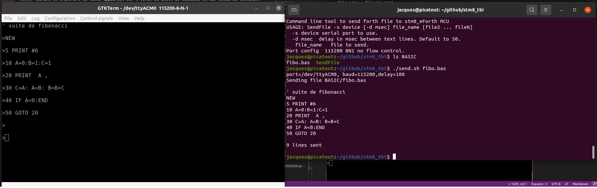

# référence du langage Tiny BASIC pour STM8 V2.5

<a id="index-princ"></a>
## index principal 

* [Types de données](#data)

* [Variables](#variables)

* [Expressions arithmétiques](#expressions)

* [Syntaxe](#syntaxe)

* [Bases numériques](#bases)

* [Ligne de commande](#cli)

* [Référence des commandes et fonctions](#index)

* [fichiers en mémoire FLASH](#fichiers)

* [Installation](#install)

* [Utilisation](#utilisation)

* [transfert de fichiers BASIC à la carte](#send)

* [Code source](#sources)

<a id="data"></a>
### Type de données 
Le seul type de donné numérique est l'entier 24 bits donc dans l'intervalle **-8388608...8388607**.  

Cependant pour des fins d'impression des chaînes de caractères entre guillemets sont disponibles. Seul les commandes **PRINT** et **INPUT** utilisent ces chaînes comme arguments. 

Le type caractère est aussi disponible sous la forme **\c** i.e. un *backslash* suivit d'un caractère ASCII. 

Il est aussi possible d'imprimer un caractère en utilisant la fonction **CHAR()**. **CHAR()** retourne un entier dans l'intervalle {0..127} du code ASCII.
Cette fonction peut-être utilisée dans une expression arithmétique mais la commande **PRINT** la traîte séparément en imprimant le caractère.
Dans l'exemple suivant la commande **PRINT** reçoit comme premier paramètre la function **CHAR(33)** et imprime le caractère ASCII **'!'**. Le deuxième paramètre 
est une expression arithmétique utilisant la fonction **CHAR(33)**. Dans ce cas l'expression est évaluée et sa valeur imprimé.

Le 2ième exemple produit une erreur de syntaxe car la commande **PRINT** consomme la fonction **CHAR(33)** et laisse une expression mal formée. 
 ```
 >? char(33),2*char(33)
!	66 

>? char(33)*2
!
run time error, syntax error
    0 ? CHAR ( 33 ) * 

>
``` 

[index principal](#index-princ)

<a id="variables"></a>
### Variables 

Dans la version **1.x**, Le nombre des variables était limité à 26, chacune d'elle étant représentée par une lettre de l'alphabet. 

La version **2.0** ajoute les variables définies par la commande [DIM](#dim). Ces variables peuvent avoir un nom d'un maximum de 15 caractères.

### Tableau 

Il n'y a qu'un seul tableau appelé **@** et dont la taille dépend de la taille du programme. En effet ce tableau utilise la mémoire RAM laissée libre par le programme. Un programme peut connaître la taille de ce tableau en invoquant la fonction [UBOUND](#ubound). Si le programme s'exécute à partir de la mémoire FLASH alors toute la RAM à l'exception de celle utilisée par le système BASIC est disponible pour le tableau **@**.  

Depuis la version **2.0**.  Le tableau **@** partage la mémoire RAM restante avec les constantes définies avec la directive [CONST](#const) et les variables définies avec la directive [DIM](#dim). Cependant le système réserve l'espace pour un tableau **@** de dimension **10**. 

### Symboles et étiquettes

Depuis la version **2.0** Il est possible de définir des noms symboliques d'au maximum 15 caractères. Ces noms doivent débuté par une lettre suivit de lettres, chiffres et des caractères **'_'**, **'.'** ainsi que **'?'**.  Ces symboles ont 3 usages.

<a id="label"></a>
1. Une __Étiquette__ est un symbole placé en début de ligne et qui peut servir de cible à une commande [GOTO](#goto) ou [GOSUB](#gosub). Une étiquette sur la permière ligne d'un programme sert à identifier le nom du programme pour les commandes [SAVE](#save) et [DIR](#dir).

1. Depuis la version **2.0** le mot réservé  [CONST](#const) permet de définir des constantes symboliques dans un programme. Les noms de constantes obéissent aux même critères que les étiquettes.  

1. Depuis la version **2.0** le mot réservé [DIM](#dim) permet de définir des variables symboliques dans un programme. Les noms de variables obéissent aux même critères ques les étiquettes.
Donc depuis la version **2.0** un programme n'est plus limité au 26 lettres de l'alphabet comme nom de variable. Notez cependant que les variables nommées par une lettre **A..Z** sont plus rapide d'accès puisque leur adresse est connue par le compilateur alors que les variables définies par [DIM](#dim) doivent-être recherchées dans un table à chaque invocation.

[index principal](#index-princ)
<a id="expressions"></a>
### expression arithmétiques 

Il y a 5 opérateurs arithmétiques par ordre de précédence:
1. **'(' ')'** les expressions entre parenthèses ont la plus hautre priorité.  
1. **'-'**  moins unaire, qui a la plus haute priorité après les parenthèses.
1.  __'*'__ mulitipliation, **'/'** division, **'%'** modulo 
1. **'+'** addition, **'-'** soustraction.

La division est tronquée vers le zéro et le quotient à le même signe que le dividende.

### opérateurs relationnels.

Les opérateurs relationnels ont une priorités inférieure à celle des opérateurs arithmétiques. Le résultat d'une relation est **0 si faux et -1 si vrai**. Ce résultat peut-être utilisé dans une expression arithmérique. Puisque les relations sont de moindre priorité elle doivent-être misent entre parenthèses lorsqu'elles sont utilisées dans une expression arithmétique.

1. **'&gt;'**   Retourne vrai si le premier terme est plus grand que le second.
1. **'&lt;'** Retourne vrai si le premier terme est plus petit que le second.
1. **'&gt;='** Retourne vrai si le premier terme est plus grand ou égal au second. 
1. **'&lt;='** Retourne vrai si le premier terme est plus petit ou égal au second. 
1. **'='** Retourne vrai si les 2 termes ont la même valeur. 
1. **'&lt;&gt;'** ou **'&gt;&lt;'** Retourne vrai si les 2 termes sont différents. 

### Opérateurs binaires/Booléens 

Les opérateurs **AND**,**NOT**, **OR** et **XOR** effectuent des opérations bit à bit mais peuvent-être aussi être utilisés comme opérateurs en logique combinatoire. Si ces opérateurs sont utilisés avec le résultat d'une relation alors le résultat est le même que pour un opérateur logique du même nom. C'est à dire que le résultat sera **0** ou **-1**.
par exemple:
```
a=3 ? a and 5
 1

``` 
Dans cet exemple le **AND** agit comme un opérateur bit à bit comme l'instruction machine du même nom. 
```
>? a>2 and a<4
 -1
>
```
Dans ce 2ième exemple l'opérateur **AND** agit comme un  opérateur en logique combinatoire et retourne -1 (VRAI).

Ces opérateurs ont une plus faible priorité que les opérateurs de comparaison. Entre eux ils ont la priorité suivante.

1. **NOT**   plus haute priorité des 4. 
1. **AND**   plus haute priorité que **OR** et **XOR**. 
1. **OR** et **XOR**  ont la même priorité. 

Les opérateurs de priorité identiques sont évalués de gauche à droite. Les parenthèses peuvent-être utilisées pour modifier la priorité des relations combinatoire.
```

>? not 3>5 and 4<0
   0 

>? not(3>5 and 4<0)
  -1 

>
```

[index principal](#index-princ)
<a id="syntaxe"></a>
## Syntaxe 

Le code utilisé pour le texte est le code [ASCII](https://fr.wikipedia.org/wiki/American_Standard_Code_for_Information_Interchange).

Un programme débute par un numéro de ligne suivit d'une ou plusieurs commandes séparées par le caractère **':'**.
```
>let t=ticks:for i=1 to 10000: let a=10:next i : ? ticks-t
400  
```
fonctionne sans problème.

Une commande est suivie de ses arguments séparés par une virgule. Les arguments des fonctions doivent-être mis entre parenthèses. Par fonction j'entends une commande BASIC qui retourne une valeur. Cependant une fonction qui n'utilise pas d'arguments n'est pas suivie de parenthèses. Les commandes qui ne retoune pas de valeur reçoivent leur arguments sans parenthèses. 

l'espace entre les unités lexicales est optionnel s'il n'y a pas d'embuiguité sur la séparation des unités lexicale.
```
?3*5  ' ici il n'y a pas d'ambiguité.
 15 

> for i=1to 100 :? i;: next i  ' ici il faut un espace entre 'to' et '100' 
```

Cependant il n'est pas nécessaire de mettre un espace entre le *1** et le **TO** car lorsqu'une unité lexicale commence par un chiffre 
il est évident que c'est un entier et l'analyseur s'arrête au dernier chiffre de l'entier. 

Les commandes peuvent-être entrées indifféremment en minuscule ou majuscule.
L'analyseur lexical convertie les lettres en  majuscules sauf à l'intérieur d'une chaîne entre guillemets.

Depuis la version **2.0** les abbréviations de commandes ne fonctionnent plus. Elles venaient en conflit avec les noms de variables court. Par exemple:
```
10 DIM PI=31416 
```
Le compilateur recherchait **PI** dans le dictionnaire des mots réservés et trouvait **PICK** ce qui générait une erreur au moment de l'exécution. J'ai donc modifié la routine *search_dict* pour refuser les abbréviations.

Certaines commandes sont représentées facultativement par une caractère unique. Par exemple la commande **PRINT** peut-être remplacée par le caractère **'?'**. La commande **REM** peut-être remplacée par un apostrophe (**'**). 

Plusieurs commandes peuvent-être présentent sur la même ligne. Le caractère **':'** est utilisé pour séparer les commandes sur une même ligne. Son utilisation est facultif s'il n'y pas pas d'ambiguité. 
```
>LET C=3 LET D=35 ' valide car il n'y pas d'ambiguité.

```

Une fin de ligne marque la fin d'une commande. Autrement dit une commande ne peut s'étendre sur plusieurs lignes. 

[index principal](#index-princ)
<a id="bases"></a>
## bases numériques
Les entiers peuvent-être indiqués en décimal,hexadécimal ou binaire. Cependant ils ne peuvent-être affichés qu'en décimal ou hexadécimal. 

Forme lexicale des entiers. Dans la liste qui suit ce qui est entre **'['** et **']'** est facultatif. Le caractère **'+'** indique que le symbole apparaît au moins une fois. Un caractère entre apostrophes est écris tel quel *(symbole terminal)*. **::=** introduit la définition d'un symbole.

*  digit::= ('0','1','2','3','4','5','6','7','8','9')
*  hex_digit::= (digit,'A','B','C','D','E','F') 
*  entier décimaux::=  ['+'|'-']digit+
*  entier hexadécimaux::= ['+'|'-']'$'hex_digit+
*  entier binaire::= ['+'|'-']'&'('0'|'1')+   

examples d'entiers:

    -13534 ' entier décimal négatif 
    +$ff0f  ' entier hexadécimal 
    -&101   ' entier binaire correspondant à 5 en décimal. 

[index principal](#index-princ)
<a id="cli"></a>
## Ligne de commande et programmes 
 
Au démarrage l'information sur Tiny BASIC est affichée. Ensuite viens l'invite de commande qui est représentée par le caractère **&gt;**. 
```
Tiny BASIC for STM8
Copyright, Jacques Deschenes 2019,2022
version 2.0

>
```
À partir de là l'utilisateur doit saisir une commande au clavier. Cette commande est considérée comme complétée lorsque la touche **ENTER** est enfoncée. La texte est d'abord compilé en *tokens*. Si il y a un numéro de ligne alors cette ligne est inséré dans l'espace mémoire réservé aux programmes sinon elle est exébutée immédiatement. 

* Un numéro de ligne doit-être dans l'intervalle {1...32767}.

* Si une ligne avec le même numéro existe déjà elle est remplacée par la nouvelle. 

* Si la ligne ne contient qu'un numéro sans autre texte et qu'il existe déjà une ligne avec ce numéro la ligne en question est supprimée. Sinon elle est ignorée. 

* Les lignes sont insérées en ordre numérique croissant. 

Certaines commandes ne peuvent-être utilisées qu'à l'intérieur d'un programme et d'autres seulement en mode ligne de commande. L'exécution est interrompue et un message d'erreur est affiché si une commande est utilisée dans un contexte innaproprié. 

Le programme en mémoire RAM est perdu à chaque réinitialiation du processeur sauf s'il a été sauvegardé en mémoire flash avec la commande [SAVE](#save). Si un programme doit-être sauvegardé en mémoire FLASH il doit comprendre au début de la première ligne une [étiquette](#label) pour être identifié par les commande [SAVE](#save),[DIR](#dir) et [RUN](#run). 

Notez qu'il peut-être intéressant d'écrire vos programmes sur le PC avec un éditeur de texte qui accepte  l'encodage ASCII ou UTF8. Les fichiers sur le PC peuvent-être envoyer à la carte avec le script [send.sh](send.sh) qui est dans le répertoire racine. Ce script fait appel à l'utilitaire [SendFile](BASIC/SendFile).

### Commandes d'édition

La fonction qui lit la ligne de commande permet les fonctions suivantes.

Touches|fonction 
-|-
BS|Efface le caractère à gauche 
ln CTRL+E|Édite la ligne 'ln'
CTLR+R|Ramène la dernière ligne saisie à l'écran.
CTRL+D|Supprime la ligne en cours d'édition. 
HOME| Déplace le curseur au début de ligne
END| Déplace le curseur à la fin de la ligne 
flèche gauche| Déplace le curseur vers la gauche 
flèche droite| Déplace le cureseur vers la droite
CTRL+O|Commute entre les modes insertion et écrasement

<a id="reference"></a>

<hr>

## Référence des commandes et fonctions.
la remarque **{C,P}** après le nom de chaque commande indique dans quel contexte cette commande ou fonction peut-être utilisée. **P** pour *programme* et **C** pour ligne de commande. Une fonction ne peut-être utilisée que comme argument d'une commande ou comme partie d'une expression. 

[index principal](#index-princ)

<a id="index"></a>
## INDEX du vocabulaire
nom|description 
-|-
[ABS](#abs)|Fonction qui retourne la valeur absolue.
[ADCON](#adcon)|active ou désactive le convertisseur analogue/numérique
[ADCREAD](#adcread)|Lecture analogique d'une broche.
[ALLOC](#alloc)| allocation d'espace sur la pile des expressions
[AND](#and)| opérateur binaire ET
[ASC](#asc)|Fonction qui retourne la valeur ASCII d'un caractère.
[AUTORUN](#autorun)|Active l'exécution automatique d'un programme.
[AWU](#awu)| met la carte en sommeil pour un temps déterminé.
[BIT](#bit)| calcule le masque d'un bit. 
[BRES](#bres)|met un bit à zéro.
[BSET](#bset)|met un bit à 1.
[BTEST](#btest)|Vérifie l'état d'un bit.
[BTOGL](#btogl)|Inverse l'état d'un bit.
[BUFFER](#buffer)|alloue un tampon mémoire.
[BYE](#bye)|met la carte en sommeil.
[CHAIN](#chain)|Chaîne l'exécution d'un programme. 
[CHAR](#char)|Fonction qui retourne le caractère ASCII correspondant au code.
[CONST](#const)|Directive pour définir des constantes.
[CR1](#cr1)|Constante système qui retourne l'offset du registre CR1 d'un port GPIO
[CR2](#cr2)|Constante système qui retourne l'offset du registre CR2 d'un port GPIO
[DATA](#data)|Directive débutant une ligne de données.
[DDR](#ddr)|Constante système qui retourne l'offset du registre DDR d'un port GPIO
[DEC](#dec)|Définie la base décimale pour l'impresssion des nombres.
[DIM](#dim)|Directive pour définir des variables symboliques.
[DIR](#dir)|Commande pour afficher la liste des programmes sauvegardés en mémoire FLASH.
[DO](#do)|Directive débutant une boucle DO..UNTIL.
[DREAD](#dread)|Lecture d'une broche GPIO en mode numérique.
[DROP](#drop)| libère n éléments du sommet de la pile des expressions.
[DWRITE](#dwrite)|Écriture d'une broche en mode numérique.
[EDIT](#edit)|Charge en mémoire RAM un programme sauvegardé pour édition.
[EEFREE](#eefree)|Retourne la première adresse EEPROM libre.
[EEPROM](#eeprom)|Retourne l'adresse de début de l'EEPROM.
[END](#end)|Termine l'exécution d'un programme.
[ERASE](#erase)|Supprime un programme sauvegardé en mémoire FLASH.
[FCPU](#fcpu)|Sélectionne la fréquence de fonctionnement du MCU.
[FOR](#for)|Directive qui débute une boucle FOR..NEXT 
[FREE](#free)|Retourne le nombre d'octets libre en mémoire rAM.
[GET](#get)|Lecture d'un carctère dans une variable.
[GOSUB](#gosub)|Appel d'une sous-routine
[GOTO](#goto)|Branchement inconditionnel
[HEX](#hex)|Définie la base hexadécimal comme fomrat pour l'impression des nombres.
[I2C.CLOSE](#i2c_close)| ferme le périphérique I2C. 
[I2C.OPEN](#i2c_open)| ouvre le périphérique I2C.
[I2C.READ](#i2c_read)| lecture de données d'un dispositif I2C.
[I2C.WRITE](#i2c_write)| envoie de commandes ou données à un dispositif I2C.
[IDR](#idr)|Constante système qui retourne l'offset du registre IDR d'un port GPIO.
[IF](#if)|Directive d'exécution conditionnelle.
[INPUT](#input)|Directive de lecture d'un nombre dans une variable.
[IWDGEN](#iwdgen)|Activation de l'Independant Watchdog Timer.
[IWDGREF](#iwdgref)|Raffrachie le IDWD avant qu'il n'expire.
[KEY](#key)|Attend un caractère du termnal.
[KEY?](#qkey)|Vérifie si un caractère es disponible du terminal.
[LET](#let)|Affectation de varaiable.
[LIST](#list)|Commande pour afficher le texte d'un programme.
[LOG2](#log)|Retourne le log base 2 d'un entier.
[LSHIFT](#lshift)|Décalage d'un entier vers la gauche.
[NEW](#new)|Vide la mémoire RAM.
[NEXT](#next)|Termine une boucle FOR..NEXT.
[NOT](#not)|Opérateur d'inversion des bits d'un entier. i.e complément à 1.
[ODR](#odr)|Constante système qui retourne l'offset du registre ODR d'un port GPIO
[ON](#on)|Directive GOTO ou GOSUB sélectif. 
[OR](#or)|Opérateur binaire OU.
[PAD](#pad)|Constante système qui retourne l'adresse d'un tampon de 128 octets.
[PAUSE](#pause)|suspend l'excétion pour un certains nombre de millisecondes.
[PEEK](#peek)|Retourne la valeur de l'octet à l'adresse passé en argument.
[PICK](#pick)|Retourne la valeur de l'entier à la position n sur la pile des expressions.
[PINP](#pinp)|Lecture d'une broche en mode numérique sur un des connecteurs D.
[PMODE](#pmode)|Sélectionne le mode entrée|sortie d'une broche sur un des connecteurs D.
[POKE](#poke)|Dépose une valeur octet à l'adresse passée en argument.
[POP](#pop)|Retire et retourne le sommet de la pile des arguments.
[POUT](#pout)|Modifie la sortie numérique d'une des broches sur un connecteur D.
[PRINT ou ?](#print)| Imprime sur le terminal une liste de valeurs. 
[PORTA](#prtx)|Constante système qui retourne l'adresse du port GPIO A 
[PORTB](#prtx)|Constante système qui retourne l'adresse du port GPIO B
[PORTC](#prtx)|Constante système qui retourne l'adresse du port GPIO C
[PORTD](#prtx)|Constante système qui retourne l'adresse du port GPIO D
[PORTE](#prtx)|Constante système qui retourne l'adresse du port GPIO E
[PORTF](#prtx)|Constante système qui retourne l'adresse du port GPIO F
[PORTG](#prtx)|Constante système qui retourne l'adresse du port GPIO G
[PORTI](#prtx)|Constante système qui retourne l'adresse du port GPIO I
[PUSH](#push)|Empile la valeur de l'expression qui suit sur la pile des expressions.
[PUT](#put)|Insère à la position n la valeur de l'expression sur la pile des expressions.
[READ](#read)|Lecture d'une donnée sur une ligne DATA.
[REBOOT](#reboot)|Redémarre la carte.
[REM ou '](#rem)| Débute un commentaire.
[RESTORE](#restore)|Réinitialise le pointeur DATA.
[RETURN](#return)|Quitte une sous-routine.
[RND](#rnd)|Retourne un nombre aléatoire.
[RSHIFT](#rshift)|Décalage vers la droite d'un entier.
[RUN](#run)|Commande pour lancer l'exécution d'un programme.
[SAVE](#save)| Sauvegarde le programme en mémoire FLASH. 
[SIZE](#size)| Commande qui affiche  l'information sur le programme actif.
[SLEEP](#sleep)|Met le MCU en sommeil. Il peut-être réactivé par une interruption externe.
[SPIEN](#spien)|Active un périphérique SPI
[SPIRD](#spird)|Lecture du périphérique SPI
[SPISEL](#spisel)|Sélectionne le périphérique SPI
[SPIWR](#spiwr)|Écriture sur un périphérique SPI.
[STEP](#step)|Détermine l'incrément dans une boucle FOR..NEXT.
[STOP](#stop)|Arrête l'exécution d'un programme et renvoie à la ligne de commande.
[TICKS](#ticks)|Retourne le nombre de millisecondes depuis le démarrage de la carte.
[TIMEOUT](#timeout)|Fonction qui retourne VRAI si le TIMER a expiré.
[TIMER](#timer)|Démarre la minuterie.
[TO](#to)|Directive déterminant la limite d'une boucle FOR..NEXT.
[TONE](#tone)|Génère une toanlité.
[UBOUND](#ubound)|Retourne l'indice maximum du tableau @.
[UFLASH](#uflash)|Retourne la première adresse libre de la mémoire FLASH.
[UNTIL](#until)|Directive qui termine une boucle DO..UNTIL.
[USR](#usr)|Appel d'une routine écrite en code machine.
[WAIT](#wait)|Moniteur l'état d'une broche et attend jusqu'à l'état désiré 
[WORDS](#words)|Affiche la liste des mots réservés.
[WRITE](#write)|Écriture de donnés dans la mémoire FLASH ou EEPROM.
[XOR](#xor)|opérateur binaire OU exclusif.

[index principal](#index-princ)
<hr>

<a id="abs"></a>
### ABS(*expr*)  {C,P}
Cette fonction retourne la valeur absolue de l'expression fournie en argument. 

    >? abs(-45)
    45
[index](#index)
<a id="adcon"></a>
### ADCON 0|1 [,diviseur]
Active **1** ou désactive **0** le convertisseur analogique/numérique. *diviseur* détermine la fréquence d'horloge du convertisseur et doit-être un entier dans l'intervalle {0..7}. Il s'agit d'un diviseur donc **7** correspond à la fréquence la plus basse. Le diviseur s'applique à Fosc qui est de 16Mhz. Il faut 11 cycles d'horloges pour chaque conversion.  Il s'agit d'un convertisseur 10 bits donc le résultat est entre 0...1023. Si l'argument *diviseur* est omis c'est la fréquence maximale qui est utilisée.

paramètre|diviseur|fréquence
-|-|-
0|2|8Mhz
1|3|5,33Mhz
2|4|4Mhz
3|6|2,66Mhz
4|8|2Mhz
5|10|1,6Mhz
6|12|1,33Mhz 
7|18|0,89Mhz
```
>adcon 1,0 ' active ADC fréquence maximale

>?adcread(0) 'Lecture canal 0 
 757

>adcon 0 ' desactive l'ADC.
```
On peut désactiver le convertisseur pour réduire la consommation du MCU.

[index](#index)
<a id="adcread"></a>
### ADCREAD(canal)
Lecture d'une des 6 entrées analogiques reliées au connecteur CN4. L'argument **canal** détermine quel entrée est lue {0..5}. Cette fonction est l'équivalent de la fonction *AnalogRead* de l'API Arduino.
```
>adcon 1,0 ' active ADC fréquence maximale

>?adcread(0) 'Lecture canal 0 
 655

```

[index](#index)
<a id="alloc"></a>
### ALLOC n {C,P}
Réserve *n* éléments sur la pile des expressions. Ces éléments peuvent-être utilisées comme variables locales jeter après usage avec la commande [DROP n](#drop). 

[index](#index)
<a id="and"></a>
### *expr1|rel1|cond1* AND *expr2|rel2|cond2* {C,P}
Opérateur logique bit à bit entre les 2 expressions. L'équivalent de l'opérateur **&** en C. Cependant cet opérateur peut aussi être utilisé comme opérateur en logique combinatoire.  s'il est situé entre 2 relations plutôt qu'entre 2 expressions arithmétiques.

Voir aussi [NOT](#not),[OR](#or),[XOR](#xor).

```
>a=2 ? a
   2 

>b=4 ? b
   4 

>if a>=2 and b<=4 ? "vrai" 
   vrai 

>
```

[index](#index)
<a id="asc"></a>
### ASC(*string*|*char*) {C,P}
La fonction **ascii** retourne la valeur ASCII du premier caractère de la chaîne fournie en argument ou du caractère.
```
    >? asc("A")
    65 

    >? asc(\Z)
    90

    >
```
[index](#index)
<a id="autorun"></a>
### AUTORUN \C|name {C}
Cette commande sert à sélectionner un programme qui a été sauvegardé en mémoire FLASH pour qu'il démarre automatiquement lors de l'initialisation du système. 
* **\E**  Annule la fonction autorun 
* *name* est le nom du programme a démarrarer automatiquement. Voir [fichiers](#fichiers) pour savoir comment nommer un programme.

[index](#index)
<a id="awu"></a>
### AWU *expr*  {C,P}
Cette commande arrête le MCU pour une durée déterminée. Son nom vient du périphérique utilisée **AWU** qui signifit  *Auto-WakeUp*.  Ce périphérique utilise l'oscillateur LSI de 128 Khz pour alimenter un compteur. Lorsque le compteur arrive à expiration une interruption est activée. Ce périphérique déclenché par l'instruction machine **HALT** qui arrête l'oscillateur interne **HSI** de sorte que le MCU et les périphériques internes à l'exception de celui-ci cessent de fonctionner. Ce mode réduit la consommation électrique au minimum. *expr* doit résutler en un entier dans l'interval {1..32720}. Cet entier correspond à la durée de la mise en sommeil en millisecondes.
```
>awu 1  ' sommeil d'une milliseconde

>awu 30720 ' sommeil maximal de 30.7 secondes

>
```

L'Oscillateur **LSI** possède une précision de +/-12.5% sur l'étendu de l'échelle de température d'opération du MCU.  Il ne faut donc pas attendre une grande précision de cette commande. La commande **PAUSE**  est plus précise mais consomme plus de courant. **AWU** est surtout utile pour les applications fonctionnant sur piles pour prolonger la durée de celles-ci.

[index](#index)
<a id="bit"></a>
### BIT(*expr*) {C,P}
Cette fonction retourne 2^*expr*  (2 à la puissance n). *expr* doit-être entre {0..15} 
```
>for i=0 to 15: ? bit(i),:next i
   1   2   4   8  16  32  64 128 256 512 1024 2048 4096 8192 16384 -32768
   
> bset $500a,bit(5) ' allume LD2 sur la carte

```
[index](#index)
<a id="bres"></a>
### BRES addr,mask {C,P}
La commande **bit reset** met à **0** les bits de l'octet situé à *addr*. Seul les bits à **1** dans l'argument *mask* sont affectés. 

    >bres $500a,32 

Éteint la LED2 sur la carte en mettant le bit 5 à 0. **Notez** que les bits sont numérotés de **0..7**, **0** étant le bit le moins significatif. 

[index](#index)
<a id="bset"></a>
### BSET addr,mask  {C,P}
La commande **bit set** met à **1** les bits de l'octet situé à *addr*. Seul les bits à **1** dans l'argument *mask* sont affectés. 

    >bset $500a,&100000

Allume la LED2 sur la carte en mettant le bit 5 à 1.

[index](#index)
<a id="btest"></a>
### BTEST(addr,bit) {C,P}
Cette fonction retourne l'état du *bit* à *addr*.  Permet entre autre de lire l'état d'une broche GPIO configurée en entrée.
*bit* doit-être dans l'intervalle {0..7}. 
```
>? btest($50f3,0)
   1

>? btest($50f3,5)
   0
```

[index](#index)
<a id="btogl"></a>
### BTOGL addr,mask  {C,P}
La commande **bit toggle** inverse les bits de l'octet situé à *addr*. Seul les bits à **1** dans l'argument *mask* sont affectés. 
```
    >btogl $500a,32
```

Inverse l'état de la LED2 sur la carte. 

[index](#index)
<a id="buffer"></a>
### BUFFER *nom*, *grandeur* {P}
Cette commande permet de réserver de la mémoire RAM pour utilisation comme tampon d'octets. Les données sont écrites dans le tampon avec la commande [POKE](#poke) et lus avec la fonction [PEEK](#peek). Voir les programmes [i2c_eeprom.bas](BASIC/i2c_eeprom.bas) et [i2c_oled.bas](BASIC/i2c_oled.bas) pour des exemples d'utilisation de cette commande. 

* *nom* est le nom de la variable qui retourne l'adresse du tampon.

* *grandeur* est la taille en octets du tampon. 

```
>list
   10  BUFFER BUF , 16
   20  FOR I= BUF  TO I+ 15 POKE I, RND( 255) NEXT I
   30  FOR I= BUF  TO I+ 15 PRINT PEEK( I); NEXT I
program address:  $90, program size:  108 bytes in RAM memory

>run
 215 248 88 147 11 229 252 86 214 192 27 194 136 88 227 115
>
```

[index](#index)
<a id="bye"></a>
### BYE  {C,P}
Met le microcontrôleur en mode sommeil profond. Dans ce mode tous les oscilleurs sont arrêtés et la consommation électrique est minimale. Une interruption extérieure ou un *reset* redémarre le MCU. Sur la care **NUCLEO-8S208RB** il y a un bouton **RESET** et un bouton **USER**. Le bouton **USER** est connecté à l'interruption externe **INT4** donc permet de réveiller le MCU. Au réveil le MCU est réinitialisé.

[index](#index)
<a id="chain"></a>
### CHAIN name,line# {P}
Cette commande permet de lancer l'exécution d'un programme à partir d'un autre programme. Lorsque le programme ainsi lancer se termine l'exécution poursuit dans le programme qui à lancer ce dernier après la commande **CHAIN**. Un programme lancer par **CHAIN** peut à son tour lancer un autre programme de la même façon. Chaque appel par cete commande utilise 8 octets sur la pile de contrôle. Il faut donc faire attention de ne pas créer une chaîne trop longue. La pile de contrôle est de 140 octets et est utilisées pour les boucles et les GOSUB, les interruptions et les appels de sous-routines en code machine. Les programmes appellés par **CHAIN** doivent résidés en mémoire FLASH. 

[index](#index)
<a id="char"></a>
### CHAR(*expr*) {C,P}
La fonction *character* retourne le caractère ASCII correspondant aux 7 bits les moins significatifs de l'expression utilisée en argument. Pour l'interpréteur cette fonction retourne un jeton de type **TK_CHAR** qui n'est reconnu que par les commandes **PRINT** et **ASC**.

    >for a=32 to 126:? char(a),:next a 
     !"#$%&'()*+,-./0123456789:;<=>?@ABCDEFGHIJKLMNOPQRSTUVWXYZ[\]^_`abcdefghijklmnopqrstuvwxyz{|}~
    > 


[index](#index)
<a id="const"></a>
### CONST nom=valeur [,nom=valeur] {P}
Cette commande sert à créer des constantes qui utilisent la mémoire RAM disponible après le programme.
 * **nom** est le nom de la constante. 
 * **valeur** est la valeur de cette constante. Il peut s'agit d'une expression. 
 * Plusieurs constantes peuvent-être définies dans la même commande en les séparant par une virgule.
 ```
>li
    5 ' test vitesse d'utilisation d'une constante symbolique par rapport
    6 ' a une constante numerique. 
   10 CONST TEST =1024
   20 PRINT "test assignation d'une variable."
   24 PRINT "constante numerique: ",
   30 T=TICKS FOR I=1 TO 10000 A=20490 NEXT I PRINT TICKS-T "MSEC."
   34 PRINT "constante symbolique: ",
   40 T=TICKS FOR I=1 TO 10000 A= TEST NEXT I PRINT TICKS-T "MSEC."
   50 CONST LED2 =20490
   60 PRINT "test basculement etat LED2 sur la carte."
   64 PRINT "constante numerique: ",
   70 T=TICKS FOR I=1 TO 10000 BTOGL 20490,32 NEXT I PRINT TICKS-T "MSEC."
   74 PRINT "constante symbolique: ",
   80 T=TICKS FOR I=1 TO 10000 BTOGL LED2 ,32 NEXT I PRINT TICKS-T "MSEC."
program address:  $80, program size:  600 bytes in RAM memory

>run
test assignation d'une variable.
constante numerique:  397 MSEC.
constante symbolique:  540 MSEC.
test basculement etat LED2 sur la carte.
constante numerique:  651 MSEC.
constante symbolique:  770 MSEC.

>
 ```

[index](#index)
<a id="cr1"></a>
### CR1 (C,P)

Cette constante système retourne l'index du registre **CR1** *(Control Register 1)* d'un port GPIO. En mode entrée ce registre active ou désactive le pull-up. En mode sortie il configure le mode push-pull ou open-drain. 

Voir aussi [ODR](#odr),[IDR](#idr),[DDR](#ddr),[CR2](#cr2)

[index](#index)
<a id="cr2"></a>
### CR2 {C,P}
Cette constante système retourne l'index du registre **CR2** *(Control Register 2)* d'un port GPIO. En mode entrée ce registre active ou désactive l'interruption externe. En mode sortie il configure la vitesse du port. 

Voir aussi [ODR](#odr),[IDR](#idr),[DDR](#ddr),[CR1](#cr1)

[index](#index)
<a id="data"></a>
### DATA {P}
Cette directive permet de définir des données dans un programme. L'interpréteur ignore les lignes qui débute par **DATA**.  Ces lignes ne sont utilisées que par la fonction [READ](#read). Notez que contrairement à MS-BASIC il s'agit d'un fonction et non d'une commande. Cette fonction ne prend aucn argument.

Voir aussi [RESTORE](#restore).

```
>list
    5 ' joue 4 mesures de l'hymne a la joie
   10 RESTORE 
   20 DATA 440,250,440,250,466,250,523,250,523,250,466,250,440,250
   30 DATA 392,250,349,250,349,250,392,250,440,250,440,375,392,125
   40 DATA 392,500
   50 FOR I =1TO 15:TONE READ ,READ :NEXT I 
```

[index](#index)
<a id="ddr"></a>
### DDR {C,P}
Cette constante système retourne l'index du registre **DDR** *(Data Direction Register)* d'un périphérique GPIO. Ce registre permet de configurer les bits du port en entrée ou en sortie. Par défaut ils sont tous en entrée. 

Voir aussi [ODR](#odr),[IDR](#idr),[CR1](#cr1),[CR2](#cr2)

```
>bset portc+ddr,32 ' LED2 en sortie

>
```

[index](#index)
<a id="dec"></a>
### DEC {C,P}
La commande *decimal* définie la base numérique pour l'affichage des entiers à la base décimale. C'est la base par défaut. 

Voir aussi [HEX](#hex).

```
>HEX:?-10:DEC:?-10
$FFFFF6
-10
```
[index](#index)
<a id="dim"></a>
### DIM var_name[=expr][,var_name[=expr]] {P}
La commande DIM sert à déclarer des variables autres que les 26 variables **A..Z** du tinyBASIC. Il s'agit d'une extension au langage TinyBASIC disponible depuis la version **2.x**. Les noms de variables obéissent au même règles que les noms d'étiquettes.   
* **nom** est le nom de la variable. 
 * **valeur** est la valeur d'initialisation de la variable. Il peut s'agit d'une expression. Les variables sont initialisées par défaut à 0. 
 * Plusieurs variables peuvent-être définies dans la même commande en les séparant par une virgule.

[index](#index)
<a id="do"></a>
### DO {C,P}
Mot réservé qui débute une boucle **DO ... UNTIL** Les instructions entre  **DO** et **UNTIL**  s'exécutent en boucle aussi longtemps que l'expression qui suit **UNTIL** est fausse.  Voir [UNTIL](#until). 
```
>li
   10 A = 1 
   20 DO 
   30 PRINT A ,
   40 A =A + 1 
   50 UNTIL A > 10 

>run
   1   2   3   4   5   6   7   8   9  10
``` 
[index](#index)
<a id="dir"></a>
## DIR {C}
Cette commande sert à afficher la liste des programmes sauvegardés en mémoire FLASH du MCU. Contrairement à la vesion **1.x** qui sauvegardait les fichiers dans les 96Ko de mémoire étendue du STM8S208R, la version **2.x** Utilise seulement la mémoire FLASH après le système BASIC et 0xFFFF. La raison en est que les programmes sauvegardés sont maintenant exécutés in situ plutôt que copiés en mémoire RAM. Pour les raisons suivantes: 

1. Ça libère la RAM pour les données de l'applciation. 
1. L'interpréteur BASIC ne peut exécuter du code en mémoire étendue. Il serait cependant possible de le modifier pour qu'il exécute des programmes en mémoire FLASH étendue mais avec une pénalité de performance. 
voir les commandes [SAVE](#save),[ERASE](#erase) et [AUTORUN](#autorun).
```
>dir
$B984   97 bytes,BLINK
$BA04  138 bytes,FIBONACCI
```
[index](#index)
<a id="dread"></a>
### DREAD *pin*
Cette fonction permet de lire l'état d'une des broches **D0..D15** du connecteur **CN8** 
Lorsqu'elle est configuré avec **PMODE** en mode entrée. Cette fonction retourne **0** si l'entrée est à zéro volt ou **1** si l'entrée est à Vdd. 
```
10 PMODE 5,PINP 
20 ? DREAD(5)
```
[index](#index)
<a id="drop"></a>
### DROP *n* {C,P}
Cette commande jette *n* éléments préalablement réservés sur la pile des expressions avec la commande [ALLOC](#alloc). 


[index](#index)

<a id="dwrite"></a>
### DWRITE *pin*,*level* 
Le connecteur **CN8**  de la carte **NUCLEO** indentifie les broches selon la convention *Arduino*. Ainsi les broches notées **D0...D15** peuvent-être utilisées en entrée ou sortie digitales, i.e. leur niveau est à 0 volt ou à Vdd.  **DWRITE** est une commande qui porte le même nom que la fonction Arduino et qui permet d'écrire **0|1** sur l'une de ces broche lorsqu'elle est configurée en mode sortie. *pin* est une numéro entre **0...15** et *level* est soit **PINP** ou **POUT**. Avant d'utiliser **DWRITE** sur une broche il faut utiliser **PMODE** pour configurée la broche en sortie. 
```
10 PMODE 10,POUT ' mettre D10 en sortie 
20 DWRITE 10, 0  , Met la sortie D10 a zero.
```

[index](#index)
<a id="edit"></a>
### EDIT name {C}
Copie le programme *name* sauvegardé en mémoire FLASH dans la RAM pour modification.
```
Tiny BASIC for STM8
Copyright, Jacques Deschenes 2019,2022
version 2 .0 
running application at address: $AA84 479 

>size
program address: $AA84 program size: 106 bytes

>edit PERFORMANCE 

>list
program size: 106 bytes
   1  PERFORMANCE
  10  ' ceci est un test de performance 
  20  T=TICKS
  30  FOR I=1 TO 10000 GOSUB 100 NEXT I
  40  PRINT TICKS-T
  50  END
 100  RETURN

>size
program address: $80 program size: 106 bytes

>
```

[index](#index)
<a id="eefree"></a>
### EEFREE {C,P}
Cette fonction retourne l'adresse EEPROM libre. C'est à dire celle après la dernière constante définie.
```
>li \c
   0 constants in EEPROM

>? eefree
16384 

>const LED2=bit(5)

>li \c
LED2=  32
   1 constants in EEPROM

>? eefree
16393 

>
```

[index](#index)
<a id="eeprom"></a>
### EEPROM {C,P}
Retourne l'adresse du début de la mémoire EEPROM.
```
>?pe(ee) 'print peek(eeprom)
 $AA

>?ee,pe(ee)
 $4000 $AA

>?pe(ee+1)
  $0

>wr ee+1,$55 'write 16385,85

>?pe(ee+1) ' verifie 
  85

>
```

[index](#index)
<a id="end"></a>
### END {C,P}
Cette commande arrête l'exécution d'un programme et retourne le contrôle à la ligne de commande. Cette commande peut-être placée à plusieurs endroits dans un programme. Elle peut aussi être utlisée sur la ligne de commande pour interrompre un programme après l'invocation d'une commande STOP.
```
>lis
   10 a=1
   20 a=a+1
   30 ? a,: if a>100:end 'arrete lorsque A depasse 100
   40 goto 20

>run
   2   3   4   5   6   7   8   9  10  11  12  13  14  15  16  17  18  19  20  21  22  23  24  25  26  27  28  29  30  31  32  33  34  35  36  37  38  39  40  41  42  43  44  45  46  47  48  49  50  51  52  53  54  55  56  57  58  59  60  61  62  63  64  65  66  67  68  69  70  71  72  73  74  75  76  77  78  79  80  81  82  83  84  85  86  87  88  89  90  91  92  93  94  95  96  97  98  99 100 101
>
```
[index](#index)
<a id=erase></a>
### ERASE \E|\F|NAME {C}
Cette commande sert à effacer la mémoire EEPROM ou FLASH ou un programme en mémoire FLASH.

* **ERASE \E** Efface tout le contenue de la mémoire EEPROM. 
* **ERASE \F** Efface tout le contenue de la mémoire FLASH après le système BASIC. Le système BASIC n'est pas affecté. 
* **ERASE nom** Sert à effacer un seul programme qui a été sauvegardé en mémoire FLASH. Voir [DIR](#dir).

[index](#index)
<a id="fcpu"></a>
### FCPU *integer*
Cette commande sert à contrôler la fréquence d'horloge du CPU. Au démarrage le CPU fonctionne à la fréquence de l'oscillateur interner **HSI** qui est de 16 Mhz. Cette commande permet de réduire la fréquence par puissance de 2 à dans l'intervalle **0..7**. Fcpu=16Mhz/2^7.
```
>fcpu 7 ' Fcpu=125 Khz

>t=ticks for a=1 to 10000 next a ? ticks-t "msec"
 19147 msec

>fcpu 0 ' Fcpu=16 Mhz 

>t=ticks for a=1 to 10000 next a ? ticks-t "msec"
 102 msec

>

```
Réduire la vitesse du CPU permet de réduire la consommation électrique. Notez que la fréquence de fonctionnement des périphériques demeure à 16Mhz.

[index](#index)
<a id="for"></a>
### FOR *var*=*expr1* TO *expr2* [STEP *expr3*] NEXT *var* {C,P}
Cette commande initialise une boucle avec compteur. La variable est initialisée avec la valeur de l'expression *expr1*. À chaque boucle la variable est incrémentée de la valeur indiquée par *expr3* qui suit le mot réservé [STEP](#step). Si [STEP](#step) n'est pas indiqué la valeur par défaut **1** est utilisée. Une boucle **FOR** se termine par la commande [NEXT](#next) tel qu'indiqué plus bas. Les instructions entre les comamndes **FOR** et [NEXT](#next)
peuvent s'étaler sur plusieurs lignes à l'intérieur d'un programme. Mais sur la ligne de commande le bloc au complet doit-être sur la même ligne.

La boucle FOR...NEXT est excéutée au moins une fois même si la limite est déjà dépassée par la condition initiale de la variable de contrôle. Ceci est du au fait que l'incrément et la vérification de la limite est effectuée par la commande **NEXT** qui vient à la fin de la boucle.  

```
>for a=1to10:? a,:next a
   1   2   3   4   5   6   7   8   9  10
>
``` 
Exemple de boucle FOR...NEXT dans un programme.
```
>li
    5 ' table de multiplication de 1 a 17
   10 for a=1to17
   20 for b=1to17
   30 ?a*b,
   40 next b:?
   50 next a

>run
   1   2   3   4   5   6   7   8   9  10  11  12  13  14  15  16  17
   2   4   6   8  10  12  14  16  18  20  22  24  26  28  30  32  34
   3   6   9  12  15  18  21  24  27  30  33  36  39  42  45  48  51
   4   8  12  16  20  24  28  32  36  40  44  48  52  56  60  64  68
   5  10  15  20  25  30  35  40  45  50  55  60  65  70  75  80  85
   6  12  18  24  30  36  42  48  54  60  66  72  78  84  90  96 102
   7  14  21  28  35  42  49  56  63  70  77  84  91  98 105 112 119
   8  16  24  32  40  48  56  64  72  80  88  96 104 112 120 128 136
   9  18  27  36  45  54  63  72  81  90  99 108 117 126 135 144 153
  10  20  30  40  50  60  70  80  90 100 110 120 130 140 150 160 170
  11  22  33  44  55  66  77  88  99 110 121 132 143 154 165 176 187
  12  24  36  48  60  72  84  96 108 120 132 144 156 168 180 192 204
  13  26  39  52  65  78  91 104 117 130 143 156 169 182 195 208 221
  14  28  42  56  70  84  98 112 126 140 154 168 182 196 210 224 238
  15  30  45  60  75  90 105 120 135 150 165 180 195 210 225 240 255
  16  32  48  64  80  96 112 128 144 160 176 192 208 224 240 256 272
  17  34  51  68  85 102 119 136 153 170 187 204 221 238 255 272 289

>
```

[index](#index)
<a id="free"></a>
### FREE {C,P}
Cette fonction retourne le nombre d'octets libre dans la mémoire RAM.
```
>new

>? free
5608 

>10 ? "hello world!"

>? free
5588 

>
```

[index](#index)
<a id="get"></a>
### GET *var* 
Cette commande fait la lecture d'un caractère en provenance du terminal et place sa valeur ASCII dans la variable *var*. **GET** contrairement à [KEY](#key) n'attend pas la réception d'un caractère. Si aucun caractère n'est disponible la valeur 0 est placé dans la variable et le programme continu après cette commande. 
```
 10 PRINT "Enfoncez une touche pour arrêter le programme\n"  PAUSE 400
20 DO ? "hello ",  GET A UNTIL A<>0 

```

[index](#index)
<a id="gosub"></a>
### GOSUB *line#*|*label* {P}
Appel de sous-routine., *line#* doit être un numéro de ligne existant sinon le programme arrête avec un message d'erreur. 

*label* est une étiquette placée en début de ligne et qui peut-être utilisée au lieu d'un numéro de ligne.

```
>li
5 ' test GOSUB with line# and label
10 GOSUB 100 
20 GOSUB LBL1 
30 END 
100 ? "GOSUB line# works!" return 
200 LBL1 ? "GOSUB label works!" return 

>run
GOSUB line# works!
GOSUB label works!

>
```

[index](#index)
<a id="goto"></a>
### GOTO *line#*|label {P}
Saute à la ligne dont le numéro est déterminé par *line#*. Cette ligne doit existée sinon le programme s'arrête avec un message d'erreur.

Une étiquette *label* peut-être utilisée à la place d'un numéro de ligne. 

```
>li
    5 ' test GOTO avec line# et label 
   10 GOTO 100
   20  LBL1 PRINT "GOTO label works!"
   30 END
  100 PRINT "GOTO line# works!"GOTO LBL1 
program address:  $80, program size:  119 bytes in RAM memory

>run
GOTO line# works!
GOTO label works!

>
```
[index](#index)
<a id="hex"></a>
### HEX {C,P}
Sélectionne la base numérique hexadécimale pour l'affichage des entiers.

Voir auddi [DEC](#dec).
```
>HEX ?-10 DEC:?-10
$FFFFF6
  -10
```
[index](#index)

<a id="i2c_close"></a>
## I2C.CLOSE {C,P}
Cette commande sert à fermer le périphérique I2C du MCU. voir [I2C.OPEN](#i2c_open).

[index](#index)

<a id="i2c_open"></a>
## I2C.OPEN *freq* (C,P)
Cette commande sert à ouvrir le périphérique I2C du MCU. Ce périphérique est connecté aux broches PE:1 et PE:2 du MCU. Voir les programmes [i2c_eeprom.bas](BASIC/i2c_eeprom.bas) et [i2c_oled.bas](BASIC/i2c_oled.bas)  pour des exemples de son utilisation.

[index](#index)

<a id="i2c_read"></a>
## I2C.READ *dev_id*,*count*,*buf*,*stop* {C,P}
Commande pour la lecture de données en provenance d'un dispositif utilisant l'interface I2C. Voir les programmes [i2c_eeprom.bas](BASIC/i2c_eeprom.bas) et [i2c_oled.bas](BASIC/i2c_oled.bas)  pour des exemples de son utilisation.

* *dev_id*  est l'adresse I2C du dispositif. 
* *count*   est le nombre d'octets qui doivent-être lus. 
* *buf*     est l'adresse du tampon mémoire qui doit recevoir les octets lus.
* *stop*    Prend les valeurs **0** ou **1**. **0** -> libère le bus de l'interface après la transatcion. **1** ne libère pas le bus.

[index](#index)

<a id="i2c_write"></a>
## I2C.WRITE *dev_id*,*count*,*buf*,*stop* {C,P}
Commande pour l'envoie de données vers un dispositif utilisant l'interface I2C. Voir les programmes [i2c_eeprom.bas](BASIC/i2c_eeprom.bas) et [i2c_oled.bas](BASIC/i2c_oled.bas)  pour des exemples de son utilisation.

* *dev_id*  est l'adresse I2C du dispositif. 
* *count*   est le nombre d'octets qui doivent-être lus. 
* *buf*     est l'adresse du tampon mémoire qui contient les octets à envoyer au périphérique.
* *stop*    Prend les valeurs **0** ou **1**. **0** -> libère le bus de l'interface après la transatcion. **1** ne libère pas le bus.

[index](#index)
<a id="idr"></a>
### IDR {C,P}
Constante système qui correspond à l'offset du registre **IDR** par rapport à l'adresse de base d'un port GPIO. 
Un port GPIO utilise 5 registres de configurations: 

* [ODR](#odr) *Output Data Register*, offset 0 

* [IDR](#idr) *Input Data Register*, offset 1 

* [DDR](#ddr) *Data Direction Register*, offset 2 

* [CR1](#cr1) *Control Register 1, offset 3 

* [CR2](#cr2) *Control Register 2, offset 4 

```
>? "Nucleo board LD2 ODR address:" PORTC+ODR
Nucleo board LD2 ODR address:20490 

>          
```

[index](#index)

<a id="if"></a>
### IF *condition* : cmd [:cmd]* {C,P}
Le **IF** permet d'exécuter les instructions qui suivent sur la même ligne si l'évalution de *condition* est vrai. Toute valeur différente de zéro est considérée comme vrai.  Si la résultat de *CONDITION* est zéro les instructions qui suivent le **IF** sont ignorées.  Il n'y a pas de **ENDIF** ni de **ELSE**. Toutes les instructions à exécuter doivent-être sur la même ligne que le **IF**. 

```
>a=5%2:if a:?"vrai",a
vrai   1

>if a>2 : ? "vrai",a

>
```

[index](#index)

<a id="input"></a>
### INPUT [*string*]*var* [,[*string*]*var*]+  {C,P}
Cette commande permet de saisir un entier fourni par l'utilisateur. Cet entier est déposé dans la variable donnée en argument. Plusieurs variables peuvent-être saisies en une seule commande en les séparant par la virgule. 
Facultativement un message peut-être affiché à la place du nom de la variable. Cette chaîne précède le nom de la variable sans virgule de séparation entre les deux.

```
>li
    5 ' test INPUT command 
   10 INPUT "age? "A,"sex(1=M,2=F)? "S
   20 IF S=1 PRINT "man ",:GOTO 40
   30 PRINT "woman ",
   40 IF A>59 PRINT "babyboomer":END
   50 PRINT "still young"
program address:  $80, program size:  161 bytes in RAM memory

>run
age? :60
sex(1=M,2=F)? :1
man babyboomer

>run
age? :40
sex(1=M,2=F)? :2
woman still young

>
```
[index](#index)

<a id="iwdgen"></a>
### IWDGEN *expr* {C,P}
Active l'*Independant WatchDog timer*. *expr* représente le délais de la minuterie en mulitiple de **62,5µsec** avant la réinialiation du MCU. Le compteur du **IWDG** doit-être rafraîchie avant la fin de ce délais sinon le MCU est réinitialisé. Un **WatchDog timer** sert à détecter les pannes matérielles ou logicielles. Une fois activé le **IWDG** ne peut-être désactivé que par une réiniatiliation du MCU.  La commande [IWDGREF](#iwdgref)  doit-être utilisée en boucle pour empêcher une réinitialisation intempestive du MCU. *expr* doit-être dans l'interval {1..16383}.
16383 représente un délais d'une seconde.

```
>li
    5 ' indepencdent watchdog timer test 
   10 IWDGEN 16383 ' enable **IWDG** with 1 second delay  
   20 IF KEY?  GOTO 40
   30 PRINT \.,:PAUSE 100:IWDGREF ' refresh **IWDG** before it expire. 
   34 GOTO 20
   40 PRINT "\nThe IWDG will reset MCU in 1 second ."
program address:  $80, program size:  225 bytes in RAM memory

>run
.................
The IWDG will reset MCU in 1 second .

> �

Tiny BASIC for STM8
Copyright, Jacques Deschenes 2019,2022
version 2.0

>
```

[index](#index)

<a id="iwdgref"></a>
### IWDGREF  {C,P}
Cette commande sert à rafraîchir le compteur du **IWDG** avant l'expiration de son délais.
Voir commande [IWDGEN](#iwdgen).

[index](#index)

<a id="key"></a>
### KEY {C,P}
Attend qu'un caractère soit reçu de la console. Si ce caractère est affecté à une variable il sera automatiquement converti en entier. 
```
>? "Press a key to continue...":k=key
Press a key to continue...

>? k
  13 

>
```

[index](#index)
<a id="qkey"></a>
### KEY? {C,P}
Cette fonction vérifie s'il y a un caractère en attente dans le tampon de réception du terminal. Retourne **-1** si c'est le cas sinon retourne **0**.
```
>do a=key? until a : ? a,key
  -1 v

>
```

[index](#index)
<a id="let"></a>
### LET *var*=*condition* [,var=condition] {C,P}
Initialise une variable. En Tiny BASIC il n'y a que 26 variables représentées par les lettres de l'alphabet. Il y a aussi une variable tableau unidimensionnelle nommée **@**. **Notez** que le premier indice du tableau est **1**.  plusieurs variables peuvent-être initialisées dans la même commande
en les séparants par une virgule.

*condition* peut-être arithmétique ou relationnel.

Depuis la version **2.0** il est possible de définir des variables supplémentaires en utilisant le mot réservé [DIM](#dim). 

Depuis la version **2.5** le mot réservé **LET** est obligatoire. 


```
>LET A=24*2+3:?a
51
>LET A=31416, b=2*A:?B
62832   
>LET C=-4*(a<51):?C
0
>LET @(3)=24*3

>?@(3)
72

>
```

[index](#index)
<a id="list"></a>
### LIST [\C] | [*line#1*][,*line#2*] {C}

Cette commande a 2 fonctions afficher le programme en mémoire ou bien afficher la liste des [constantes](#const) sauvegardées **EEPROM**. 

* [\C](#const) Cette option affiche la liste des constantes sauvegardées dans la mémoire **EEPROM**  et s'utilise à l'exclusion du listage de programme. 

```
>list \c
LED2=20490 
TEST=1024 
  2 constants in EEPROM

>
```

* LIST [*line#1*][*,line#2*] Affiche le programme contenu dans la mémoire à l'écran. Sans arguments toutes les lignes sont affichées. Avec un argument la liste débute à la ligne dont le numéro est **&gt;=line#1**. Avec 2 arguments la liste se termine au numéro **&lt;=line#2**. 
```
>li
   5  ' suite de fibonacci 
  10  A=0 :B=1 :C=1 
  20  PRINT A,
  30  C=A:A=B:B=B+C
  40  IF A<0 :END
  50  GOTO 20 
program address: $80 , program size: 119 bytes in RAM memory

>li 30,51
  30  C=A:A=B:B=B+C
  40  IF A<0 :END
  50  GOTO 20 
program address: $80 , program size: 119 bytes in RAM memory

>

```
Si le dernier programme exécuté était celui sauvegardé en mémoire **FLASH** avec la commande [SAVE](#save) alors le listing sera celui du programme en mémoire **FLASH*** l'adresse du programme ainsi que sa taille sont indiqués à la fin du listing.

[index](#index)
<a id="log"></a>
### LOG2(*expr*) {C,P}
Cette fonction retourne le log en base 2 de *expr*. Il s'agit log2 tronqué à l'entier le plus petit.
```
>i=1 do ? log2(i),:i=i*2 until i=$400000 
   0    1    2    3    4    5    6    7    8    9   10   11   12   13   14   15   16   17   18   19   20   21 
>
```
Cette fonction est l'inverse de [BIT](#bit).
```
>? log(bit(7))
   7 
```

[index](#index)
<a id="lshift"></a>
### LSHIFT(*expr1*,*expr2*) {C,P}
Cette fonction décale vers la gauche *expr1* par *expr2* bits. Le bit le plus faible est remplacé par **0**. 
```
>? lshift(1,15)
 -32768

>
```
Voir aussi [RSHIFT](#rshift)

[index](#index)
<a id="new"></a>
### NEW {C}
Clear program from RAM.  

[index](#index)
<a id="next"></a>
### NEXT var {C,P}
Fait parti de la structure de contrôle [FOR...NEXT](#for) indique la fin de la boucle. À ce point la variable de contrôle est incrémentée de la valeur de [STEP](#step) et si elle dépasse la limite la boucle est interrompue sinon l'éxécution se poursuit au début de la boucle.

Voir aussi [FOR](#for), [TO](#to),[STEP](#step). 

[index](#index)
<a id="not"></a>
### NOT *expr|relation|condition* {C,P}
Cet opérateur unaire retourne le complément binaire de la valeur de l'expression passée en argument. C'est à dire que la valeur de chaque bit est inversé. Les bits à **0** deviennent **1** et vice-versa. 

Voir aussi [AND](#and),[OR](#or),[XOR](#xor).

```
>hex

>? not 0
$FFFFFF 

>? not $ffffff
  $0 

>? not 5
$FFFFFA 

>? not $fffffa
  $5 

>
```

[index](#index)
<a id="odr"></a>
### ODR {C,P}

Cette constante système renvoie l'index du registe **ODR** par rapport à l'adresse du port GPIO. 
Sur la carte NUCLEO-8S208RB il y a une LED identifiée **LD2**.
Cette LED est branchée sur le bit **5** du port **C**
```
>bset portc+odr,bit(5) ' allume LD2 

>bres portc+odr,bit(5) ' eteint LED2

>
``` 
Voir aussi [IDR](#idr),[DDR](#ddr),[CR1](#cr1), [CR2](#cr2). 

[index](#index)
<a id="on"></a>
### ON *expr* GOTO|GOSUB liste_destination
Cette commande permet de sélectionner la destination d'un [GOTO](#goto) ou [GOSUB](#gosub) en fonction de la valeur d'une expression. *liste_destination* est une liste de numéros de lignes ou d'étiquttes dont un élément sera sélection comme destination. Les numéros sont séparés par une virgule. Si la valeur de l'expression est plus petite que **1** ou plus grande que le nombre d'élément de la liste, l'exécution se poursuit sur la ligne suivante.
```
>li
    5 PRINT "testing ON expr GOTO line#,line#,..."
    7 INPUT "select 1-5"A
   10 ON A GOTO 100, LBL1 ,300,400, EXIT 
   14 PRINT "Woops! selector out of range.":END
   20 GOTO 500
  100 PRINT "selected GOTO 100":GOTO 500
  200  LBL1 PRINT "selected GOTO LBL1":GOTO 500
  300 PRINT "selected GOTO 300":GOTO 500
  400 PRINT "selected GOTO 400"
  500 PRINT "testing ON expr GOSUB line#,line#..."
  505 INPUT "select 1-7"B
  510 A=1 ON A*B GOSUB 600,700,800,900,1000, LBL2 , EXIT 
  520 IF B<1 OR B>7 GOTO 14
  524 GOTO 5
  600 PRINT "selected GOSUB 600":RETURN
  700 PRINT "selected GOSUB 700":RETURN
  800 PRINT "selected GOSUB 800":RETURN
  900 PRINT "selected GOSUB 900":RETURN
 1000 PRINT "selected GOSUB 1000":RETURN
 1100  LBL2 PRINT "selected GOSUB LBL2":RETURN
 2000  EXIT PRINT "selected EXIT"
 2010 END
program address:  $80, program size:  675 bytes in RAM memory

>run
testing ON expr GOTO line#,line#,...
select 1-5:1
selected GOTO 100
testing ON expr GOSUB line#,line#...
select 1-7:6
selected GOSUB LBL2
testing ON expr GOTO line#,line#,...
select 1-5:5
selected EXIT

>

```  

[index](#index)
<a id="or"></a>
### *expr1|rel1|cond1* OR expr2|rel2|cond2*  {C,P}
 Cet opérateur applique une opération **OU** bit à bit entre les 2 éléments. Si ces éléments sont des *relations* ou des *conditions* le résulat sera **0** ou **-1**.  

```
>a=3:b=5 if a>3 or a<5 ? b
   5 

>if a<3 or a>5 ? a

>  
```

Voir aussi [AND](#and),[NOT](#not),[OR](#or),[XOR](#xor).

[index](#index)
<a id="pad"></a>
### PAD {C,P}
Retourne l'adresse du tampon de 128 octets utilisé pour la compilation et d'autres fonctions.
```
>? pad
5816

>
```

Ce tampon se trouve juste sous la pile des expressionset après le *Terminal Input Buffer* qui est un tampon de 80 octets. 

[index](#index)
<a id="pause"></a>
### PAUSE *expr* {C,P}
Cette commande suspend l'exécution pour un nombre de millisecondes équivalent à la valeur d'*epxr*. pendant la pause le CPU est en mode suspendu c'est à dire qu'aucune instruction n'est exécutée jusqu'à la prochaine interruption. La commande **PAUSE** utilise l'instruction machine *wfi* pour suspendre le processeur. Le TIMER4 génère une interruption à chaque milliseconde. Le compteur de **PAUSE** est alors décrémenté et lorsqu'il arrive à zéro l'exécution du programme reprend.
```
>li
   10 input"pause en secondes? "s
   20 if s=0:stop
   30 pause1000*s
   40 goto 10

>ru
pause en secondes? 5
pause en secondes? 10
pause en secondes? 0

>
```
[index](#index)
<a id="peek"></a>
### PEEK(*expr*) {C,P}
Retourne la valeur de l'octet situé à l'adresse représentée par *expr*. Même s'il s'agit d'un octet il est retourné comme un entier positif entre {0..255}.
```
>hex:peek($5240)'UART3_SR 
 $D0
> ' $D0 signifie que le UART3 est inactif.

>
```
[index](#index)
<a id="pick"></a>
## PICK(*n*) {C,P}
Cette fonction retourne le nième élément de la pile des expression sans le retirer de la pile. L'élément au sommet de la pile est d'indice **0**, le second d'indice **1**, etc.

Les autres commandes et fonctions qui permettent d'utiliser directement la pile des expressions sont les suivantes:

* [ALLOC n](#alloc) Réserve *n* éléments au sommet de la pile.
* [PUSH expr](#push)  Empile la valeur de *expr*. 
* [POP](#pop) Retire l'élément au sommet de la pile. 
* [DROP n](#drop)  Jette les *n* éléments du sommet de la pile.
* [PUT n,expr](#put) Dépose la valeur *expr* à la position *n* de la pile.  

```
>push 1 push 2 ? pick(0) pick(1)
   2    1 

>
```


[index](#index)
<a id="pinp"></a>  {C,P}
### PINP pin 
Constante système utilisée par la commande [PMODE](#pmode) pour définir une broche en mode entrée logique.

[index](#index)
<a id="pmode"></a>
### PMODE *pin*,*mode*
Configure le mode entrée/sortie d'une des 15 broches nommées **D0..D15** sur l connecteur **CN8**. *pin* est un entier dans l'intervalle {0..15} et mode est {[PINP](#pinp),[POUT](#pout)}. Cette commande est équivalente à la fonction Arduino *PinMode*. 

```
10 PMODE 10,POUT 
20 DWRITE 10, 1
```
[index](#index)
<a id="poke"></a>
### POKE *expr1*,*expr2*
Dépose la valeur de *expr2* à l'adresse de *expr1*. Même si expr2 est un entier>255 seul l'octet faible est utilisé. 
```
>poke $5231,asc("A") ' Envoie un caractère au terminal.
A
>
```
[index](#index)
<a id="pop"></a>
## POP {C,P}
Cette fonction dépile la valeur au sommet de la pile des expression et la retourne. 
```
>push 1 push 2 ? pop pop 
   2    1 

>
```

[index](#index)
<a id="pout"></a>
### POUT  {C,P} 
Constante utilisée par la commande [PMODE](#pmode) pour définir une broche en mode sortie logique. 

[index](#index)
<a id="print"></a>
### PRINT [#n]|[*string*|*expr*|*char*][,*string*|*expr*|*char*][';'] {C,P}
La commande **PRINT** sans argument envoie le curseur du terminal sur la ligne suivante. Si la commande se termine par une point-virgule il n'y a pas de saut à la ligne suivante et la prochaine commande **PRINT** se fera sur  la même ligne. Les arguments sont séparés optionnelement par la virgule, ou le point-virgule lorsqu'il y a ambiguité sur la fin d'une expression. 

* La virgule envoie un caractère ASCII 9 (Horizontal tabulation) au terminal. La largeur des colonnes de tabulation horizontal dépendent de la configuration du terminal. Sur GTKTerm elle est de 8 caractères.

* Le point-virgule à la fin de la commande **PRINT** annule le retour à la ligne suivante. Entre 2 items elle n'a aucun effet.

l'option **#n** sert à fixer la largeur de champ réservé pour l'imprssion d'un entier.

```
>? 3
 3

>?,3
	 3

>? "hello";" world!"
hello world!

>? "hello","world!"
hello	world!

>? "hello" "world!"
helloworld!

>

```

Le **'?'** peut-être utilisé à la place de **PRINT**.

**PRINT** accepte 3 types d'arguments: 

* *string*,  chaîne de caractère entre guillemets
* *expr*,   Toute expression arithmétique,relationnel ou contion logique.
* *char*,  Un caractère ASCII pécédé de **\\** ou tel que retourné par la fonction **CHAR()**.
```
>? "la valeur de A=",a
la valeur de A=  51

>PRINT "Caractere recu du terminal ",char(key)
Caractere recu du terminal Z

>
```
[index](#index)
<a id="prtx"></a>
### PORTc {C,P}
Les constanstes système **PORTc** renvoie l'adresse de base des registres de cntrôle d'un port GPIO. **c** est un caractère identifiant le port. Il y a 9 ports 
sur le MCU STM8S208, **PORTA**...**PORTI**
```
>? porta
 20480

>? portc+ddr
20492 

>hex: ? portc+odr
 $500A

>bset portc+odr,bit(5) ' allume LD2
```
[index](#index)
<a id="push"></a>
## PUSH expr {C,P}
Cette commande sert à empiler sur la pile des expressions la valeur de *expr*. C'est l'inveerse de la commande [POP](#pop). 
```
>push 1 push 2 ? pop pop 
   2    1 

>
```

[index](#index)
<a id="put"></a>
## PUT n,expr {C,P}
Cette commande sert à déposé sur la pile des expressions la valeur de *expr* à la position *n*. Cette commande est utilisée en conjonction avec la commande [ALLOC](#alloc). Ces commandes permettent l'utilisation de variables locales temporaires. 
```
>li
    1  XSTACK 
    2 ' test xtack functions and commands 
   10 ALLOC 3
   20 PUT 0,-1 PUT 1,-2 PUT 2,-3
   30 PRINT PICK(0) PICK(1) PICK(2)
   40 PUT 2,-5
   50 PRINT PICK(2)
program address:  $90, program size:  169 bytes in RAM memory

>run
  -1   -2   -3 
  -5 

>

```

[index](#index)
<a id="read"></a>
### READ {P}
Cette fonction retourne l'entier pointé par le pointeur de donné initialisé avec la commande [RESTORE](#restore). À chaque appel de **READ** le pointeur est avancé à l'item suivant et s'il y a plusieurs lignes [DATA](#data) dans le programme et que la ligne courante est épuisée, le pointeur passe à la ligne suivante. C'est une erreur fatale d'invoquer  [DATA](#data) lorsque toutes les données ont étées lues. Cependant le pointeur peut-être réinitialisé avec la commande [RESTORE](#restore).  
```
>list
   10 RESTORE 
   20 DATA 100,200
   30 DATA 300
   40 PRINT READ ,READ ,READ ,READ 

>run
 100 200 300
No data found.
   40 PRINT READ ,READ ,READ ,READ 
```
Dans cet exemple il y a 3 données disponibles mais on essai dans lire 4. Donc à la quatrième invocation de **READ** le programme s'arrête et affiche l'erreur *No data found.*

[index](#index)
<a id="reboot"></a>
### REBOOT {C,P}
Réinitialise le MCU 
```
>reboot


Tiny BASIC for STM8
Copyright, Jacques Deschenes 2019,2022
version 2.0

>
```

[index](#index)
<a id="rem"></a>
### REM|'  *texte*
La commande **REM**  sert à insérer des commentaires (*remark*) dans un programme pour le documenter. Le mot réservé **REM** peut-être avantageusement remplacé par le caractère apostrophe (**'**). Un commentaire se termine avec la ligne et est ignoré par l'interpréteur. Le décompilateur 
remplace le mot **REM** par une apostrophe comme on le voit çi-bas.
```
>10 rem ceci est un commentaire 

>20 ' ceci est aussi un commentaire 

>list
   10 ' ceci est un commentaire 
   20 ' ceci est aussi un commentaire
program address:  $80, program size:   69 bytes in RAM memory

>
```

[index](#index)
<a id="restore"></a>
### RESTORE [line#] {p}
Cette commande initialise le pointeur de [DATA](#data) au début de la première ligne de données. Il peut être invoqué à l'intérieur d'une boucle si on veut relire les même données plusieurs fois. Pour un exemple d'utilisation voir la fonction [READ](#read). La commande peut accepter optionnellment un numéro de ligne  comme argument. Dans ce cas le pointeur [DATA](#data) sera placé sur cette ligne. Si cette ligne n'existe pas ou n'est pas une ligne de données le programme est interrompu avec un message d'erreur.  

```
>li
    5 PRINT "test RESTORE command."
   10 RESTORE
   20 PRINT READ READ READ
   30 RESTORE 300
   40 PRINT READ READ READ
   50 END
  100 DATA 1,2,3
  200 DATA 4,5,6
  300 DATA 7,8,9
program address:  $80, program size:  141 bytes in RAM memory

>run
test RESTORE command.
   1    2    3 
   7    8    9 

>

```

[index](#index)
<a id="return"></a>
### RETURN {P}
La commande **RETURN**  indique la fin d'une sous-routine. Lorsque cette commande est rencontrée l'exécution se poursuit à la commande qui suit le [GOSUB](#gosub) qui a appellé cette sous-routine.
```
>li
   10 GOSUB 100:PRINT "de retour du gosub"
   20 END
  100 PRINT "dans la sous-routine"
  110 RETURN
program address:  $80, program size:   74 bytes in RAM memory

>run
dans la sous-routine
de retour du gosub

>

```

[index](#index)
<a id="rnd"></a>
### RND(*expr*)
Cette fonction retourne un entier aléatoire dans l'intervalle {1..*expr*}.
*expr* doit-être un nombre positif sinon le programme s'arrête et affiche un message d'erreur.
```
>>li 
   10 FOR I=1 TO 100
   20 PRINT RND(1000),:IF I%16=0 PRINT
   30 NEXT I
program address:  $80, program size:   66 bytes in RAM memory

>run
   2  103   57  145  868  657  123  352  358  904  354  117  765  520  164  527 
 557  361  640  130  548  126  656  867  800  823  850  691  343  146  172  360 
 867  601  318  916  251  509  296  686  413  492  165  167  651  362  768  237 
 314  208  793  321  201  984  880  816  406  289  532  303  321  129  747  399 
 632  889  447  524   40   66  181  300  147  593  703  702  888  520  876  329 
 481  819  948  670  101  457  777  841  382  258  338  647  566  396  458  203 
 855  958  846  555 
>


```
[index](#index)
<a id="rshift"></a>
### RSHIFT(*expr1*,*expr2*) {C,P}
Cette fonction décale vers la droite *expr1* de *expr2* bits. Le bit le plus signficatif est remplacé par un **0**.

Voir aussi [LSHIFT](#lshift)

```
>? rshift($80,7)
   1

>?rshift($40,4) 
   4

>
```
[index](#index)
<a id="run"></a>
### RUN [nom] {C}
Lance l'exécution du programme qui est chargé en mémoire RAM. Si aucun programme n'est chargé il ne se passe rien.  la combinaison **CTRL+C** permet d'interrompre le programme et de retombé sur la ligne de commande.

Si un *nom* de programme sauvegardé en mémoire FLASH est donné à la commande ce dernier est exécuté.
```
>dir
$B984   97 bytes,BLINK
$BA04  138 bytes,FIBONACCI

>run fibonacci
   0    1    1    2    3    5    8   13   21   34   55   89  144  233  377  610  987 1597 2584 4181 6765 10946 17711 28657 46368 75025 121393 196418 317811 514229 832040 1346269 2178309 3524578 5702887
>    
```

[index](#index)
<a id="save"></a>
### SAVE {C}
Cette commande copie le programme qui est en mémoire RAM dans la mémoire FLASH le rendant ainsi persistant. Plusieurs programmes peuvent-être sauvegardés. Voir la commande [DIR](#dir). 

[index](#index)
<a id="size"></a>
### SIZE {C}
Cette commande affiche l'adresse du programme et sa taille. Il peut s'agir du programme en mémoire FLASH ou de celui en mémoire RAM. Celui qui a été le dernier exécuté.

[index](#index)
<a id="sleep"></a>
### SLEEP {C,P}
Cette commande place le MCU en sommeil profond. En mode *sleep* le processeur est suspendu et dépense un minimum d'énergie. Pour redémarrer le processeur il faut une interruption externe ou un reset. Le bouton **USER** sur la carte NUCLEO peut réactivé celle-ci.

**SLEEP** utilise l'instruction machine **halt** qui arrête tous les oscillateurs du MCU donc les périphériques ne fonctionnent plus. Par exemple le TIMER4 utilisé pour compter les millisecondes cesse de fonctioner. Le temps est suspendu jusqu'au redémarrage. 
```
>li
   10 PRINT TICKS ":hello"
   20 SLEEP
   30 PRINT TICKS ": world"
program address:  $80, program size:   41 bytes in RAM memory

>run
1968257 :hello
1968259 : world

>
```
Dans cet exemple le compteur de millisecones est affiché suivit du mot **"hello "** Le MCU et ensuite mis en sommeil avec la commande **SLEEP**. Après plusieurs secondes le bouton **USER** sur la carte **NUCLEO** a été enfoncé. 
Ce qui déclenche l'interruption externe **INT4** et redémarre le MCU sans le réinitialisé. Le programme se poursuit à la ligne 30 et affiche à nouveau le compteur de millisecondes suivit du mot **world**. On voit que le compteur n'a avancé que de 2 millisecondes. 

Si le bouton **RESET** avait été utilisé le MCU aurait été réinitialisé.

[index](#index)
<a id="spien"></a>
### SPIEN *div*,*0|1*
Commande pour activer le périphérique SPI l'interface matérielle du SPI est sur les broches **D10**, **D11**, **D12** et **D13** du connecteur **CN8**. L'argument *div* détermine la fréquence d'horloge du SPI. C'est une nombre entre **0** et **7**. La fréquence Fspi=Fsys/2^(div+1). Donc pour zéro Fspi=Fsys/2 et pour 7 Fspi=Fsys/256. Le deuxième argument détermine s'il s'agit d'une activation **1** ou d'une désactivation **0** du périphérique.   

[index](#index)
<a id="spisel"></a>
### SPISEL *1|0* 
Comme il peut y avoir plusieurs dispositifs branchés sur un bus SPI il faut un mécanisme pour sélectionné celui avec lequel la communication doit s'établir. Les dispositifs SPI possèdent à cet effet une proche appellée **~CS** *chip select* Le **~** signifit que le dispositif est sélectionné lorsque le niveau est à zéro. Cependant Pour la commande **SPISEL** l'argument **1** signfit que la broche est mise à **0** i.e. dispositif sélectionné et **0** signifit l'inverse. 
```
10 SPIEN 0,1 'activation du périphérique SPI. 
20 SPISEL 1  ' sélection du dispositif externe.  
30 SPIWR 5   ' écriture de nombre 5.
40 ? SPIRD   ' Lecture d'un octet de réponse.
50 SPISEL 0  ' désélection du dispositif. 
```

[index](#index)
<a id="spird"></a>
### SPIRD 
Cette fonction lit un octet à partir du périphérique SPI. Cet octet est retourné comme entier.

[index](#index)
<a id="spiwr"></a>
### SPIWR *byte* [, byte] 
Cette commande permet d'envoyer un ou plusieurs octets vers le périphérique SPI. Le programme suivant illustre l'utilisation de l'interface SPI avec une mémoire externe EEPROM 25LC640. Le programme active l'interface SPI à la fréquence de 2Mhz (16Mhz/2^(2+1)). Ensuite doit activé le bit **WEL** du **25LC640** pour authorizer l'écriture dans l'EEPROM. Cette EEPROM est configurée en page de 32 octets. On écris donc 32 octets au hazard à partir de l'adresse zéro. pour ensuite refaire la lecture de ces 32 octets et les affichés à l'écran. 
```
>li 
   10 SPIEN 2,1' spi clock 2Mhz
   20 SPISEL 1:SPIWR 6:SPISEL 0 'active bit WEL dans l'EEPROM 
   22 SPISEL 1:SPIWR 5:IF NOT (AND (SPIRD ,2)):GOTO 200
   24 SPISEL 0
   30 SPISEL 1:SPIWR 2,0,0
   40 FOR I =0TO 31:SPIWR RND (256):NEXT I 
   42 SPISEL 0
   43 GOSUB 100' wait for write completed 
   44 SPISEL 1:SPIWR 3,0,0
   46 HEX :FOR I =0TO 31:PRINT SPIRD ,:NEXT I 
   50 SPISEL 0
   60 SPIEN 0,0
   70 END  
   90 ' wait for write completed 
  100 SPISEL 1:SPIWR 5:S =SPIRD :SPISEL 0
  110 IF AND (S ,1):GOTO 100
  120 RETURN 
  200 PRINT "Echec activation bit WEL dans l'EEPROM"
  210 SPISEL 0
  220 SPIEN 0,0

>run
 $3F $99 $19 $73 $4C $FE $B1 $66 $88 $7F $31 $FD $AD $BA $78 $1B $78 $2F $23 $59 $7D $C6 $2E $D0 $80 $7A $19 $E8 $53 $BC  $5 $AC
>run
 $A0 $AE $DD $32 $C5 $D6 $DB $43 $90 $CA $CF $60 $37 $B9 $D8 $C0  $7 $3B $AE $B2 $58 $5F $B5 $33 $8D $1D $7D $3F $94 $7D $FF $F3
>
```

[index](#index)
<a id="step"></a>
### STEP *expr* {C,P}
Ce mot réservé fait partie de la commande [FOR](#for) et indique l'incrément de la variable de contrôle de la boucle. Pour plus de détail voir la commande [FOR](#for). 

[index](#index)
<a id="stop"></a>
### STOP {P}
Outil d'aide au débogage. Cette commande interrompt l'exécution du programme au point où elle est insérée. L'utilisateur se retrouve donc sur la ligne de commande où il peut exécuter différentes commandes comme examiner le contenu des piles avec la commande **SHOW** ou imprimer la valeur d'une variable. Le programme est redémarré à son point d'arrêt avec la commande **RUN**.  La commande **END** interompt l'exécution.
```
>10 FOR A=1 TO 10:PRINT A,:STOP:NEXT A

>run
   1 
break point, RUN to resume.

>run
   2 
break point, RUN to resume.

>run
   3 
break point, RUN to resume.

>run
   4 
break point, RUN to resume.

>end

>run
   1 
break point, RUN to resume.

>end

>
```
Dans cet exemple la commande **STOP** a été insérée à l'intérieur d'une boucle **FOR...NEXT** donc le programme s'arrête à chaque itération.

[index](#index)
<a id="ticks"></a>
### TICKS {C,P}
Le systême entretien un compteur de millisecondes en utilisant le **TIMER4**.  Cette fonction retourne la valeur de ce compteur. Le compteur est de 24 bits mais il est remis à zéro lorsqu'il dépasse 0x7fffff donc le *roll over* est de 8388608 millisecondes soit environ 2.3 heures. Ce compteur peut-être utilisé pour chronométrer la durée d'exécution d'une routine. Par exemple ça prend combien de temps pour exécuter 1000 boucles FOR vide.
```
>t=ticks: for a=1 to 1000:next a : ?ticks-t "msec"
  13 msec 

> REM  version sans ':' 

>t=ticks for a=1 to 1000 next a ? ticks-t "msec"
  10 msec

>
```

[index](#index)
<a id="timeout"></a>
### TIMEOUT 
Cette foncition s'utilise avec la commande [TIMER](#timer) et retourne **-1** si la minuterie est expirée ou **0** autrement.

```
>TIMER 5 DO A=TIMEOUT PRINT A,UNTIL A
   0    0    0    0    0    0    0    0    0    0    0    0   -1 
>
```

[index](#index)
<a id="timer"></a>
### TIMER *expr* {C,P}
Cette commande sert à initialiser une minuterie. *expr* doit résulté en un entier qui représente le nombre de millisecondes. Contrairement à **PAUSE** la commande **TIMER** ne bloque pas l'exécution. On doit vérifier l'expiration de la minuterie avec la fonction [TIMEOUT](#timeout).  
```
>timer 1000 ' time out after 1 second.
```

[index](#index)
<a id="to"></a>
### TO *expr* {C,P}
Ce mot réservé est utilisé lors de l'initialisation d'une boucle [FOR](#for). **expr** détermine la valeur limite de la variable de contrôle de la boucle. Voir la commande [FOR](#for) pour plus d'information. 

[index](#index)
<a id="tone"></a>
### TONE *expr1*,*expr2* {C,P}
Cette commande génère une tonalité de fréquence déterminée par *expr1* et de durée *expr2* en millisecondes. La sortie est sur **GPIO D:4** branché sur **CN9-6**. La minuterie **TIMER2** est utilisée sur le chanal sortie **1** configuré en mode PWM avec un rapport cyclique de 50%.
  
```
>li
    5 ' ce programme joue la gamme. 
   10 @(1)=440:@(2)=466:@(3)=494:@(4)=523:@(5)=554:@(6)=587
   20 @(7)=622:@(8)=659:@(9)=698:@(10)=740:@(11)=784:@(12)=831
   30 FOR I=1 TO 12:TONE@(I),200:NEXT I
program address:  $80, program size:  239 bytes in RAM memory

>run

>
``` 
[index](#index)
<a id="ubound"></a>
### UBOUND
Cette fonction retourne la taille de la variable tableau **@**. Comme expliqué plus haut cette variable utilise la mémoire RAM qui n'est pas utilisée par le programme BASIC. Donc plus le programme prend de place plus sa taille diminue. Un programme peut donc invoqué cette commande pour connaître la taille de **@** dont il dispose.
```
>li
    5 ' ce programme joue la gamme. 
   10 @(1)=440:@(2)=466:@(3)=494:@(4)=523:@(5)=554:@(6)=587
   20 @(7)=622:@(8)=659:@(9)=698:@(10)=740:@(11)=784:@(12)=831
   30 FOR I=1 TO 12:TONE@(I),200:NEXT I
program address:  $80, program size:  239 bytes in RAM memory

>? ubound
1789 

>new   

>? ubound
1869 

>
```
[index](#index)
### UFLASH (C,P)
<a id="uflash"></a>
Retourne l'adresse du début de la mémoire FLASH disponible à l'utilisateur. S'il y a un programme sauvegardé en mémoire flash, l'adresse est située après ce programme puisque la mémoire flash est organisée en block de 128 octets. Cette addresse est alignée au début d'un block. 

```
>li
    5 ' Blink LED2 on card 
   10 DO BTOGL PORTC,BIT(5) PAUSE 250 UNTIL KEY?
   20 BRES PORTC,BIT(5)
   30 END
program address:  $80, program size:   87 bytes in RAM memory

>hex ? uflash
$B600 

>save

>hex ? uflash
$B680 

>
```

[index](#index)
<a id="until"></a>
### UNTIL *expr* {C,P}
Mot réservé qui ferme une boucle [DO...UNTIL](#do).  Les instructions entre le **DO** et le **UNTIL** s'exécutent en boucle aussi longtemps que **expr** est faux. Voir [DO](#do).
```
>li
   10 A=1
   20 DO
   30 PRINT A,
   40 A=A+1
   50 UNTIL A>10
program address:  $80, program size:   56 bytes in RAM memory

>run
   1    2    3    4    5    6    7    8    9   10 
>
```
[index](#index)
<a id="usr"></a>
### USR(*addr*,*expr*) {C,P}
La fonction **USR()** permet d'exécuter une routine écrite en code machine. *addr* est l'adresse de la routine et *expr* est un entier passé en argument à la routine. L'adresse à laquelle l'utilisateur peut écrire du code machine est obtenue avec la commande [UFLASH](#uflash). Le routine reçoit son argument sur la pile xstack et doit retourné son résultat sur cette pile.

Dans l'exemple suivant une routine en code machine calcule le carré d'un entier. Les macros *_at_top* et *_xpush* font parties du projet et sont dans le fichier [tbi_macros.inc](tbi_macros.inc). Le code 
machine contenu dans les lignes [DATA](#data) est d'abord écris en mémoire flash avant d'être appellé par la function **USR**. 
```
>li
    1 ' write binary code in flash and execute it.
    2 ' square a number 
    3 ' assembly code 
    4 ' square:
    5 '   _at_top 
    6 '   _xpush 
    7 '   call mul24 
    8 '   ret 
   20 RESTORE
   30 DATA 144,246,147,238,1,114,162,0,3,144,247,144
   40 DATA 239,1,205,2+128,89+128,129
   50 A=UFLASH
   60 FOR I=1 TO 18
   70 WRITE A,READ:A=A+1
   80 NEXT I
   90 INPUT "number to square?"N
  100 PRINT USR(UFLASH,N)
  110 GOTO 90
program address:  $80, program size:  419 bytes in RAM memory

>run
number to square?:15
 225 
number to square?:8
  64 
number to square?:50
2500 
number to square?:
Program aborted by user.

>
```

[index](#index)
<a id="wait"></a>
### WAIT *expr1*,*expr2*[,*expr3] {C,P}
Cette commande sert à attendre un changement d'état sur un périphérique.
*expr1* indique l'adresse du registre de périphérique susceptible de changer d'état. *expr2*.
L'attente se poursuit tant que (*expr1* & *expr2*)^*epxr3* n'est pas nul. Si *eprx3* n'est pas fournie l'attente se poursuit tant que (*expr1* & *expr2*) est nul. 
```
>poke $5231,65:wait $5230,bit(6)
A
>
```
Dans cet exemple l'adresse $5131 correspond au registre UART1_DR et $5230 au UART1_SR. Lorsque la transmission du caractère est complétée le bit 6 de ce registre passe à **1** et l'attente se termine.

[index](#index)
<a id="words"></a>
### WORDS {C,P}
Affiche la liste de tous les mots qui sont dans le dictionnaire. Le dictionnaire est une liste chaînée des noms des commandes et fonctions de Tiny Basic en relation avec l'adresse d'exécution. 
```
>words
ABS ADCON ADCREAD AND ASC AWU BIT BRES BSET BTEST BTOGL BYE CHAR CONST CR1
CR2 DATA DDR DEC DO DREAD DWRITE EDIT EEFREE EEPROM END ERASE FCPU FOR FREE
GET GOSUB GOTO HEX IDR IF INPUT IWDGEN IWDGREF KEY KEY? LET LIST LOG2 LSHIFT
NEW NEXT NOT ODR ON OR PAD PAUSE PEEK PINP PMODE POKE POUT PRINT PORTA PORTB
PORTC PORTD PORTE PORTF PORTG PORTH PORTI READ REBOOT REM RESTORE RETURN
RND RSHIFT RUN SAVE SIZE SLEEP SPIEN SPIRD SPISEL SPIWR STEP STOP TICKS
TIMEOUT TIMER TO TONE UBOUND UFLASH UNTIL USR WAIT WORDS WRITE XOR 
  98 words in dictionary

>
```

[index](#index)
<a id="write"></a>
### WRITE *expr1*,*expr2*[,*expr*]* 
Cette commande permet d'écrire un octet ou plusieurs dans la mémoire EEPROM ou dans la mémoire FLASH. *expr1* est l'adresse ou débute l'écriture et la liste d'expressions qui suivent  donne les valeurs à écrire aux adresses successives. le **STM8S208RB** possède 4Ko de mémoire EEPROM 128Ko de mémoire FLASH. Pour la mémoire flash seul la plage d'adresse à partir de **UFLASH** peuvent-être écrite. Cette commande est utile pour injecter du code machine dans la mémoire flash pour exécution avec la fonction [USR](#usr). 

```
>write eeprom+100,1,2,3,4,5

>for a=0to4:?peek(eeprom+100+a),:next a
   1   2   3   4   5
>
```
**AVERTISSEMENT: Écrire dans la mémoire FLASH en bas de l'adresse _UFLASH_ va endommagé le système Tiny BASIC** 

[index](#index)
<a id="xor"></a>
### *expr1|rel1|cond1* XOR *expr2|rel2|cond2* {C,P}
Cet opérateur applique la fonction **ou exclusif** bit à bit entre les 2 epxressions,relation ou condition booléenne.
```
>? xor($aa,$55)
 255

>hex:?xor($aa,$a)
 $A0

>
```

[index](#index)

[index principal](#index-princ)
<hr>

<a id="fichiers"></a>
## Programmes sauvegardés en mémoire FLASH.
La commande [SAVE](#save) permet de sauvegarder des programmes en mémoire FLASH du MCU. Ces programmes sont exécutés à partir de la mémoire FLASH contrairement à la vesion **1.x** alors qu'ils étaient copiés en mémoire RAM pour exécution. Pour nommer un programme la méthode est différente de la version **1.x**. À partir de la version **2.x** le nom du programme est déterminé par une étiquette situé au début de la première ligne du programme. la commande [DIR](#dir) lit cette étiquette et l'affiche comme nom de fichier. Voir les commandes suivantes pour en savoir plus sur les programmes en mémoire FLASH.

* [SAVE](#save) Sauvegarde le programme en RAM dans la mémoire FLASH.
* [DIR](#dir) Affiche la liste des programmes sauvegardés. 
* [ERASE](#erase) Supprime un fichier. 
* [AUTORUN](#autorun) Sélectionne un fichier pour démarrage automatique lors de l'initialisation du système. 

[index principal](#index-princ)

<a id="install"></a>

## Installation de Tiny BASIC sur la carte NUCLEO-8S208RB 
À la ligne 36 du fichier [PABasic.asm](PABasic.asm) il y a une macro nommée **_dbg**. Cette macro ajoute du code supplémentaire lors du développement du système et doit-être mise en commentaire pour construire la version finale. construire Tiny BASIC et programmer la carte NUCLEO est très simple grâce la l'utilitaire **make**. Lorsque la carte est branchée et prête à être programmée faites la commande suivante:
```
$ make && make flash

***************
cleaning files
***************
rm -f build/*

**********************
compiling TinyBASIC      
**********************
sdasstm8 -g -l -o build/PABasic.rel PABasic.asm
sdcc -mstm8 -lstm8 -L../lib/ -I../inc  -o build/PABasic.ihx  build/PABasic.rel

***************
flashing device
***************
stm8flash -c stlinkv21 -p stm8s208rb -w build/PABasic.ihx 
Determine FLASH area
Due to its file extension (or lack thereof), "build/PABasic.ihx" is considered as INTEL HEX format!
7808 bytes at 0x8000... OK
Bytes written: 7808
```
[index principal](#index-princ)

<a id="utilisation"></a>
# Utilisation de TinyBASIC sur STM8
Vous trouverez dans le manuel de l'[utilisateur de tiny BASIC](manuel_util_tb.md) des exemples d'utilisation. 

[index principal](#index-princ)

# Structure interne du système
Utilisation de la Mémoire carte __NUCLEO-8S208RB__

RAM 0x00..0x17ff<br> 
EEPROM 0x4000-0x47FF<br> 
FLASH 0x8000-0xffff<br> 
XFLASH 0x10000-0x27FFF<br>

addr | utilisation
-|-
0x00-0x8B | variables système
0x8C-0x8F | signature "TB" et grandeur du programme
0x90-0x1649 | mémoire pour les programmes
0x164A-0x1667 |  @() réserve 10 éléments mininum.
0x1668-0x16B7 | tampon TIB (Terminal Input Buffer)
0x16B8-0x1737 | tampon PAD<sup>1</sup> (usage varié) 
0x1738-0x1773 | pile des expressions 
0x1774-0x17ff | pile de contrôle 
0x4000-0x4003 | information AUTORUN
0x8000-0x807F | table des vecteurs d'interruption
0x8080-0xB47F<sup>2</sup> | système BASIC
0xB480-0xFFFF | programmes BASIC sauvegardés.

1. Le tampon **PAD** est utilisé par le compilateur, pour la conversion des entiers en chaîne de caractères et comme tampon pour l'écriture de bloc mémoire FLASH. 
1. L'adresse **0xB47F** varie selon la version du système. l'adresse 
réservé pour les programme BASIC débutr au prochain bloc libre et est donc toujour alignée sur 128 octets. 

## utilisation des registres du MCU

1. Les entiers 24 bits sont chargé dans **A:X**

* **A** bits 23..16 
* **X** bits 15..0

2. **Y**  est réservé comme pointeur pour la pile des 
expressions. Il doit-être préservé lorsqu'utilisé par une sous-routine.  

[index principal](#index-princ)

<a id="send"></a>
# Transfert de fichiers
Il est possible de transférer des programmes BASIC du PC vers la carte sur laquelle est installé **STM8 TinyBasic**. 

Le cable USB du programmeur STLINK de la carte est utilisé pour la console utilisateur. En ubuntu/linux ce lien apparaît comme un périphérique **ACM** sur le PC. sur mon poste de travail il s'agit du périphérique **/dev/ttyACM0** mais ça peut-être un autre chiffre dépendant de la configuration de votre PC. S'il y a 2 cartes de branchées au PC il y aura **ttyACM0** et **ttyACM1**. 

J'utilise **GTKTerm** comme console utilisateur configuré sur le port **/dev/ttyACM0** à 115200 BAUD 8N1. 


Dans le dossier BASIC il y a un utilitaire qui permet de transférer un fichier source BASIC vers la carte via le port sériel utilisé par l'émulateur de terminal (GtkTerm dans mon cas). 
```
$ BASIC/SendFile
Command line tool to send source file to stm8_eForth MCU
USAGE: SendFile -s device [-d msec] file_name 
  -s device serial port to use.
  -d msec  delay in msec between text lines. Default to 50.
   file_name   file to send.
Port config  115200 8N1 no flow control.
```
Dans le dossier racine il y a le script [send.sh](send.sh) qu'on utilise de la façon suivante:
```
./send.sh nom_programme 
```
le script est très simple. 
```
#! /bin/sh 
# Modifiez le nom du port sériel selon votre configuration.
BASIC/SendFile -s/dev/ttyACM0 BASIC/$1
```
Durant le transfert le texte appaîrait sur l'écran du shell de commande et sur celui du terminal.



Bien qu'il soit possible de créer les fichiers source sur le terminal et de les sauvegarder sur dans la mémoire flash du MCU. Il plus pratique de les créer dans un éditeur de texte sur le PC et de les transférer par la suite sur la carte.

[index principal](#index-princ)

<a id="sources"></a>
# code source 

* [hardware_init.asm](hardware_init.asm) Initialisation matérielle.
* [TinyBasic.asm](TinyBasic.asm)  Code source de l'interpréteur BASIC.
* [tbi_macros.inc](tbi_macros.inc) constantes et macros utilisées par ce programme.
* [terminal.asm](terminal.asm) interface utilisateur avec l'émulateur de terminal sur le PC.
* [compiler.asm](compiler.asm) compile le code source BASIC en byte code pour exécution.
* [decompiler.asm](decompiler.asm) décompile le bytecode pour l'afficher à nouveau sur l'écran du terminal. Le décompilateur est utilisé par la commande [LIST](#list).
* [arithm24.asm](arithm24.asm)  fonctions arithmétiques sur entiers 24 bits. 
* [flash_prog.asm](flash_prog.asm) routine pour la programmation **IAP** de la mémoire FLASH et EEPROM.

[index principal](#index-princ)
