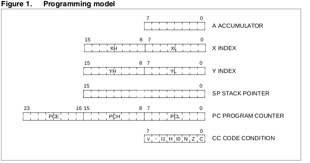
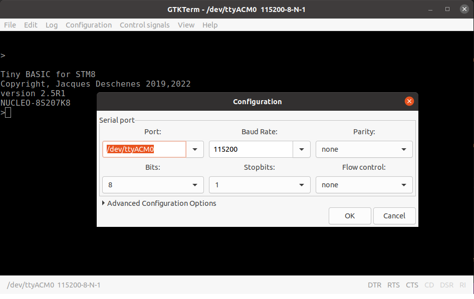
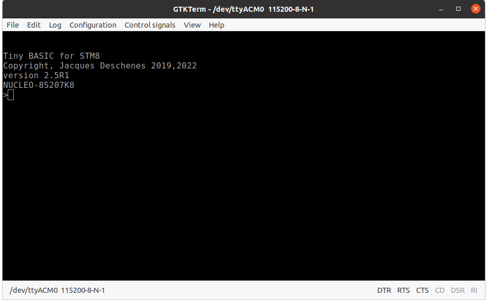
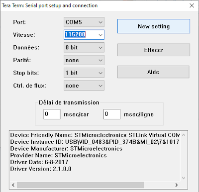
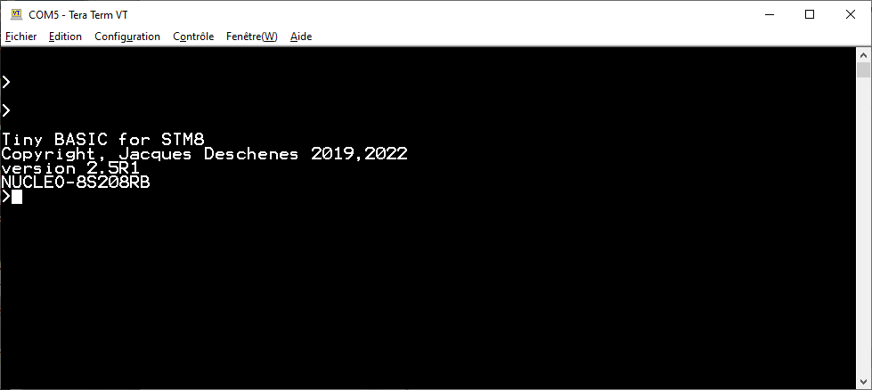
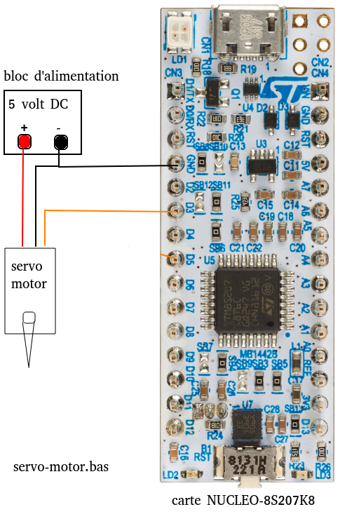

# STM8 TinyBASIC user's manual, version 2.6

<a id="index"></a>
 * [Introduction](#intro)
 * [supported boards](#supported-boards)
 * [Building project from sources](#sources-build)
 * [TinyBASIC firwmare installation](#firmware-install)
 * [Terminal configuration](#terminal-setup)
 * [programs examples](#programs-examples)

<a id="intro"></a>
## Introduction 

STM8 TinyBASIC is a simple programming language but that enable all MCU peripherals configuration and usage on supported NUCLEO boards. Although there is no support for interrupts, TinyBASIC system istself use the following interrupts

* **TIMER4 Update** that increment an internal milliseconds counter.
* **UART(1 or 3) RX full**, to queue characters received from terminal.
* **I2C** to support TinyBASIC **I2C.xxxx** commands. 
* **AWU** to support TinyBASIC **AWU** command.
* **EXTI4** only on NUCLEO-8S208RB board. That interrupt is triggered by pushing **USER** button and is used to abort a programm lock in infinite loop.

STM8 TinyBASIC is a simple language for simple microcontrollers projects. 

The system is designed to work connected to any PC host whatever the operating system provide a terminal emulator software is available to interface with NUCLEO board. This emulator must support VT100 ANSI sequence as the TinyBASIC system send some of the to host. 

This manual explain how to install TinyBasic on supported NUCLEO board and then how to use it to write programs. Aside documention provide by this project the following PDF documents form STMicroelectronics should be consulted as required.

* [stm8s20x datasheet](docs/NUCLEO-8S208RB/stm8s208rb.pdf)
* [NUCLEO-8S207K8 user manual](docs/NUCLEO-8S207K8/nucleo-stm8S207K8_user_man.pdf)
* [NUCLEO-8S208RB user manual](docs/NUCLEO-8S208RB/nucleo-8s208rb_user_manual.pdf)

Also [TinyBASIC reference manual](tbi_reference_tbi.pdf) is a must read.

### LICENSE 

This is an open source project distributed under [GPL V3 license](LICENSE.TXT).

STM8 TinyBASIC project repository can be found at [https://github.com/Picatout/stm8_tbi](https://github.com/Picatout/stm8_tbi).

[index](#index)
<hr align="left" width="40%">

<a id="supported-boards"></a>
## Supported boards
The NUCLEO boards supported by this project are sold by STMicroelectronics and both use microcontrollerse of ST8S20x family. 

These microcontrollers are base on 8 bits MCU which is an extension of the classic [MOS6502 cpu](https://fr.wikipedia.org/wiki/MOS_Technology_6502). **x**,**Y** and **SP** registers are extended to 16 bits and the **PC** to 24 bits. The binary code is not compatible with the 6502 and has a lot richer instruction set. 

#### Programming model of STM8 CPU. 
<br>

#### STM8 TinyBASIC 

STM8 tinyBASIC use 24 bits integers to give access to flash memory beyond  64KB limit of 16 bits addresses. Both MCU on these boards have flash memory over address 65535. 

* [NUCLEO-8S207K8](https://www.st.com/en/evaluation-tools/nucleo-8s207k8.html)
   64KB flash meomory in address range 32768..98303
  <br><br>
  This small board can be plugged on solderless breadboard, but as not access to SPI peripheral on the CN3 or CN4 connectors even though the MCU has one.


* [NUCLEO-8S208RB](https://www.st.com/en/evaluation-tools/nucleo-8s208rb.html) 
128KB flash memory in address range 32768..163839
  <br><br>
  This larger board as more I/Os and SPI peripheral is available on connector CN8.
 

The BASIC programs can only be saved below 65536 address by design of the BASIC interpreter. Extended memory over that 16 bits limit can be used to store program data.

[index](#index)
<hr align="left" width="40%">

<a id="sources-build"></a>
## Building project from sources

### Required software tools

* **GNU make**  on Linux system can be installed with:
```
sudo apt install make
``` 
* **objcopy** from binutils package 
```
sudo apt install binutils
```

* [sdcc](https://sourceforge.net/projects/sdcc/) also containt **sdasstm8**.  Can be build and installed from source but is also available on Ubuntu.    
```
sudo apt install sdcc 
```
* [stm8flash](https://github.com/vdudouyt/stm8flash) To flash TinyBasic.bin to NUCLEO board. This tool must be constructed from source but not mandaroy as the binary can be flashed  using NUCLEO board virtual drive as described at [TinyBASIC firmware installation](#firmware-install). 

### building and flashing NUCLEO board

* clone the git on your PC 
```
git clone https://github.com/Picatout/stm8_bit 
```
* Select the options in [config.inc](config.inc) file.
```
;;;;;;;;;;;;;;;;;;;;;;;;;;;;;;
;;  configuration parameters 
;;;;;;;;;;;;;;;;;;;;;;;;;;;;;;

DEBUG=0 ; set to 1 to include debugging code 

SEPARATE=0 ; set to 1 for 'make separate' 

WANT_IWDG=0 ; set to 1 to add words IWDGEN and IWDGREF 

; boards list
; set selected board to 1  
NUCLEO_8S208RB=0
; use this to ensure 
; only one is selected 
.if NUCLEO_8S208RB 
NUCLEO_8S207K8=0
.else 
NUCLEO_8S207K8=1
.endif 

; NUCLEO-8S208RB config.
.if NUCLEO_8S208RB 
    .include "inc/stm8s208.inc" 
    .include "inc/nucleo_8s208.inc"
.endif  

; NUCLEO-8S207K8 config. 
.if NUCLEO_8S207K8 
    .include "inc/stm8s207.inc" 
    .include "inc/nucleo_8s207.inc"
.endif 

; all boards includes 

	.include "inc/ascii.inc"
	.include "inc/gen_macros.inc" 
	.include "tbi_macros.inc" 
```
* **DEBUG** set to **1** to include debugging code in compiled binary. This code is in [debug_support.asm](debug_support.asm) file. To disable this option set it to **0**. 
* **WANT_IWDG** Set to **1** to include BASIC commands **IWDGEN** and **IWDGREF** in binary. Set to  **0** otherwise.
* **NUCLEO_8S208RB** set to **1** to select this board as target. Otherwise set it to **0** to target  **NUCLEO_8S207K8** board. 

* Use bash script [build.sh](build.sh) To build and flash. This script take 2 parameters:
  1. Board type, options are **s207** or **s208**.
  1. Optional parameter **flash**  to flash the binary if build is successful.
```
~/github/stm8_tbi$ ./build.sh s207 flash
```

[index](#index)
<hr align="left" width="40%">


<a id="firmware-install"></a>
## TinyBASIC firmware installation

The repository contain last binary build in project subdirecoty **build/stm8s20x**.  
If there no need to rebuild the project follow these instructions to install the binary on NUCLEO board.

When a NUCLEO board is connected to PC a virtual drive is create

* **NOD_8S207** for NUCLEO-8S207K8 board.
* **NODE_8S208** for NUCLEO-8S208RB board.

Flashing the TinyBASIC firmware on the board is as easy copying the binary to this drive.

First time I tried to flash one of my NUCLEO-8S208RB board using this method on my Windows laptop it failed. Then I updated the [STKLINK firmware](https://www.st.com/en/development-tools/stsw-link007.html) and tried again with success.

[index](#index)
<hr align="left" width="40%">

<a id="terminal-setup"></a>
## Terminal configuration 
The only software required on the PC host to used a NUCLEO board with STM8 TinyBASIC installed is a terminal emulator compatible [VT100](https://en.wikipedia.org/wiki/VT100). This is readily available on Windows and Linux system. 

The configuration setup for serial port is:

* __115200 BAUD__
* __8 bits__
* __1 stop__
* __no parity__

For terminal setup, line termination  **CR** is used.

### terminal emulator used 

* On my Ubuntu system I use [GTKterm]()
```
sudo apt install gtkterm 
```
 but minicom could do as well. 
```
sudo apt install minicom 
```

On linux system the NUCLEO board virtual serial port name is **/dev/ttyACMx** where **x** is a digit idenfying the port. 

Here a screen capture of GTKterm configuration window.

<br>
If this configuration is saved with *default* as name will load automatically at GTKterm startup.<br>

Here what is looks like.



* On Windows system I use [TeraTerm](https://osdn.net/projects/ttssh2/releases/)

Here some screen captures of Teraterm configuration 

At startup Teraterm display **new connexion** dialog box. STMicroelectronics STLink serial port is well idendified.<br>.
<br>
Then terminal configuration must be done. As line terminator, transmit must be **CR** on receive **AUTO** or **CR** can be selected.<br>**VT102** is selected as terminal type.<br>Line width must be at least **80** characters.<br> 
<br>
Finally serial configuration is done.<br>
<br>
The configuration can be saved but is not restored automatically at startup. When teraterm is restarted
1. the config must be restored from saved file.
1. The **new connexion** dialog box must be opened and **new setting** button clicked to make the new setting active.

Finally Tera Term screen capture with font size 12.



[index](#index)
<hr align="left" width="40%">

<a id="programs-examples"></a>
## Programs examples
The subdirectory **BASIC** contains many TinyBASIC programs you can look at for examples.  

You should also read [STM8 Tiny BASIC language reference manual.](tbi_reference_en.pdf).

From terminal  type **WORDS** to display all commands,functions and keywords available in the language. 

The input case doesn't matter, the system convert to uppercase except for quoted strings.

```
>words
ABS		ADCON		ADCREAD		ALLOC		AND
ASC		AUTORUN		AWU		BIT		BRES
BSET		BTEST		BTOGL		BUFFER		BYE
CHAIN		CHAR		CONST		CR1		CR2
DATA		DDR		DEC		DIM		DIR
DO		DREAD		DROP		DWRITE		EDIT
EEFREE		EEPROM		END		ERASE		FCPU
FOR		FREE		GET		GOSUB		GOTO
HEX		I2C.CLOSE	I2C.OPEN	I2C.READ	I2C.WRITE
IDR		IF		INPUT		KEY		KEY?
LET		LIST		LOG2		LSHIFT		NEW
NEXT		NOT		ODR		ON		OR
PAD		PAUSE		PEEK		PICK		PINP
PMODE		POKE		POP		POUT		PRINT
PORTA		PORTB		PORTC		PORTD		PORTE
PORTF		PORTG		PORTI		PUSH		PUT
READ		REBOOT		REM		RESTORE		RETURN
RND		RSHIFT		RUN		SAVE		SIZE
SLEEP		STEP		STOP		TICKS		TIMEOUT
TIMER		TO		TONE		TRACE		UBOUND
UFLASH		UNTIL		USR		WAIT		WORDS
WRITE		XOR		
107 words in dictionary

>
```

**NUCLEO-8S208RB** board as 4 more command than **NUCLEO-8S207K8** board. These commands are for the **SPI** peripheral.

### immediate command
* Any command list that is not preceded by a line number is compiled an executed immedially.
```
>for i=1 to 10:? i;:next i
1 2 3 4 5 6 7 8 9 10 
>
```
* If the first item is a number between 1...32767  the line is consired part of a program and inserted in program space after compilation. 
```
>10 for i=1 to 10:? i;:next i

>list
   10 FOR I = 1 TO 10 : ? I ; : NEXT I 
program address: $91, program size: 25 bytes in RAM memory

>run
1 2 3 4 5 6 7 8 9 10 
>
```

* If line contains only a line number it is ignore or if an existing line with that number exist it is deleted from the program. 
```
>10

>list

>
```

* lines can be typed in any order but are inserted in program space in sorted order.
```
>10 for i=1 to 10:? i;:next i

>5 ' count to 10 

>list
    5 ' count to 10
   10 FOR I = 1 TO 10 : ? I ; : NEXT I 
program address: $91, program size: 43 bytes in RAM memory

>
```

### Available program space 
The 2 boards have 6KB of RAM space but some of it is used by Tiny BASIC system. To know free space available for program type
```
>? free " bytes free"
5561  bytes free

>
```
Programs are edited in RAM to reduce **flash memory wear** but this limit their size to free RAM. To alleviate that limitation an application can span many files. Once a file is tested and debugged it can be save in FLASH memory file system. Using the command **CHAIN** one file can call another program file for execution. See the command **CHAIN** in reference manual for more detail. 

## Then some programs examples

## example 1 blinky
Both board have a *user LED* both connected to the same **PORTC bit 5** which the sytem configure at bootup as output. In the following example this LED is blinked once/second.   
The system define constants for all General Purpose I/O port **(PORTx)** as well for the 5 registers that control those ports **ODR**,**IDR**,**DDR**,**CR1** and **CR2**. See reference manual for more detail on these.
```
1 BLINK 
5 ' Blink user LED on board
10 DO BTOGL PORTC , BIT ( 5 ) PAUSE 500 UNTIL KEY? 
20 LET A = KEY ' drop this key from rx queue
30 BRES PORTC , BIT ( 5 ) ' turn off LED 
40 END 
```

Another way to control this LED is to use **DWRITE** command. 
```
5 ' CTRL+C to quit program
7 ' blink 3 times per second
10 LET B = 1 
20 FOR A = 0 TO 0 STEP 0 ' infinite loop
30 DWRITE 13 , B ' user LED is on D13
40 LET B = 1 - B 
50 PAUSE 333 
60 NEXT A 
```

## example 2, Pulse Width Modulation in software

In the following example the user LED brightness is controlled by PWM.
```
    1 PWM.SOFT 
    5 ' Software PWM, control user LED   
    7 GOSUB HELP 
   10 LET R = 511 , S = 1 , N = 0 , P = 0 : ? R ; 
   20 LOOP ' PWM loop 
   22 IF K = P : LET N = N + 1 , S = N / 10 + 1 
   24 IF K <> P : LET S = 1 , N = 0 
   26 LET P = K , K = 0 
   30 IF R : BSET PORTC , BIT ( 5 ) 
   40 FOR A = 0 TO R : NEXT A 
   50 BRES PORTC , BIT ( 5 ) 
   60 FOR A = A TO 1023 : NEXT A 
   70 IF KEY? : LET K = KEY : GOSUB UPPER 
   72 IF ( K = ASC ( \D ) OR K = ASC ( \U ) ) AND K = P : LET N = N + 1 , S = N / 10 + 1 
   74 IF K = 0 OR K <> P : LET S = 1 , N = 0 
   78 IF K = 0 : GOTO 30 
   80 IF K = ASC ( \U ) : GOTO 200 
   84 IF K = ASC ( \F ) : LET R = 1023 : GOTO 600 : '  pleine intensite 
   90 IF K = ASC ( \D ) : GOTO 400 
   94 IF K = ASC ( \O ) : LET R = 0 : GOTO 600 : '  eteindre
   96 IF K = ASC ( \? ) : GOSUB HELP : GOTO 600 
  100 IF K = ASC ( \Q ) : GOSUB CLS : END 
  110 GOTO LOOP 
  200 IF R < 1023 : LET R = R + S : GOTO 600 
  210 GOTO LOOP 
  400 IF R > 0 : LET R = R - S : GOTO 600 
  410 GOTO LOOP 
  600 IF R < 0 : LET R = 0 
  602 IF R > 1023 : LET R = 1023 
  604 GOSUB CLS : ? R ; 
  610 GOTO LOOP 
 1000 UPPER ' upper case letter
 1010 IF K < ASC ( \a ) : RETURN 
 1020 IF K > ASC ( \z ) : RETURN 
 1030 LET K = K - 32 
 1040 RETURN 
 2000 CLS ' clear terminal screen and move cursor home
 2002 ' using ANSI control sequences
 2010 ? CHAR ( 27 ) ; "[2J" ; CHAR ( 27 ) ; "[H" 
 2020 RETURN 
 3000 HELP 
 3010 GOSUB CLS 
 3012 ? "To control LD2 use:" 
 3014 ? , "'D' decrease intensity" 
 3016 ? , "'U' increase intensity" 
 3018 ? , "'F' full intensity" 
 3020 ? , "'O' turn off LD2" 
 3024 ? , "'Q' quit." 
 3026 ? , "'?' help" 
 3028 ? "Press any key to leave this help screen." 
 3030 DO UNTIL KEY? : ? KEY 
 3032 GOSUB CLS 
 3034 RETURN 
```
The brightness is displayed at top left corner on terminal.

The following terminal keys are used to control brightness
* **u** to increase 
* **d** to decrease 
* **f** full brightness
* **o** turn off 
* **q** quit program 
* **?** display this help  

## example 3, reading analog input 
For this example a 10 Kohm potentiometer is connected to analog input **A0** and the **ADCREAD** function is used to read the potentiometer position. Lower leg of potentiometer is connected to **GND**, upper leg to **3.3V** and center one to **A0**.  Rotating the potentiometer varies the LED brightness.

```
    1 AN.READ
    5 'analog input demo
   10 LET K = 0 :PRINT K;: ADCON  1 
   20 LET R =ADCREAD ( 0 )
   30 IF R :BSET PORTC,BIT(5) 
   40 FOR A = 0 TO R :NEXT A 
   50 BRES PORTC,BIT(5) 
   60 FOR A =A TO  1023 :NEXT A 
   70 IF KEY? :LET K =KEY AND $DF
   80 IF K =ASC (\Q):ADCON  0 :END
   90 PRINT "\b\b\b\b\b\b";R;
  100 GOTO  20 
```
 **Q** key to quit program. 

On line **1** the label **AN.READ** enable this program to be saved in flash memory as to save a program in the file system its first line must be labeled as this label is used as file name.
```
>save

>dir     
$B804 206 bytes,AN.READ

>run an.read
$0   
>autorun an.read

>reboot
 AN.READ running
432    
>
```
* **SAVE** command to save the program in file system. 
* **DIR** command to display list of saved programs. 
    * first number is program address in hexadecimal.
    * second number is program size in decimal. 
    * last is file name which is the label on program first line.
* **RUN AN.READ** run the given file. The file execute from flash this keep RAM free.
* **AUTORUN AN.READ** Make file **AN.READ** run at boot up .
* **REBOOT** command reboot the MCU and the AN.READ is running. **AUTORUN \C** disable autorun.

## example 4, PWM using TIMER1 output compare feature.
TIMER1 is a 16 bits counter with 4 channels that can be configured for input capture or output compare. In this example channel 1 output compare is configured in PWM mode 1 to control brightness of a LED connected to pint **D3**. 

#### LED connexion
* Cathode -&gt; GND 
* Anode -&gt; 100 ohm resistor -&gt; D3 
#### potentiometer connexion 
* lower leg 1 -&gt; GND 
* center leg 2 (milieu) -&gt; A0
* upper leg 3 -&gt; 3.3V

1. lines 10-40, TIMER1 registers address constants are defined. 
1. ligne 60, Enable TIMER1 peripheral clock signal.
1. lignes 80-100, Configure channel 1 in PWM mode 1.
1. ligne 110-120, Configure TIMER1 period for 1023 counts.
1. ligne 130, Adjust duty cycle to 50%.
1. ligne 150, Enable PWM channel 1. 
1. ligne 170, enable analog to digital converter.
1. lignes 190-220, Inside  DO..UNTIL loop read potientiometer on **A0** and set PWM duty cycle with potientiometer value to control LED brightness.
1.  Any key pressed on terminal end the program.

```
1 PWM.HARD 
5 ' pwm on D3 using TIMER1 channel 1
10 CONST TIM1.CR1=$5250,TIM1.ARRH=$5262,TIM1.ARRL=$5263,TIM1.CCMR1=$5258 
20 CONST TIM1.CCR1H=$5265,TIM1.CCR1L=$5266,TIM1.EGR=$5257,TIM1.CCER1=$525C 
30 CONST TIM.CCMR.OCM=4,TIM1.PSCRH=$5260,TIM1.PSCRL=$5261,CLK.PCKENR1=$50C7
40 CONST TIM1.BRK=$526D,TIM1.MOE=7
50 ' Enable TIMER1 clock 
60 BSET CLK.PCKENR1,bit(7) 
70 ' Set up TIMER1 channel 1 for pwm output MODE 1 
80 POKE TIM1.CCMR1, LSHIFT(6,TIM.CCMR.OCM):BSET TIM1.BRK,BIT(TIM1.MOE) 
90 ' no prescale divisor on TIMER clock  
100 POKE TIM1.PSCRH,0:POKE TIM1.PSCRL,0 
110 ' 1023 for counter period, this give 10 bits resolution like the ADC 
120 POKE TIM1.ARRH,3:POKE TIM1.ARRL,255
130 POKE TIM1.CCR1H,1:POKE TIM1.CCR1L,255 
140 ' enable counter 
150 BSET TIM1.CCER1,BIT(0):BSET TIM1.EGR,BIT(0):BSET TIM1.CR1,BIT(0)
160 ' enable analog digital converter 
170 ADCON 1 
180 ' read analog input channel and set TIM1.CCR1 register with value.
190 DO 
200 ? "\b\b\b\b\b";:LET N=ADCREAD(0): ? n;
210 POKE TIM1.CCR1H,N/256:POKE TIM1.CCR1L,N
220 UNTIL KEY? ' quit when a key is pressed 
230 BRES TIM1.CCER1,BIT(0):BRES TIM1.CR1,BIT(0):BRES CLK.PCKENR1,BIT(7)
240 END 
```

## example 5, servo-motor control 
Small servo-motors are controlled by PWM at frequency of 50 hertz. This example show the use of servo command in this purpose. Channel 2 is used and  [SG90](https://www.amazon.ca/-/fr/servo-t%C3%A9l%C3%A9command%C3%A9-h%C3%A9licopt%C3%A8re-contr%C3%B4le-servomoteurs/dp/B072V529YD) servo-motor. 

### assembly 



The 3 follwing commands are available for servo-motor control purpose.

* **SERVO.EN 0|1** **0** disable servo control, **1** enable it.
* **SERVO.CH.EN ch#,0|1**
  * **ch#** channel number {1..4}
  * **0|1** **0** disable that channel, **1** enable it.
* **SERVO.POS ch#,usec** Set rotation angle of motor.   
  * **ch#** channel number to set.
  * **usec** pulse width in microseconds {500..2500}

Up to 4 servo can be controlled simultaneously. 

servo<br>channel|output|conn.<br>NUCLEO-8S207K8|conn.<br>NUCLEO-8S208RB
-|-|-|-
1|D3|CN3:6|CN7:4
2|D5|CN3:8|CN7:6
3|D6|CN3:9|CN7:7
4|D9|CN3:12|CN8:2 

__WARNING:__ Don't connect servo-motor power to board 5 volt regulator. Those small motor draw enough current at motor startup to reset the board. 

Specification I found for SG90 specify  a 1000...2000 usec interval for pulse width. But with this range the rotatation is only 90&deg; So I extended this range to 500...2500 usec to get 180&deg; rotation. One can't always trust datasheet.
```
1 SERVO.CTRL 
5 ' servo-motor control on channel 1 on D3 
6 ' servo-pulse range 500 usec - 2500 usec.
10 ' enable servo-motor control
20 SERVO.EN 1 ' 0 to disable 
30 'enable channel 1
40 SERVO.CH.EN 1,1 
50 ADCON 1 
60 ' read analog input channel and set TIM1.CCR1 register with value.
70 DO 
80 ? "\b\b\b\b\b";:LET N=ADCREAD(0)*2+500: ? n;
90 SERVO.POS 1,N  ' set servo rotation angle
100 UNTIL KEY? ' quit when a key is pressed 
110 ' disable servo motor control 
120  SERVO.CH.EN 1,0 ' disable channel 0
130  SERVO.EN 0 ' disable TIMER1 
140 END
```

Note that TIMER1 can't be used for other purpose when it is used for servo control.

### example 6, I2C peripheral bus. 

**I2C** is acronym for **I**nter **I**ntegrated **C**ircuit. This is a communication bus used for communication between integrated circuit on same board or assembly. This is a 2 wires **bus** working in open drain. Up to 128 devices can be connected on 1 bus as each device has a 7 bit address to identify it.  In subdirectory **BASIC** there is 2 demo programs using **I2C** interface bus. 

The commands related to I2C are :

* **I2C.OPEN** enable I2C bus.
* **I2C.CLOSE** disable I2C bus.
* **I2C.WRITE** Send data to device connected on I2C bus.
* **I2C.READ**  Receive data from device on I2C bus.

The program [i2c_eeprom.bas](BASIC/i2c_eeprom.bas) demonstrate the usage of I2C interfaced EEPROM 24LC512. 

The program [i2c_oled.bas](BASIC/i2c_oled.bas) demonstrate small I2C interfaced [OLED grahpic display](https://www.amazon.ca/dp/B07YNP2L95/ref=sr_1_4_sspa?__mk_fr_CA=%C3%85M%C3%85%C5%BD%C3%95%C3%91&crid=37VHB4HVI0FNE&keywords=oled+display&qid=1669950137&qu=eyJxc2MiOiI0LjE2IiwicXNhIjoiMy44MSIsInFzcCI6IjMuMzUifQ%3D%3D&sprefix=oled+display%2Caps%2C69&sr=8-4-spons&psc=1&spLa=ZW5jcnlwdGVkUXVhbGlmaWVyPUEzRFZWTVc2Nzc0NDhKJmVuY3J5cHRlZElkPUEwODI0Nzk4MUVaR0tBTUY2N0M0JmVuY3J5cHRlZEFkSWQ9QTAzNjI3OTMxVFpIQkFTUkFZR0xVJndpZGdldE5hbWU9c3BfYXRmJmFjdGlvbj1jbGlja1JlZGlyZWN0JmRvTm90TG9nQ2xpY2s9dHJ1ZQ==). 


[index](#index)
